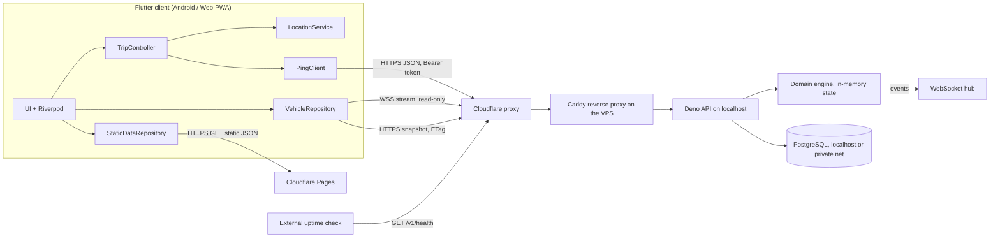
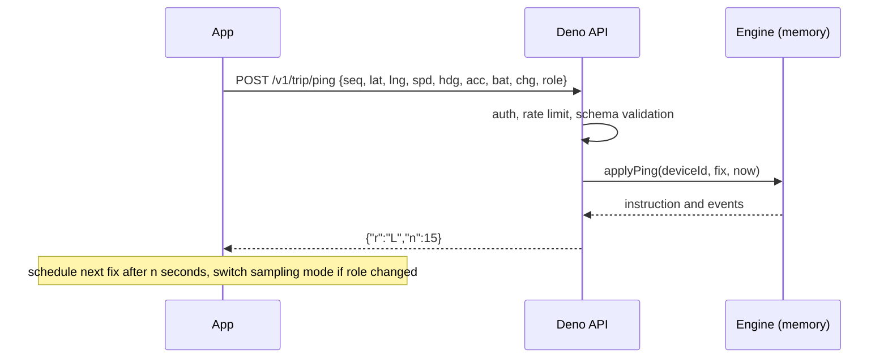
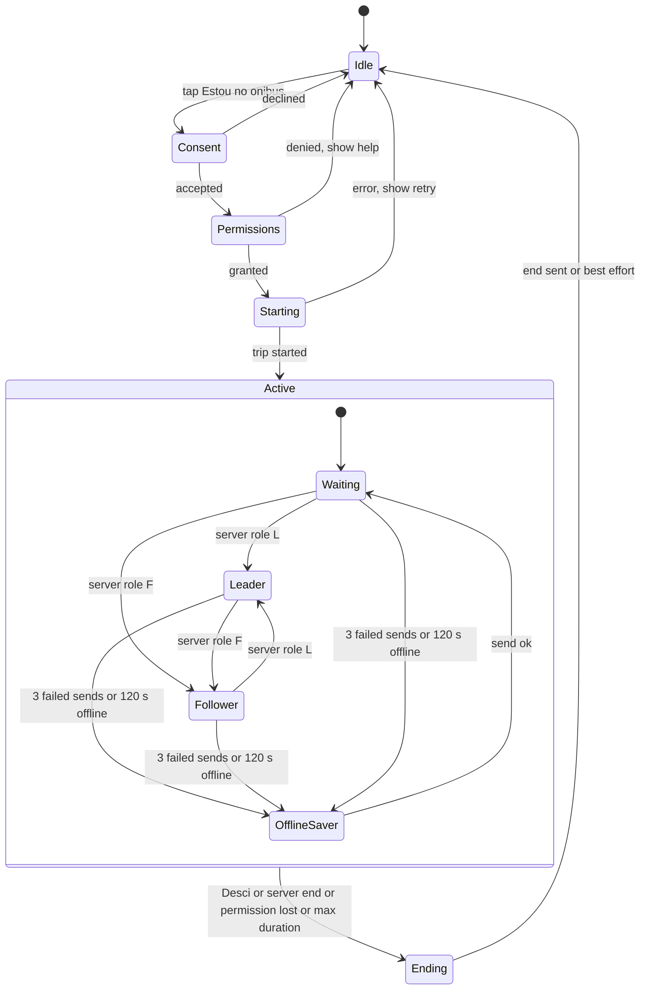

# PLAN.md

> Implementation plan for a collaborative, crowd-sourced bus-tracking app for
> **São Mateus, ES, Brazil**. **Version 1.1 - 2026-10-01.** Derived from
> `relatorio-tecnico-bus-tracking-sao-mateus.md` (v. 27/09/2026), plus the
> verification work and design changes listed in section 2. v1.1 moves the
> backend from Supabase to a **Deno/TypeScript API on the owner's VPS with
> PostgreSQL**. This file is the build contract. Another model (and a human
> reviewer) must be able to build the alpha from this file alone.

## Table of contents

0. How to use this document (read first)
1. Product definition and alpha scope
2. Corrections and deviations from the report (with reasons)
3. Verified facts, constraints and assumptions
4. Requirements (functional, non-functional, security, privacy)
5. Architecture
6. Backend specification (Deno/TypeScript API + PostgreSQL)
7. Static data (lines, schedules, routes)
8. Client specification (Flutter)
9. UI specification (every screen)
10. Performance, battery and data engineering rules
11. Unstable-connection rules
12. Security specification
13. LGPD (Brazilian data-protection law) specification
14. Coding, architecture and commenting rules
15. Testing and QA strategy
16. Build plan (spikes, milestones, atomic tasks)
17. CI/CD, environments and release
18. Operations and runbooks
19. Risks and owner decisions
20. Appendices (strings, DoD checklists, policy outline)

---

## 0. How to use this document (read first)

### 0.1 Precedence

If two statements conflict, the higher one wins. Record the conflict and
resolution in `DECISIONS.md`.

1. §12 (Security) and §13 (LGPD) - non-negotiable.
2. The budgets and rules in §4 and §10 (CPU, RAM, data, battery, resilience).
3. The rest of this plan.
4. The original report.

### 0.2 Conventions

- **MUST / SHOULD / MAY** follow RFC 2119.
- Scope tags: **[A]** = required for alpha. **[A\*]** = alpha "should" (cut
  first if time slips). **[L]** = later (do not build now; do not block on it).
- **VERIFY** = a fact that may have changed or that this plan could not fully
  confirm. Check against official docs when you reach that task, and write the
  result in `DECISIONS.md`. Never assume.
- IDs: `RFxx` / `RNFxx` keep the report's numbering; new ones continue the
  sequence. `SECxx` security, `PRVxx` privacy, `Dxx` deviation, `Sx` spike,
  `Txx` task, `KLx` known limitation.

### 0.3 Rules for the implementing model

1. **One change per task** (§16). Small commits. Do not start the next task
   until the current acceptance criteria pass.
2. **Spikes first** (§16 Phase A). They settle unknowns that could invalidate
   the design.
3. **Do not invent facts.** If a package API, a platform feature or a legal rule
   is not certain, mark it VERIFY, test it, record it.
4. When ambiguous, pick the **simplest option that satisfies every MUST rule**,
   write a short ADR in `DECISIONS.md`, and continue. Ask the owner only about
   items in §19.2.
5. **Never run "upgrade everything".** Dependencies change one package at a time
   (§14.7).
6. **Never** commit secrets, put any server secret (DB credentials, env values)
   in any client or repo, log coordinates, or run abuse/load tests against
   production.
7. Language: code, comments, commit messages, docs = English. **User-visible
   strings = pt-BR.** Legal documents = pt-BR.
8. If a task needs something that this plan forbids (e.g., a new SDK), stop and
   write an ADR proposing it; do not add it silently.
9. Each task lists a recommended **Model/Effort (M/E)**. It is a recommendation:
   use a stronger setting for security-critical server code, the ping/election
   logic and anything touching consent.

### 0.4 Working title and identifiers

- Product working title: **Pontual** (rename freely; avoid "São Gabriel",
  "SGBus", "Mobilibus" or any operator trademark in the name, icon or store
  listing).
- Android `applicationId`: decide before the first store upload (cannot change
  afterwards). Proposal: `app.pontual`. See §19.2.
- Repo name: `pontual`.

---

## 1. Product definition and alpha scope

### 1.1 What it is

A free, independent, **non-official** app where riders of São Mateus' city buses
share the bus's position while they ride. The backend merges the riders on the
same bus into one **vehicle**, elects one rider's phone as **leader** (the one
that reports often) to save everybody's battery, and shows other users a live
map of vehicles per line, plus static timetables.

### 1.2 Principles (in priority order)

1. **Privacy and security first.** The server never exposes individual users; it
   stores the minimum; it erases location when the trip ends.
2. **Cheap for the phone**: CPU, RAM, mobile data, battery (the owner's top
   requirement).
3. **Works on bad networks** (3G/4G in a moving bus, tunnels, dead zones).
4. **Simplicity.** Fewest moving parts that satisfy 1–3. R$0 recurring infra.
5. Features.

### 1.3 Non-goals for alpha

Push notifications, favourites, trip history, delay statistics/ML ETA, admin
panel, GTFS-Realtime export, accounts/login, payments, ads, analytics SDKs, iOS
native app, intermunicipal lines, point-to-point route planning.

### 1.4 Adoption phases (from the report, condensed)

| Phase | Audience                 | Lines                                   | Target                                                     |
| ----- | ------------------------ | --------------------------------------- | ---------------------------------------------------------- |
| 0     | Owner                    | 1 line                                  | works end-to-end alone                                     |
| 1     | Classmates (Ufes/CEUNES) | 2–3 high-flow lines to campus           | ≥1 active reporter per line most of the day                |
| 2     | Students                 | student-relevant urban lines            | organic use                                                |
| 3     | City residents           | all 21 urban lines                      | Play Console account paid (one-time US$25), local outreach |
| 4     | Future                   | municipal/intermunicipal, official data | partnership                                                |

**This plan builds Phase 0 → Phase 1 ("alpha").** Everything else is kept
possible but not built.

### 1.5 Alpha scope

**In:**

- Android app (Flutter), Portuguese (pt-BR) only.
- Web/PWA build (same codebase) so iOS users can at least **watch** the map [A];
  web **sharing** (foreground only) [A\*].
- 1–3 pilot lines seeded manually (all 21 line names listed in the line list,
  but only pilot lines flagged `pilot`/live-capable) [A]; remaining lines show
  timetable only.
- Anonymous device tokens (no sign-up), per-trip location sharing with explicit
  consent.
- Vehicle merging, leader election, live map, static timetables,
  offline-tolerant behaviour.
- Privacy center: policy, terms, "delete my data".

**Out:** see §1.3.

### 1.6 Alpha exit criteria ("alpha-stable")

All must hold before inviting classmates beyond the owner's own devices:

1. Pilot lines seeded with source attribution and a visible "unofficial
   timetable" notice.
2. ≥ 5 real bus trips recorded in field tests, including ≥ 2 phones on the same
   bus; leader hand-over occurred with **no visible gap > 20 s** on the map.
3. p95 latency from leader fix to map update on a viewer ≤ **10 s** (target ≤ 15
   s per RNF04).
4. All security tests in §12.6 pass; no open P0/P1 finding.
5. 8-hour simulator soak on the local/staging server with no errors and no
   resource alarms (CPU, RAM, connections).
6. Measured budgets in §10.1 are met on the reference devices (or each miss is
   documented with a fix plan).
7. Privacy policy + terms published and linked in-app; "delete my data" works
   end-to-end; consent flow verified.
8. App survives: screen off 30 min, airplane-mode toggle, app swiped from
   recents, GPS toggled off, permission revoked mid-trip (behaviours in §8.6).

### 1.7 Glossary

- **Trip** (also called session in older text): one rider's trip on one line; an
  in-memory object on the server, dropped at the end.
- **Vehicle**: the server's estimate of one physical bus (one or more trips
  attached).
- **Leader**: the trip whose phone reports at high frequency for a vehicle.
  **Follower**: others, low frequency (redundancy). **Waiting** (`W`): trip not
  yet attached to a moving vehicle.
- **Fix**: one GPS reading sent to the server.
- **Tick**: the server's periodic housekeeping job (every ~5 s).
- **Tile**: map image square.

---

## 2. Corrections and deviations from the report (with reasons)

The report is a good base. Verification and a deeper design pass found points
that must change. In **v1.1** the owner also decided to run the backend as a
**TypeScript (Deno) API on the owner's own VPS with PostgreSQL**, instead of
Supabase. Each deviation is binding; log new ones in `DECISIONS.md` using the
same `Dxx` style.

| ID  | Report said                                                                                                             | This plan does                                                                                                                                                                                                                                                                                            | Why                                                                                                                                                                                                                                                                                                                     |
| --- | ----------------------------------------------------------------------------------------------------------------------- | --------------------------------------------------------------------------------------------------------------------------------------------------------------------------------------------------------------------------------------------------------------------------------------------------------- | ----------------------------------------------------------------------------------------------------------------------------------------------------------------------------------------------------------------------------------------------------------------------------------------------------------------------- |
| D01 | Use `smart_location` plugin: "built-in anti-spoofing, native foreground service, offline cache; solves RNF12 for free". | Use **`geolocator`** directly (its Android foreground-notification config and `isMocked` flag, VERIFY) and implement filtering, scheduling and retry ourselves.                                                                                                                                           | Verification found `smart_location` is a tiny, very new (March 2026) wrapper around `geolocator` (v0.0.4, ~23 weekly downloads, 2 deps) with none of the claimed features. A different package, `smart_location_plus`, is a geocoding/geofencing wrapper that requests `ACCESS_BACKGROUND_LOCATION`: **do not use it**. |
| D02 | Store `location_pings` (history) for hours, cluster from them.                                                          | **No ping history and no location at rest.** The latest fix of each active trip lives **only in the API process memory** and is dropped when the trip ends. Nothing with coordinates is ever written to PostgreSQL, disk or logs.                                                                         | Strongest data minimisation (LGPD necessity principle), no write load, simpler code. Nothing in alpha needs history (see D20 for the future path).                                                                                                                                                                      |
| D03 | Clients publish via Realtime Broadcast (binary payload); an Edge Function does clustering.                              | **Clients talk only to our own Deno/TypeScript API** (HTTPS JSON for writes; HTTPS and WebSocket for reads). **No client ever connects to PostgreSQL.** The database listens on localhost/private network only and only the API holds its credentials.                                                    | Owner decision. One enforcement point for validation, authorisation and rate limits; the stream cannot be spoofed because clients cannot publish; room for caching, history, prediction and ML later; no third-party quotas.                                                                                            |
| D04 | Windowed `ST_ClusterDBSCAN` over the last 30 s of pings.                                                                | **Attach-at-ping online clustering** against vehicle state, using **dead-reckoned** positions; a periodic **tick** only for election, expiry and broadcast. Implemented as a **pure TypeScript engine**.                                                                                                  | Followers report every ~90 s: their fix is up to ~900 m behind the bus by the next window, so DBSCAN on raw positions would split one bus into several. Dead-reckoning plus tolerance fixes it and gives **stable vehicle IDs** (no marker flicker). Pure TS is far easier to unit-test than SQL.                       |
| D05 | Vehicle position = cluster centroid.                                                                                    | Vehicle position = **newest accepted fix from any attached trip**.                                                                                                                                                                                                                                        | A centroid of fixes with different ages is biased backwards.                                                                                                                                                                                                                                                            |
| D06 | Roles changed by the server; client implied to learn it.                                                                | Role and next interval are returned **in the `ping` response** (`{"r":"L","n":15}`). Leader hand-over is **two-phase** (new leader acknowledges before the old one is demoted).                                                                                                                           | No extra connection on the reporter; no gap at hand-over.                                                                                                                                                                                                                                                               |
| D07 | `schedules` table in Postgres.                                                                                          | Timetables are a **static, versioned JSON on the CDN, bundled in the app** (repo is source of truth). The server loads the same built data (lines, routes) from disk. PostgreSQL does not store lines or timetables in alpha.                                                                             | Zero DB load, cacheable, works offline, easy review via PRs.                                                                                                                                                                                                                                                            |
| D08 | Client sends `recorded_at`.                                                                                             | **Server time only.**                                                                                                                                                                                                                                                                                     | Client clocks are wrong or spoofable; removes an attack surface and bytes.                                                                                                                                                                                                                                              |
| D09 | RNF03: "poucas dezenas de KB" per trip.                                                                                 | Revised measurable budget (section 10.1): leader <= ~0.15 MB/h, follower <= ~0.03 MB/h, viewer WebSocket <= ~0.05 MB per 10 min.                                                                                                                                                                          | With a ~50-byte opaque bearer token (not a ~1 KB JWT), a ping is ~0.4-0.5 KB on the wire including headers. "A few KB per trip" is still not reachable with HTTP headers, but real data is tiny.                                                                                                                        |
| D10 | Legal basis: "legitimate interest" (defensible).                                                                        | **Consent (LGPD art. 7, I) for location sharing**, obtained in a prominent in-app disclosure at "start trip", recorded server-side by consent version. Legitimate interest only for plain map viewing. Legal review still required.                                                                       | Sharing is already opt-in per trip, so consent is natural, easier to prove, and matches Google Play's prominent-disclosure rule for location.                                                                                                                                                                           |
| D11 | (Implicit) background location.                                                                                         | **No `ACCESS_BACKGROUND_LOCATION`.** Use a **foreground service (type `location`)** started from the visible app. **Swiping the app away ends the trip.**                                                                                                                                                 | Avoids Play's strict background-location review, is more privacy-preserving, and simpler to reason about.                                                                                                                                                                                                               |
| D12 | OSM tiles as the map.                                                                                                   | **OSM raster tiles with `flutter_map`'s built-in cache (>= 8.2.0), behind a `TileSource` abstraction**, with an exit plan before Phase 2.                                                                                                                                                                 | The public OSM tile server is for light use and forbids bulk download. See section 8.9 and R-05.                                                                                                                                                                                                                        |
| D13 | Realtime binary payload.                                                                                                | **Compact JSON** (short keys, 5-decimal coordinates) over WebSocket. Binary only if a spike proves a real gain.                                                                                                                                                                                           | JSON arrays of numbers are ~45 bytes per vehicle.                                                                                                                                                                                                                                                                       |
| D14 | One backend project.                                                                                                    | **Owner's VPS with PostgreSQL** (replaces the Supabase projects used in v1.0). Environments: local (Docker Postgres), optional staging (second instance, separate DB), prod. VPS region is an owner decision (section 19.2); **Brazil strongly preferred** for LGPD transfer simplicity and latency.      | Owner already has the infrastructure; no recurring cost; full control and no vendor quotas. Trade-off: the owner now operates and secures the host (section 12.8).                                                                                                                                                      |
| D15 | Realtime channels implicitly public.                                                                                    | **Read-only WebSocket stream** served by our API. Clients can only subscribe to a line; they cannot send data on it. Vehicle positions are public by design, so reads need no login; connection caps and rate limits protect the service.                                                                 | Prevents spoofed broadcasts; removes the need to register viewers (less data held).                                                                                                                                                                                                                                     |
| D16 | Sessions are anonymous users of a third-party auth service.                                                             | **Anonymous device tokens issued by our API**: 256-bit random opaque token, only its SHA-256 hash stored, 30-day sliding expiry, revocable, created only when the user first shares a trip. No JWT, no third-party auth.                                                                                  | Smaller requests, no crypto to implement ourselves, instant revocation, nothing created for people who only watch the map.                                                                                                                                                                                              |
| D17 | Edge Function runs the 15-s loop.                                                                                       | **In-process tick loop (every ~5 s)** inside the API.                                                                                                                                                                                                                                                     | No cold starts, no invocation quota, no scheduler to secure; 5 s tick keeps map latency low.                                                                                                                                                                                                                            |
| D18 | (new)                                                                                                                   | **Hot state (trips, vehicles) is in memory**, single API instance. A restart drops live state; clients resume automatically (`resume`).                                                                                                                                                                   | Privacy (location never on disk), speed, simplicity. Acceptable for city scale; a `StateStore` seam allows Redis later.                                                                                                                                                                                                 |
| D19 | (new)                                                                                                                   | **Cloudflare proxy in front of the API; Caddy at the origin; the Deno process binds to localhost; the firewall accepts web traffic only from Cloudflare ranges.**                                                                                                                                         | Hides the origin IP, absorbs floods, gives free TLS and caching for snapshot endpoints.                                                                                                                                                                                                                                 |
| D20 | (new)                                                                                                                   | **Future analytics path (history, ETA, ML) is allowed only on de-identified, aggregated data** (for example per-route-segment travel times by hour), fed from an internal event bus. Raw per-trip tracks are never stored. Needs a consent-text version bump, RIPD update and legal review first. **[L]** | Keeps the owner's roadmap open without breaking the privacy design (section 5.5).                                                                                                                                                                                                                                       |
| D21 | (new)                                                                                                                   | Server libraries: **Hono** (HTTP + WebSocket), **postgres.js** (`postgres`), one **schema-validation library** (Valibot or Zod), **dbmate** for SQL migrations. Each needs a short ADR confirming version, licence and Deno compatibility.                                                                | Small, well-known, Deno-friendly stack; no ORM.                                                                                                                                                                                                                                                                         |

### Known limitations accepted for alpha

- **KL1 - Promotion latency.** A follower learns it became leader only at its
  next ping (<= ~90 s). Mitigations: staggered follower phases; two-phase
  hand-over (no gap on planned rotation); vehicle shows "last seen N s ago".
  Improve later with a shorter follower interval when the leader looks unstable.
- **KL2 - Lone rider = exact bus position = that rider's position.** Unavoidable
  for a crowdsourced bus tracker; disclosed in the consent text (section 9,
  S06).
- **KL3 - Bunching.** Two buses of the same line closer than the tolerance
  (~80-150 m) can merge into one vehicle.
- **KL4 - Web/iOS** reports only with the screen on and the page open.
- **KL5 - Cold start.** No riders means no live data; timetables fill the gap.
- **KL6 - Restart drops live state.** After an API restart or deploy, vehicles
  reappear when clients resume (within one ping interval, usually < 30 s).
  Deploy off-peak.
- **KL7 - Single instance.** One VPS and one API process is a single point of
  failure. Accepted for alpha; mitigated by auto-restart, monitoring and quick
  rollback.

---

## 3. Verified facts, constraints and assumptions

### 3.1 Verified during planning (2026-09-30)

- **Android developer verification.** Enforcement begins **30 Sep 2026** in
  Brazil, Indonesia, Singapore and Thailand: apps must be registered to a
  verified developer to be installed or updated on certified Android devices,
  including sideloaded APKs. Limited-distribution accounts (<= 20 devices, no ID
  or fee for students/hobbyists) and an "advanced flow"/ADB route for
  unregistered apps exist. Global expansion is planned for 2027. VERIFY details
  at `developer.android.com/developer-verification` before every distribution
  decision.
- **flutter_map >= 8.2.0** has built-in tile caching on non-web platforms
  (default soft limit **1 GB, far too large; cap it**, section 8.9). Web has no
  built-in cache (browser HTTP cache is used).
- `smart_location` is not what the report describes (see D01).
- From v1.1 no third-party backend-as-a-service is used. Free-tier limits of
  such services no longer apply; capacity is bounded by the owner's VPS (section
  6.11).

### 3.2 Still VERIFY (done inside spikes S1 to S4)

- `geolocator` Android foreground-service behaviour with screen off / app swiped
  away; `Position.isMocked` availability; notification action button support.
- Server stack on Deno: current stable Deno version and permission flags; Hono
  (JSR) with `Deno.upgradeWebSocket`; `postgres` (postgres.js) running on Deno
  with TLS and pooling; dbmate on the target OS.
- Cloudflare: WebSocket support and idle timeout on the owner's plan; whether
  the free plan can cache the snapshot endpoints with a cache rule; current IP
  ranges list for the origin firewall; whether Authenticated Origin Pulls is
  practical.
- Bytes per ping request/response and keep-alive reuse at 15 s vs 90 s cadence
  through Cloudflare.
- Flutter Web: `--wasm` build support and size; service-worker behaviour in the
  current stable Flutter; Screen Wake Lock on iOS standalone PWAs.
- Play Console: foreground-service permission declaration; closed-testing
  requirements for new personal accounts (the number of testers and days has
  changed over time).

### 3.3 Assumptions (owner to confirm, section 19.2)

- The owner has **one Linux VPS (Debian or Ubuntu LTS) with root access and
  PostgreSQL** (same host or private network), and controls a domain whose DNS
  can be on Cloudflare. Specs unknown; the alpha needs little (a few hundred MB
  of RAM for Deno plus state).
- Single operator (Viacao Sao Gabriel); no official open data; timetables
  transcribed manually from public sources (section 7.5).
- Pilot users have Android phones with Google Play Services and 2-4 GB RAM; some
  are low-end.
- Sao Mateus is in UTC-3 (America/Sao_Paulo). Store UTC; display local time.
- The owner is a Flutter/Dart/Deno user (Riverpod + go_router in other
  projects). Reuse those habits: **Riverpod (no codegen), go_router,
  Deno/TypeScript for the server and tooling**.

---

## 4. Requirements

Status tags: **[A]** alpha-must, **[A\*]** alpha-should, **[L]** later.

### 4.1 Functional requirements (RF)

| ID   | Requirement                                                                                                                                                                                                                                | Tag | Notes / change vs report                                                                         |
| ---- | ------------------------------------------------------------------------------------------------------------------------------------------------------------------------------------------------------------------------------------------ | --- | ------------------------------------------------------------------------------------------------ |
| RF01 | User picks the line they are riding from the list of urban lines.                                                                                                                                                                          | A   | Lines without `pilot` flag show timetable only.                                                  |
| RF02 | Starting a **trip session** happens when the user taps "Estou no ônibus" and confirms.                                                                                                                                                     | A   | Requires consent (§13) + permissions.                                                            |
| RF03 | User can end the trip manually ("Desci").                                                                                                                                                                                                  | A   | Also from the Android notification (tap opens trip screen; action button if plugin supports it). |
| RF04 | Trip ends automatically: no ping for 10 min, hard cap 4 h, permission revoked, app swiped away. Stationary trips are never ended for standing still (traffic jams, construction stops); the movement gates only decide publishing, not survival. | A   | Server enforces; client also ends early where it can.                                            |
| RF05 | App sends periodic fixes: lat, lng, speed, heading, accuracy, battery (5 % steps), charging flag.                                                                                                                                          | A   | **No client timestamp** (D08).                                                                   |
| RF06 | Backend attaches trips of the same line that are close and coherent to one **vehicle**.                                                                                                                                                    | A   | Attach-at-ping (D04).                                                                            |
| RF07 | Backend elects a leader per vehicle: prefers charging, then highest battery (≥ 15 % unless alone), tie → least time led.                                                                                                                   | A   |                                                                                                  |
| RF08 | Leader reports every ~15 s while moving (~30 s still); followers every ~90 s ± jitter; waiting trips every ~20 s.                                                                                                                          | A   | Server tells the client the next interval in each response.                                      |
| RF09 | Leadership re-evaluated every ~5 min and immediately if the leader is dead (>45 s silent). Two-phase hand-over.                                                                                                                            | A   |                                                                                                  |
| RF10 | User sees vehicles (not individual users) of the selected line on a map and in a list.                                                                                                                                                     | A   |                                                                                                  |
| RF11 | User can view timetables of any line without any live data.                                                                                                                                                                                | A   | Static JSON.                                                                                     |
| RF12 | Server discards implausible fixes: outside city bounding box, accuracy > 60 m, speed > 25 m/s (~90 km/h), implied speed between fixes > 30 m/s with > 200 m jump, and (when route geometry exists) > 300 m from the route (not published). | A   | Strikes → session ended after 5.                                                                 |
| RF13 | No persistent identity tied to location: anonymous device token; no trip history; location only in memory and erased at trip end.                                                                                                          | A   | See section 13.                                                                                  |
| RF14 | **Consent** screen (prominent disclosure) before the first trip and whenever the consent version changes; consent version recorded server-side.                                                                                            | A   | New.                                                                                             |
| RF15 | **Delete my data**: ends the active trip, deletes the server-side device record (cascades consents), discards the local token and clears local storage.                                                                                    | A   | New (LGPD art. 18).                                                                              |
| RF16 | "Você ainda está no ônibus?" prompt when the device is slow for 15 min; no answer in 5 min → trip ends. Forgotten stationary trips still die; traffic jams and construction stops survive unattended. | A\* | New. |
| RF17 | **Kill switch / maintenance / forced update**: static `config.json` (CDN) and server flag; app shows a blocking or banner state.                                                                                                           | A   | New (ops safety).                                                                                |
| RF18 | Live-lines indicator on the home list (which lines have vehicles now).                                                                                                                                                                     | A   | One cheap, edge-cacheable endpoint `GET /v1/live`.                                               |
| RF19 | Route polyline drawn on the line map (from pilot-line traces).                                                                                                                                                                             | A\* | Encoded polyline, lazy loaded.                                                                   |
| RF20 | Stops layer / next-bus-at-stop ETA.                                                                                                                                                                                                        | L   |                                                                                                  |
| RF21 | Community timetable corrections form.                                                                                                                                                                                                      | L   | Report §12.3.                                                                                    |
| RF22 | Notifications, favourites, history, delay stats.                                                                                                                                                                                           | L   | Out of scope (report §4).                                                                        |

### 4.2 Non-functional requirements (RNF)

Budgets are **targets to validate** on the reference devices (§10.1, §15.5). If
a target is unreachable, document why and the nearest achievable value; never
silently relax.

| ID    | Requirement                                                                                                                                                                                                                 | Tag |
| ----- | --------------------------------------------------------------------------------------------------------------------------------------------------------------------------------------------------------------------------- | --- |
| RNF01 | No new recurring cost: the owner's existing VPS and PostgreSQL plus free tiers (Cloudflare, GitHub). One-time Play fee (US$25) is a separate "legal" cost.                                                                  | A   |
| RNF02 | Battery: leader phone's extra drain ≤ ~4 %/h over idle baseline; follower ≤ ~2 %/h; viewing map ≤ a typical map app.                                                                                                        | A   |
| RNF03 | Data (revised, D09): leader <= ~0.15 MB/h, follower <= ~0.03 MB/h; viewer stream <= ~0.05 MB/10 min; first map view <= ~1.5 MB (tiles), repeat views <= ~0.1 MB (cache).                                                    | A   |
| RNF04 | Fix → viewer map update: target < 15 s, alpha target p95 ≤ 10 s.                                                                                                                                                            | A   |
| RNF05 | Usable on unstable 3G/4G: no blocking spinners on cached data, bounded timeouts, backoff, latest-wins semantics (§11).                                                                                                      | A   |
| RNF06 | Data minimisation and short retention (§13.4).                                                                                                                                                                              | A   |
| RNF07 | Works with few users per line (single rider = valid vehicle once moving).                                                                                                                                                   | A   |
| RNF08 | Server availability: systemd auto-restart, external uptime check, fast rollback; the app shows a friendly "server unavailable" state and resumes trips by itself after a restart (KL6).                                     | A   |
| RNF09 | Android keeps tracking with screen off / app in background **while the foreground service runs**.                                                                                                                           | A   |
| RNF10 | iOS/Web states clearly that tracking needs the screen on and page open.                                                                                                                                                     | A   |
| RNF11 | Runs well on entry-level phones (2 GB RAM, Android 8–10 era CPUs) and low-end iPhones via PWA.                                                                                                                              | A   |
| RNF12 | Resists simple GPS spoofing: client `isMocked` rejection + server plausibility, bounding box, route check, strikes, quotas.                                                                                                 | A   |
| RNF13 | **Cold start**: first Flutter frame ≤ 2 s mid-range / ≤ 3.5 s low-end; no network call blocks first paint.                                                                                                                  | A   |
| RNF14 | **Size**: Android download (arm64, AAB) ≤ 15 MB; Web first load ≤ 3 MB transferred (compressed).                                                                                                                            | A   |
| RNF15 | **Memory**: ≤ ~150 MB PSS with map visible; ≤ ~80 MB during a trip with screen off.                                                                                                                                         | A   |
| RNF16 | **CPU**: trip tracking with screen off averages < 2 % CPU; map pan ≥ 55 fps on a low-end device for ≥ 90 % frames.                                                                                                          | A   |
| RNF17 | **Accessibility**: TalkBack-usable, 48 dp targets, contrast ≥ 4.5:1, text scale to 200 %, no information by colour alone.                                                                                                   | A   |
| RNF18 | **Observability without PII**: server-side aggregate counters and Play vitals only; no analytics SDKs; no coordinates in any log.                                                                                           | A   |
| RNF19 | **Reproducible infra**: the host is rebuilt from `docs/runbooks/vps-hardening.md` and `server/deploy/`; the database from `server/db/migrations`; static data from `data/`; durable data is tiny and backed up (encrypted). | A   |
| RNF20 | **Graceful capacity**: when caps are near (`max_active_trips`, WebSocket caps, VPS load), degrade (refuse new trips, longer intervals, polling fallback) instead of failing.                                                | A   |

### 4.3 Security requirements (SEC) - details in section 12

| ID    | Requirement                                                                                                                                                                                                         |
| ----- | ------------------------------------------------------------------------------------------------------------------------------------------------------------------------------------------------------------------- |
| SEC01 | Clients never connect to PostgreSQL. They use only the whitelisted HTTPS endpoints and the read-only WebSocket stream of our API.                                                                                   |
| SEC02 | Authorisation derives only from the bearer token. There are no client-supplied trip, session or user ids anywhere; one active trip per device. Anything not owned looks exactly like something that does not exist. |
| SEC03 | No server secret in any client or repo. Clients hold only an opaque device token. Server secrets (`DATABASE_URL`, etc.) live only in a root-owned env file or secret store on the VPS.                              |
| SEC04 | Server input is schema-validated (strict, unknown keys rejected, finite numbers). SQL only through parameterised queries, no dynamic SQL, least-privilege DB role, minimal Deno permissions.                        |
| SEC05 | The stream is read-only for clients; no client publish path exists; connection caps and message rate limits apply.                                                                                                  |
| SEC06 | TLS everywhere; no cleartext on Android; the origin accepts web traffic only from Cloudflare; strict security headers on the web build and the API.                                                                 |
| SEC07 | Input validated twice (client for UX, server for truth).                                                                                                                                                            |
| SEC08 | Per-device and per-IP rate limits, per-device quotas, global capacity cap, blocklist, kill switch.                                                                                                                  |
| SEC09 | Supply chain: pinned dependencies, lockfiles committed, minimal allow-list of packages, 2FA on GitHub, Cloudflare, Google and the VPS provider accounts.                                                            |
| SEC10 | Automated security tests (HTTP-level authorisation and abuse tests plus the simulator) run in CI before every release.                                                                                              |
| SEC11 | Host hardening: key-only SSH, default-deny firewall, automatic security updates, non-root service user, sandboxed systemd unit, database not exposed, encrypted off-site backups (section 12.8).                    |

### 4.4 Privacy requirements (PRV) - details in section 13

| ID    | Requirement                                                                                                                                                                                                                                                                                |
| ----- | ------------------------------------------------------------------------------------------------------------------------------------------------------------------------------------------------------------------------------------------------------------------------------------------ |
| PRV01 | Collect only: pseudonymous device id (and the hash of its token), consent version and time, and, **in process memory only**, the latest fix of an active trip (line, lat, lng, speed, heading, accuracy), battery bucket and charging flag.                                                |
| PRV02 | Never collect: name, e-mail, phone, contacts, device identifiers (IMEI/Android ID/advertising ID), installed apps, photos, microphone. Do not store IP addresses ourselves (in-memory rate-limit buckets only).                                                                            |
| PRV03 | Location never reaches disk or the database. It is dropped from memory when the trip ends (user, timeout <= 10 min, max duration, abuse); vehicles are hidden after 120 s without a fix and removed when no member is alive; device records are deleted after 30 days of inactivity. |
| PRV04 | Other users only see **vehicles**, never trips, battery or device ids.                                                                                                                                                                                                                     |
| PRV05 | In-app privacy policy and terms (pt-BR), "delete my data", consent version tracking, a contact channel for data-subject requests.                                                                                                                                                          |
| PRV06 | No third-party SDKs that collect data (no Firebase/Crashlytics/Ads/Analytics).                                                                                                                                                                                                             |
| PRV07 | Host region: Brazil preferred (owner decision, section 19.2); disclose every third party that sees IPs (Cloudflare, OSM tile servers, the VPS provider as hosting processor).                                                                                                              |

---

## 5. Architecture

### 5.1 Overview



### 5.2 Components and responsibilities

| Component                   | Does                                                                                                                 | Must NOT                                                                                        |
| --------------------------- | -------------------------------------------------------------------------------------------------------------------- | ----------------------------------------------------------------------------------------------- |
| **Flutter app**             | UI, consent, location sampling, ping client, map, static data cache                                                  | hold server secrets, trust its own validation, log coordinates                                  |
| **Cloudflare Pages**        | hosts the Web build, static JSON (`manifest.json`, `config.json`, `lines.<hash>.json`, `routes/*.json`), legal pages | store user data                                                                                 |
| **Cloudflare proxy**        | TLS, DDoS absorption, caching of public snapshot endpoints, hides origin IP                                          | be the only defence (origin still validates everything)                                         |
| **Caddy (VPS)**             | terminates origin TLS, forwards to `127.0.0.1`, sets size/time limits, minimal or no access logs                     | log IPs or bodies                                                                               |
| **Deno API**                | validation, authentication, authorisation, rate limits, domain engine, WebSocket hub, jobs                           | run as root, accept DB access from clients, write coordinates anywhere                          |
| **PostgreSQL**              | pseudonymous durable data only: devices (token hash), consents, blocklist, runtime config                            | store coordinates, be reachable from the internet                                               |
| **GitHub Actions**          | CI, static deploy, release builds                                                                                    | hold production server credentials beyond a restricted deploy key (or deploy manually in alpha) |
| **External uptime monitor** | pings `/v1/health`                                                                                                   | receive any user data                                                                           |

### 5.3 Data flows

**A. Register (first time the user chooses to share a trip)**

1. App has no token: `POST /v1/devices` -> `{token, exp}`; stored in app-private
   storage.
2. App sends `POST /v1/consents {version}` (after the S06 consent).

**B. Start trip**

1. App requests OS permissions, then `POST /v1/trip` with line and first fix.
2. API validates (kill switch, blocklist, consent version, quotas, capacity,
   bbox, line active), ends any stale trip of that device, creates an in-memory
   trip, returns `{"r":"W","n":20}`.
3. App starts the foreground service and the fix stream.

**C. Ping (every fix)**



**D. Tick (every ~5 s, inside the API)**: expire/end trips and erase their fixes
-> election -> remove dead vehicles -> build per-line snapshots -> push to the
WebSocket hub only for lines that changed.

**E. View**: open line screen -> `GET /v1/lines/{id}/vehicles` (instant state,
ETag) -> open `wss://.../v1/stream` and `{"op":"sub","line":7}` -> apply
messages -> on reconnect or 45 s silence with vehicles present, refetch the
snapshot -> on leave/background, close the socket. Viewers never register.

**F. End trip**: `DELETE /v1/trip` (best effort); the server also ends by
timeout. Fix erased from memory immediately.

**G. Delete my data**: `DELETE /v1/me` ends the trip, deletes the device row
(cascades consents), evicts caches.

### 5.4 Trust boundaries

- **Untrusted:** every client, every parameter, headers (except those set by
  Cloudflare, trusted only because the origin firewall accepts Cloudflare ranges
  only), the network.
- **Trusted:** the API process, the database (authorisation lives in the API,
  not in the DB), repo-controlled static data.
- A compromised client can at best (a) report fake positions for its own trip
  within bounds, (b) be rate-limited or ended. It cannot read others' trips
  (none are exposed), cannot reach the database, and cannot publish to the
  stream.
- A compromised API process is the serious case: it holds the app DB
  credentials. Mitigations: least-privilege DB role, no coordinates at rest,
  minimal Deno permissions, systemd sandbox, host hardening (section 12.8).

### 5.5 Extensibility seams (for caching, history, predictions, ML)

The owner wants to grow into caching, historical behaviour, predictions and
machine learning. The design keeps these doors open **without** weakening
privacy:

- The engine emits **internal events** (`TripStarted`, `FixAccepted`,
  `VehicleUpdated`, `VehicleRemoved`, `TripEnded`) on an in-process event bus.
  Today the only subscriber is the WebSocket hub. Events carry **no device id**;
  they carry vehicle id, line id and coarse data.
- **Caching:** public snapshot endpoints are already cache-friendly (ETag, short
  `max-age`). A `StateStore` interface (in-memory implementation now) can later
  get a Redis implementation if a second API instance is ever needed.
- **History, ETA, ML:** build a separate consumer module that receives events
  and stores **de-identified aggregates** only (for example median speed per
  route segment per hour of week, headway statistics). Rules (D20): no raw
  per-trip tracks; no device or trip identifiers; trim trip starts and ends;
  minimum group sizes before publishing any aggregate; new consent-text version
  and RIPD update before the first byte is stored; lawyer review. Route segments
  require route geometry and stops (RF20, later).
- Prediction models run on the aggregates, never on raw location. Model serving
  can be a separate process behind the same API.

---

## 6. Backend specification (Deno/TypeScript API + PostgreSQL)

### 6.1 Stack and rules

| Concern          | Choice                                                                         | Notes                                                                                                   |
| ---------------- | ------------------------------------------------------------------------------ | ------------------------------------------------------------------------------------------------------- |
| Runtime          | **Deno** (latest stable at T06, pinned in `deno.json` and the systemd unit)    | TypeScript with `strict`. Minimal permission flags (section 6.9).                                       |
| HTTP + WebSocket | **Hono** (JSR) on `Deno.serve`; WebSocket via `Deno.upgradeWebSocket` (VERIFY) | If Hono proves a poor fit, a bare `Deno.serve` plus a ~100-line router is the fallback. ADR either way. |
| Database driver  | **postgres.js** (`postgres`) with parameterised tagged templates               | No ORM. TLS to DB if it is not on localhost.                                                            |
| Validation       | **One** schema library (Valibot or Zod)                                        | Every request body, query and WebSocket message is parsed into typed values at the boundary.            |
| Migrations       | **dbmate** plain SQL files (VERIFY), forward-only                              | Fallback: a tiny Deno runner with checksums.                                                            |
| Tests            | `deno test`                                                                    | Engine is pure and unit-tested; HTTP tests run the server in-process against a test PostgreSQL.         |
| Process manager  | **systemd** (hardened unit)                                                    | Auto-restart, journald logs (no PII).                                                                   |
| Reverse proxy    | **Caddy**                                                                      | Automatic TLS or Cloudflare origin certificate.                                                         |

### 6.2 Repository layout (`server/`)

```
server/
  deno.json                 # tasks, import map, lock file reference
  deno.lock                 # committed
  src/
    main.ts                 # bootstrap: config, db, state, http, ws, jobs, graceful shutdown
    config/                 # env parsing (fail fast), runtime config loader (app_config), defaults
    http/                   # app.ts (Hono), middleware/ (requestId, headers, bodyLimit, cors, rateLimit, auth, errors), routes/
    ws/                     # hub.ts (connections, subscriptions, caps, heartbeat, backpressure)
    domain/                 # PURE: geo.ts, validate.ts, attach.ts, election.ts, ping.ts, tick.ts, snapshot.ts, types.ts (no I/O, no Date.now)
    state/                  # in-memory store (trips by device, vehicles, line index), clock, event bus
    db/                     # client.ts, repositories (devices, consents, blocked, appConfig)
    security/               # token.ts (generate/hash), ipRateLimiter.ts, clientIp.ts
    jobs/                   # tick loop, config refresh, device purge, db health
    data/                   # loader for built static data (lines, routes) from disk
    observability/          # log.ts (no PII), metrics.ts (counters), internal metrics listener (localhost only)
  db/migrations/            # 0001_init.sql ...
  test/                     # unit, http, security, ws
  deploy/                   # systemd unit, Caddyfile, nftables sample, postgres role script, backup script
```

Rules: `domain/` imports nothing outside `domain/` and has **no I/O and no
clock** (time is a parameter). Handlers contain no business rules; they parse,
authenticate, call the engine or a repository, and format the response.

### 6.3 Runtime configuration

**Environment (validated at boot; the process refuses to start on any invalid or
missing value):** `APP_ENV` (`local|staging|prod`), `HOST` (default
`127.0.0.1`), `PORT`, `DATABASE_URL` (secret), `ALLOWED_ORIGINS` (comma list,
exact origins), `TRUST_CLOUDFLARE` (`true` only when the origin firewall accepts
Cloudflare only), `DATA_DIR` (built static data), `LOG_LEVEL`, `METRICS_PORT`
(localhost only). Secrets live in a root-owned `0600` env file loaded by
systemd, never in the repo.

**Runtime tunables** live in table `app_config` (JSON values), reloaded every 30
s, so the kill switch and limits change without a deploy. Defaults are compiled
in; the DB only overrides.

| key                                                              | default                                                                 | meaning                                                           |
| ---------------------------------------------------------------- | ----------------------------------------------------------------------- | ----------------------------------------------------------------- |
| `service_enabled`                                                | `true`                                                                  | kill switch                                                       |
| `consent_version`                                                | `1`                                                                     | current consent text version                                      |
| `bbox`                                                           | `{"lat_min":-19.05,"lat_max":-18.40,"lng_min":-40.25,"lng_max":-39.55}` | accepted area (approximate; VERIFY against real municipal routes) |
| `max_active_trips`                                               | `300`                                                                   | global capacity cap                                               |
| `max_starts_per_hour` / `max_resumes_per_10min`                  | `6` / `6`                                                               | per device                                                        |
| `min_ping_interval_s`                                            | `4`                                                                     | per trip                                                          |
| `accuracy_max_m`                                                 | `60`                                                                    | reject worse fixes                                                |
| `speed_max_mps`                                                  | `25`                                                                    | about 90 km/h (RF12)                                              |
| `teleport_speed_mps` / `teleport_min_m`                          | `30` / `200`                                                            | implied-speed check                                               |
| `strikes_to_end`                                                 | `5`                                                                     | abuse threshold                                                   |
| `route_max_dist_m`                                               | `300`                                                                   | off-route threshold (only if the line has a route)                |
| `attach_base_tol_m` / `attach_speed_factor` / `attach_tol_max_m` | `80` / `0.5` / `400`                                                    | attach tolerance: `min(max, base + factor * speed * age)`         |
| `coherence_fails_to_detach`                                      | `2`                                                                     |                                                                   |
| `moving_speed_mps` / `moving_ticks_to_publish`                   | `3` / `2`                                                               | a new vehicle is created only after sustained movement            |
| `leader_interval_moving_s` / `leader_interval_still_s`           | `15` / `30`                                                             |                                                                   |
| `follower_interval_s` / `follower_jitter_s`                      | `90` / `10`                                                             |                                                                   |
| `waiting_interval_s`                                             | `20`                                                                    |                                                                   |
| `leader_dead_after_s`                                            | `45`                                                                    |                                                                   |
| `member_alive_s`                                                 | `300`                                                                   |                                                                   |
| `publish_ttl_s`                                                  | `120`                                                                   | vehicle hidden if no fix for this long                            |
| `reelect_every_s`                                                | `300`                                                                   |                                                                   |
| `leader_min_battery`                                             | `15`                                                                    | unless alone                                                      |
| `trip_timeout_s` / `trip_max_s`                                  | `600` / `14400`                                                         |                                                                   |
| `tick_period_s`                                                  | `5`                                                                     |                                                                   |
| `device_ttl_days`                                                | `30`                                                                    | sliding token expiry and purge                                    |
| `register_per_ip_per_hour` / `register_global_per_hour`          | `60` / `600`                                                            | registration limits (CGNAT-aware)                                 |
| `ws_max_connections` / `ws_max_per_ip`                           | `1000` / `20`                                                           | stream caps                                                       |

### 6.4 Database (PostgreSQL) - durable, pseudonymous data only

**No table has a coordinate, speed, heading, battery or trip column.** A CI test
scans the migrations and fails if such a column name appears
(`no_location_at_rest`).

```sql
-- 0001_init.sql (sketch)
create table devices (
  id           uuid primary key default gen_random_uuid(),
  token_hash   bytea not null unique check (octet_length(token_hash) = 32),   -- SHA-256 of the opaque token
  created_at   timestamptz not null default now(),
  last_seen_at timestamptz not null default now(),
  expires_at   timestamptz not null
);
create index devices_expires_idx on devices (expires_at);

create table consents (
  device_id   uuid not null references devices(id) on delete cascade,
  version     smallint not null,
  accepted_at timestamptz not null default now(),
  primary key (device_id, version)
);

create table blocked_devices (
  device_id  uuid primary key references devices(id) on delete cascade,
  reason     text,
  blocked_at timestamptz not null default now()
);

create table app_config (
  key        text primary key,
  value      jsonb not null,
  updated_at timestamptz not null default now()
);
```

**Roles (least privilege):**

- `pontual_migrator`: owns the schema; used only by migrations (never by the
  running API).
- `pontual_app`: `SELECT, INSERT, UPDATE, DELETE` on the four tables above only;
  no `CREATE`, no superuser, no access to other databases. This is the only
  credential in `DATABASE_URL`.
- PostgreSQL listens on `localhost` or a private interface only; `pg_hba.conf`
  uses `scram-sha-256`; the port is closed in the firewall. `log_statement`
  stays `none`.
- Authorisation is **not** in the database: it is enforced in the API, and every
  query touching a device is scoped by the authenticated device id.

### 6.5 HTTP API (normative)

Rules for all endpoints: JSON only (`Content-Type: application/json`); body size
limits (ping <= 1 KB, others <= 1 KB); `Cache-Control: no-store` unless stated;
no cookies; CORS only for `ALLOWED_ORIGINS` (browsers) and none needed for the
mobile app; every body is validated against a strict schema (unknown keys
rejected); numbers must be finite; errors never include internals.

**Auth:** `Authorization: Bearer <token>` where the token is opaque (`bm1_` + 43
base64url chars). Reads (`GET`) are **public** by design (vehicle positions are
public). **There are no trip or session ids in any URL or body:** a device has
at most one active trip and the token identifies it (removes the whole class of
object-id attacks and keeps ids out of proxy logs).

| Endpoint                      | Auth                                     | Request                                                                                     | Success response                                                                                                             | Rate limit key / limit                                    |
| ----------------------------- | ---------------------------------------- | ------------------------------------------------------------------------------------------- | ---------------------------------------------------------------------------------------------------------------------------- | --------------------------------------------------------- |
| `GET /v1/health`              | no                                       | none                                                                                        | `200 {"ok":true}` (DB reachability cached 10 s)                                                                              | IP / generous                                             |
| `POST /v1/devices`            | no (Turnstile token on web when enabled) | `{}`                                                                                        | `201 {"token":"bm1_...","exp":<epoch_s>,"id":"<uuid>"}`                                                                      | IP `register_per_ip_per_hour`, global cap                 |
| `POST /v1/consents`           | yes                                      | `{"version":1}`                                                                             | `200 {"ok":true}` (`version` must equal the current one)                                                                     | device 10/h                                               |
| `POST /v1/trip`               | yes                                      | `{"line":7,"lat":-18.72345,"lng":-39.85678,"acc":12,"bat":75,"chg":false,"resume":false}`   | `201 {"r":"W","n":20}`                                                                                                       | device `max_starts_per_hour`; `resume` has its own budget |
| `POST /v1/trip/ping`          | yes                                      | `{"seq":42,"lat":..,"lng":..,"spd":8.3,"hdg":270,"acc":12,"bat":75,"chg":false,"role":"L"}` | `200 {"r":"L","n":15}` plus optional `"e"` and `"a":1`                                                                       | device: `min_ping_interval_s` strikes + 30/min bucket     |
| `DELETE /v1/trip`             | yes                                      | none                                                                                        | `204` (idempotent)                                                                                                           | device 30/min                                             |
| `GET /v1/lines/{id}/vehicles` | no                                       | none                                                                                        | `200 {"t":<epoch_s>,"v":[[id,lat,lng,hdg,kmh,n,age_s],...]}` with `ETag`; `304` on match; `Cache-Control: public, max-age=5` | IP 120/min                                                |
| `GET /v1/live`                | no                                       | none                                                                                        | `200 [[line_id,count],...]` (only lines with a published vehicle); `Cache-Control: public, max-age=10`                       | IP 60/min                                                 |
| `GET /v1/stream` (WebSocket)  | no                                       | see 6.8                                                                                     | stream of snapshots                                                                                                          | IP `ws_max_per_ip`, global `ws_max_connections`           |
| `DELETE /v1/me`               | yes                                      | none                                                                                        | `204`                                                                                                                        | device 5/h                                                |

**Error codes** (body `{"e":"<code>"}`):

| HTTP      | `e`                   | Meaning                                                                                              |
| --------- | --------------------- | ---------------------------------------------------------------------------------------------------- |
| 400       | `bad_request`         | validation failed (generic text only)                                                                |
| 401       | `auth`                | missing, unknown or expired token                                                                    |
| 403       | `blocked` / `consent` | device blocked / consent missing or outdated                                                         |
| 404       | `gone`                | the device has no active trip (also returned for anything not owned: nothing else exists to confuse) |
| 404       | `line`                | unknown or inactive line                                                                             |
| 413 / 415 | `too_large` / `media` | body size / content type                                                                             |
| 422       | `area`                | start fix outside the accepted area                                                                  |
| 429       | `rate` / `quota`      | rate limit / start quota (with `Retry-After`)                                                        |
| 503       | `capacity` / `maint`  | global cap reached / kill switch (with `Retry-After`)                                                |

`ping` outcomes that end the trip are **HTTP 200** with `"e"`: `timeout`,
`abuse` (the trip no longer exists afterwards). The `idle` code is
recognized by clients but no longer emitted.

### 6.6 Domain engine (pure TypeScript)

**State (in memory, owned by `state/`):**

```ts
interface Trip { // one per device, keyed by deviceId; never serialised, never logged
  deviceId: string;
  lineId: number;
  vehicleId: number | null;
  startedAtMs: number;
  lastSeenAtMs: number | null;
  seq: number;
  lat: number;
  lng: number;
  speedMps: number;
  heading: number | null;
  accuracyM: number;
  batteryPct: number;
  charging: boolean;
  role: "L" | "F" | "W";
  movingTicks: number;
  stillTicks: number;
  coherenceFail: number;
  strikes: number;
  ledS: number;
  offRoute: boolean;
}
interface Vehicle {
  id: number;
  lineId: number;
  lat: number;
  lng: number;
  heading: number | null;
  speedMps: number;
  fixAtMs: number;
  leaderDeviceId: string | null;
  nextLeaderDeviceId: string | null;
  lastElectAtMs: number;
  updatedAtMs: number;
}
```

**Concurrency:** engine functions are **synchronous** and never `await`.
JavaScript's single thread then guarantees that each ping or tick is atomic with
respect to all others, so no locks are needed. Anything async (device lookup,
consent check) happens before or after the call, never inside it.

**Helpers:** `distM` (haversine), `predict(lat,lng,speed,heading,dtS)` dead
reckoning (equirectangular, fine at city scale):

```
lat2 = lat + (v*dt*cos(h)) / 111320
lng2 = lng + (v*dt*sin(h)) / (111320*cos(lat))     // h in radians clockwise from north; if heading is null keep lat/lng and widen tolerance by v*dt
```

`distToPolylineM(point, polyline)` for the optional route check (routes are
small, <= ~1000 points; a linear scan is enough). No PostGIS needed.

**`startTrip(deviceId, line, fix, now)`**: preconditions already checked by the
handler (kill switch, blocklist, consent). Engine checks: line exists and is
active (from loaded data), fix inside bbox and plausible, global
`max_active_trips`, per-device starts/hour (or resume budget). Ends any existing
trip of the device (erasing its fix), creates a trip with role `W`, returns
`{r:"W", n:waiting_interval_s}` or an error code.

**`applyPing(deviceId, fix, now)`** (normative order):

1. **Trip lookup:** none for this device -> `gone`.
2. **Sequence:** `seq <= trip.seq` -> duplicate or out of order: return the
   current instruction unchanged.
3. **Rate limit:** `now - lastSeenAt < min_ping_interval_s` -> `strikes += 1`;
   return the current instruction.
4. **Validate:** finite numbers; lat/lng inside bbox; `acc <= accuracy_max_m`;
   `0 <= spd <= speed_max_mps`; heading null or 0..359; battery 0..100. Invalid
   -> `strikes += 1`, ignore the fix, return the instruction.
   `strikes >= strikes_to_end` -> end the trip (`abuse`).
5. **Teleport:** implied speed vs the stored fix `> teleport_speed_mps` and
   distance `> teleport_min_m` -> strike, ignore.
6. **Route check** (only if the line has a route): distance to route
   `> route_max_dist_m` -> `offRoute = true`: store the fix, **do not attach or
   publish**, no strike (detours exist).
7. **Store** the fix on the trip: `seq`, `lastSeenAt = now`, battery, charging;
   update `movingTicks` (moving if `spd >= moving_speed_mps`) and `stillTicks`
   (still if `spd < 0.5`).
8. **Attach:**
   - Not attached: find the **nearest** vehicle of the same line whose
     _predicted_ position (dead-reckoned from its last fix by
     `age = now - fixAt`, capped at 60 s) is within
     `tol(age) = min(attach_tol_max_m, attach_base_tol_m + attach_speed_factor * speed * age)`.
     Found -> attach (no movement needed: the rider may board while the bus is
     stopped).
   - Else if `movingTicks >= moving_ticks_to_publish` -> **create** a vehicle at
     this fix and attach (this trip becomes leader).
   - Else stay **Waiting** (`W`): the user may have pressed "start" while still
     at the stop; never publish a stopped lone trip as a bus.
   - Attached: coherence check against the predicted vehicle position; failure
     -> `coherenceFail += 1`, success -> reset; `>= coherence_fails_to_detach`
     -> detach (becomes Waiting; may re-attach or create on the next fix). A
     detached slow trip (walking) never creates a vehicle because it needs
     `movingTicks`.
9. **Update vehicle** if this fix is newer than `fixAt`: position, speed,
    heading, `fixAt = now`, `updatedAt = now`, emit `VehicleUpdated`.
10. **Role and interval** (what the client must do next):
    - Waiting -> `{"r":"W","n":waiting_interval_s}`.
    - `vehicle.leaderDeviceId === me` -> `L`; interval
      `leader_interval_moving_s`, or `leader_interval_still_s` if
      `stillTicks >= 2`.
    - `vehicle.nextLeaderDeviceId === me` -> respond `L`; **if**
      `fix.role === "L"` (the client already switched) then
      `leaderDeviceId = me; nextLeaderDeviceId = null` (**phase 2**).
    - else `F`; interval `follower_interval_s +/- random(follower_jitter_s)`.
    - A vehicle with **no** leader (new, or leader gone): the first attached
      trip becomes leader immediately.
11. Optionally set `"a":1` when the slow-speed (walking) pattern persists for >=
    15 min (RF16). `fix.role` is only an acknowledgement for hand-over; the
    engine never grants anything because of it.

**`endTrip(deviceId, reason)`**: remove the trip (its fix is gone with it),
detach from the vehicle, emit `TripEnded` (no ids), delete the vehicle if no
member remains.

**`tick(now)`** (every `tick_period_s`; never overlaps; early exit when there
are no trips and no vehicles):

1. **End** trips: `now - lastSeenAt > trip_timeout_s` -> `timeout`;
   `now - startedAt > trip_max_s` -> `max_duration`.
2. **Per vehicle:** members = trips attached with
   `lastSeenAt > now - member_alive_s`; none -> remove the vehicle.
   `leaderAlive` = leader is a member and
   `lastSeenAt > now - leader_dead_after_s`. If not alive ->
   `next = best(members)` (clear the leader). Else if
   `now - lastElectAt >= reelect_every_s` -> `cand = best(members)`; if
   `cand !== leader` -> `next = cand`; `lastElectAt = now`. Add `tick_period_s`
   to the leader's `ledS`.
3. **Per line** with changes since the last emit (a vehicle updated, removed, or
   count changed): build the snapshot (vehicles with
   `now - fixAt <= publish_ttl_s`) and hand it to the WebSocket hub and the
   snapshot cache. `best(members)` = eligible members (battery >=
   `leader_min_battery`, or only member) ordered by: charging first, higher
   battery, lower `ledS`, older `startedAt`.

**Snapshot format** (REST and WebSocket):
`{"t":<epoch_s>,"v":[[id, lat5, lng5, heading, kmh, min(n,3), age_s], ...]}`.
Coordinates rounded to 5 decimals (about 1.1 m). `n` is the member count
**capped at 3**. No device ids, trip ids, battery or exact counts ever leave the
server.

### 6.7 In-memory state and capacity

- Structures: `tripsByDevice: Map`, `vehiclesById: Map`,
  `vehiclesByLine: Map<lineId, Set>`, rate-limit buckets (pruned on tick),
  device cache (token hash -> device, TTL 60 s, bounded LRU), snapshot cache per
  line.
- A trip is well under 1 KB; 300 trips plus buffers is a few MB. The WebSocket
  hub dominates memory (per-connection buffers); caps in 6.3 bound it.
- **Restart behaviour (D18, KL6):** state is lost. Clients that get `404 gone`
  on ping while a trip is active call `POST /v1/trip` with `"resume":true` and
  the latest fix (no consent prompt: consent is already recorded; if the token
  is unknown they re-register and re-post the stored consent version). Viewers
  reconnect with backoff and jitter. SIGTERM triggers graceful shutdown: stop
  accepting, send `{"bye":"restart"}` on sockets, close with 1012, exit.
- A `StateStore` seam isolates this so a Redis implementation can be added later
  (YAGNI until needed).

### 6.8 WebSocket stream (`GET /v1/stream`)

- Public, read-only. Origin header checked against `ALLOWED_ORIGINS` for
  browsers.
- Client messages (schema-validated, max 128 bytes, max 10 per minute):
  `{"op":"sub","line":7}` (replaces any previous subscription; one line per
  connection) and `{"op":"unsub"}`. Anything else closes the socket.
- Server messages: on subscribe, immediately the current snapshot; afterwards on
  change `{"l":7,"t":<epoch_s>,"v":[...]}` (full snapshot for that line);
  `{"bye":"restart"}` before shutdown.
- Server sends a protocol ping every 25 s (Cloudflare idle timeouts, VERIFY) and
  closes sockets without a pong in 60 s.
- Caps: `ws_max_connections` global, `ws_max_per_ip` (with CGNAT in mind: finite
  but generous). Backpressure: if a socket's send buffer is large, close it; the
  client falls back to polling the cached snapshot.
- No tokens, no personal data on this channel.

### 6.9 Security controls implemented in the server (details in section 12)

- **Middleware order:** request id -> secure headers -> client IP resolution ->
  body limit and content-type -> rate limit -> auth (if required) -> schema
  validation -> handler -> error handler.
- **Client IP:** from the socket; `CF-Connecting-IP` is trusted **only** when
  `TRUST_CLOUDFLARE=true`, which requires the origin firewall to accept
  Cloudflare ranges only. IPs are used for in-memory rate-limit buckets and
  **never stored or logged**.
- **Tokens:** generated with the platform CSPRNG (`crypto.getRandomValues`, 32
  bytes), prefix `bm1_`, only the SHA-256 hash is stored, lookups by hash,
  30-day sliding expiry, `last_seen_at` written at most once per 6 h, revocation
  evicts the cache.
- **Registration abuse:** per-IP and global limits (finite but CGNAT-aware),
  Cloudflare Turnstile on the web client when abuse appears, Play Integrity
  attestation as a later hardening **[L]**.
- **Deno permissions** (VERIFY exact flags):
  `--allow-net=<bind addr>,<db host:port>`, `--allow-env=<listed vars>`,
  `--allow-read=<DATA_DIR>`; **no** `--allow-write`, `--allow-run`,
  `--allow-ffi`, `--allow-sys`.
- **Errors:** one global handler returns generic codes; details go to the
  protected log without personal data.
- **Logging:** structured JSON; a `Log` wrapper with no API that accepts
  coordinates, tokens or device ids; request logs contain method, route
  template, status, duration, request id only.

### 6.10 Background jobs (in-process)

| Job             | Schedule                       | Does                                                        |
| --------------- | ------------------------------ | ----------------------------------------------------------- |
| `tick`          | every `tick_period_s` (5 s)    | section 6.6; guarded against overlap                        |
| `configRefresh` | every 30 s                     | reload `app_config` (kill switch, limits)                   |
| `devicePurge`   | daily ~03:30 America/Sao_Paulo | delete devices past `expires_at` (cascades consents/blocks) |
| `dbHealth`      | every 10 s                     | cheap `select 1`; marks readiness                           |
| `metrics`       | continuous                     | counters on the localhost-only listener                     |

### 6.11 Capacity (VPS)

Pings are small (< 1 KB) and infrequent per phone; a single Deno process
comfortably handles thousands of requests per second, far above the alpha's
tens. The binding limits are WebSocket connections (RAM, file descriptors: raise
`LimitNOFILE`) and the owner's bandwidth. Watch CPU, RAM, connections and DB
latency weekly (section 18).

### 6.12 Backend tests: see sections 12.6 and 15.2.

---

## 7. Static data (lines, schedules, routes)

### 7.1 Source of truth and pipeline

- **The repo is the source of truth.** Humans edit `data/lines/*.json` (one file
  per line) and `data/routes/<code>.geojson`. A Deno tool validates and builds:
  1. `build/lines.<hash>.json` - all lines + timetables (immutable,
     content-hashed name).
  2. `build/routes/<code>.<hash>.json` - encoded polyline (precision 5) per
     pilot line.
  3. `build/manifest.json` -
     `{ "data_version": "...", "lines": "lines.<hash>.json", "routes": {"<code>": "routes/<code>.<hash>.json"}, "generated_at": "..." }`.
  4. `build/config.json` - remote flags:
     `{ "min_app_version": "0.1.0", "maintenance": false, "message_pt": "", "consent_version": 1, "tile_url": "https://tile.openstreetmap.org/{z}/{x}/{y}.png" }`.
  5. A **server data bundle** (the same lines JSON and route files) deployed
     with the API release to `DATA_DIR`; the API loads it at boot and on
     `SIGHUP`.
- Build output is deployed to Cloudflare Pages with cache headers:
  `manifest.json` and `config.json` → `Cache-Control: no-cache` (use ETag);
  hashed files → `public, max-age=31536000, immutable`.
- The app **bundles** the latest `lines.json` + `manifest.json` as assets (first
  run works offline). At runtime it fetches `manifest.json` at most once per day
  (conditional GET), downloads a new `lines.<hash>.json` only if the name
  changed, and swaps it atomically.

### 7.2 `data/lines/<code>.json` schema (v1)

```json
{
  "schema": 1,
  "id": 1,
  "code": "aroeira-cohab",
  "short": "AC",
  "name": "Aroeira / Cohab",
  "terminals": ["Aroeira", "Cohab"],
  "area_tags": ["Aroeira", "Cohab"],
  "is_active": true,
  "pilot": true,
  "schedules": [
    { "day_type": "weekday", "origin": "Aroeira", "times": ["05:30", "06:10"] },
    { "day_type": "saturday", "origin": "Aroeira", "times": ["06:00"] },
    { "day_type": "sunday_holiday", "origin": "Aroeira", "times": ["07:00"] }
  ],
  "source_ids": ["onibus-online"],
  "verified_at": null
}
```

Rules: `id` is a stable smallint, **never reused**; `code` is an immutable slug
(`^[a-z0-9-]{2,40}$`); removing a line = `is_active:false`; times are `HH:MM` 24
h, ascending, unique; `day_type ∈ {weekday, saturday, sunday_holiday}`; `short`
≤ 3 chars (badge), unique across lines. File budget: all lines ≤ 100 KB raw (≈
10–15 KB compressed). `data/sources.md` lists every source with URL, retrieval
date and licence/permission status.

### 7.3 Validation (CI-enforced)

JSON Schema validation, unique ids/codes/shorts, sorted times, UTF-8, size
budget, no unknown keys, every `source_ids` entry exists.

### 7.4 Route geometry [A\*]

- Pilot-line route traces come from the **owner's own recorded rides** (Phase 0)
  or manual tracing - never from scraping Moovit.
- Tool: GPX/GeoJSON → simplify (Douglas–Peucker ≈ 5 m) → encoded polyline for
  the app, the route file loaded by the server (no database table).
- Each route file ≤ ~8 KB. Fetched lazily when a line screen opens; cached on
  disk.

### 7.5 Acquiring timetable data (care rules)

- Transcribe **manually** and sparingly from the public sources listed in the
  report (operator site, onibus.online, horariodeonibus.net). No aggressive
  automation, honour each site's terms and `robots.txt`.
- **Do not scrape Moovit** (terms of use); look at it manually only to
  cross-check names.
- Mark everything "best effort / unofficial" in the UI; keep `verified_at` null
  until confirmed by the operator or a rider.
- Contact the operator/Secretaria de Mobilidade in parallel (report §12.2); keep
  correspondence out of the repo if it contains personal data.
- If the owner later publishes compiled data, choose a licence (open question
  §19.2).

---

## 8. Client specification (Flutter)

### 8.1 Targets and versions

- Flutter **latest stable at M0**; pin it (`.fvmrc` or CI `flutter-version`) and
  write it in README. Dart 3 (sealed classes, records, pattern matching).
- Android: `minSdk` = Flutter's current default (VERIFY; ≥ API 24 likely),
  `targetSdk` = Play's current requirement (VERIFY at release). Build **AAB**
  for Play and **per-ABI split APKs** for direct tests.
- Web: `flutter build web --release` (+ `--wasm` if S4 proves it
  smaller/faster); PWA manifest + icons.
- iOS native: **not built** (D-report). iOS users use the PWA.

### 8.2 Package allow-list (anything else needs an ADR)

| Purpose                  | Package                                                                                                                                                                   | Notes                                                                    |
| ------------------------ | ------------------------------------------------------------------------------------------------------------------------------------------------------------------------- | ------------------------------------------------------------------------ |
| State                    | `flutter_riverpod`                                                                                                                                                        | plain providers, **no code generation**                                  |
| Routing                  | `go_router`                                                                                                                                                               | flat routes, no shell route needed                                       |
| HTTP                     | `http` (dart-lang) with an `IOClient` on a shared, keep-alive `HttpClient`                                                                                                | REST calls to our API (section 11.2). On web the browser client is used. |
| WebSocket                | `web_socket_channel` (dart-lang)                                                                                                                                          | live stream (section 8.8)                                                |
| Map                      | `flutter_map` (>= 8.2.0), `latlong2`                                                                                                                                      | raster tiles + built-in cache (capped)                                   |
| Location                 | `geolocator`                                                                                                                                                              | foreground-service config on Android; `isMocked`                         |
| Battery                  | `battery_plus`                                                                                                                                                            | level + charging only                                                    |
| Prefs                    | `shared_preferences`                                                                                                                                                      | tiny key/values (consent version, device token, theme, data version)     |
| Wake lock (web/iOS)      | `wakelock_plus`                                                                                                                                                           | only on the trip screen, web build                                       |
| Links                    | `url_launcher`                                                                                                                                                            | open policy URL / mail                                                   |
| Notifications permission | `permission_handler` (notification permission only, best-effort request at share time; injects no manifest permissions) | approved by ADR 2026-10-10, lightest option per the VERIFY note |
| Polyline decode          | tiny pure-Dart function (about 25 lines)                                                                                                                                  | no package                                                               |
| Tests                    | `flutter_test`, `mocktail`                                                                                                                                                |                                                                          |

**Forbidden:** any backend-as-a-service SDK (including `supabase_flutter`),
Firebase/FCM/Crashlytics/Analytics, Google Maps SDK, ad SDKs, any telemetry SDK,
local DBs (Drift/Isar/ObjectBox, not needed in alpha), `permission_handler`
(except the notification-only use approved by ADR 2026-10-10),
`build_runner` code-gen, `freezed`, large icon/font packages (use system font +
Material icons with tree-shaking).

### 8.3 Project layout (feature-first, layered; Dart files ≤ ~300 lines)

```
app/
  lib/
    main.dart                         # bootstrap only: runApp quickly, defer init
    app/                              # app.dart, router.dart, theme/ (tokens, light/dark), strings_pt.dart
    core/
      config/                         # env.dart (dart-define), constants.dart (mirrors server defaults), feature flags
      errors/                         # typed failures, Result helpers
      logging/                        # Log (no coordinates; ring buffer in memory, release = warnings only)
      net/                            # http client factory (keep-alive), backoff.dart, retry policy
      geo/                            # haversine, bbox, polyline decode, plausibility helpers (pure Dart)
      time/                           # monotonic clock wrapper, formatters pt-BR
    data/
      static_data/                    # StaticDataRepository (bundle + CDN + ETag + atomic swap)
      api/                            # BusApi: typed wrappers over the REST endpoints + DTOs
      realtime/                       # VehicleRepository (snapshot + WebSocket + watchdog + poll fallback)
      prefs/                          # PrefsRepository
    domain/                           # PURE DART (no Flutter imports)
      models/                         # Line, Schedule, Vehicle, TripSnapshot
      trip/                           # TripState (sealed), TripReducer, SamplingPolicy, AutoEndPolicy
    features/
      home/                           # lines list + live indicators
      line/                           # line screen (map tab, schedule tab)
      trip/                           # consent, permissions, trip screen, TripController, LocationService, PingClient
      settings/                       # settings, privacy center, about
      system/                         # maintenance / update-required / offline banner
    platform/                         # android/ (foreground service glue), web/ (wakelock, install hint)
  test/                               # mirrors lib/
  integration_test/
server/ (Deno API, engine, migrations, tests, deploy)   data/   tools/   docs/   .github/workflows/
```

Rules: `domain/` never imports Flutter or networking code. `features/*` talk to
`data/*` only through Riverpod providers. UI widgets contain **no business
logic** (they read state, call controller methods). One public class per file
when large.

### 8.4 App bootstrap (performance-critical)

1. `main()` → `runApp(ProviderScope(child: App()))` immediately; native splash
   only (no Flutter splash screen).
2. Home renders from **bundled** static data on the first frame.
3. After the first frame (`WidgetsBinding.addPostFrameCallback`): create the API
   client and load the stored device token if any (**no registration at
   startup**), then in idle time fetch `config.json` + `manifest.json`. **No
   network call may block rendering.**
4. If `config.json` says `maintenance:true` or `min_app_version` > current →
   show system screen (S13). If the fetch fails → ignore silently (use last
   known/bundled).

### 8.5 Trip state machine (pure Dart `TripReducer` - unit-test heavily)



State is a **sealed class**; transitions are a pure function
`(state, event) → (state, effects)`; effects (start service, call API, show
notification) are executed by `TripController`. Only one trip at a time.

### 8.6 Location service and sampling policy (Android; Web uses the same policy with browser geolocation)

**Separation of concerns:** `LocationService` produces fixes; `SamplingPolicy`
(pure) decides mode; `PingClient` sends. **Send each accepted fix immediately;
keep one request in flight; coalesce (latest wins).**

| Mode           | When                                                       | Location request                                                               | Send cadence                  |
| -------------- | ---------------------------------------------------------- | ------------------------------------------------------------------------------ | ----------------------------- |
| `waiting`      | role `W`                                                   | balanced accuracy, ~20 s                                                       | every fix (~20 s)             |
| `leaderMoving` | role `L`, moving                                           | high accuracy, ~10–15 s interval                                               | server `n` (~15 s)            |
| `leaderStill`  | role `L`, still ≥ 60 s                                     | balanced, ~30 s                                                                | server `n` (~30 s)            |
| `follower`     | role `F`                                                   | low-power/balanced, ~90 s interval (stream recreated with long interval)       | server `n` (~90 s ± jitter)   |
| `offlineSaver` | 3 failed sends or no success for 120 s                     | follower-like sampling, no uploads except **probes** (30 → 60 → 120 s, jitter) | probe only                    |
| `paused`       | permission revoked / location services off / mock detected | stream stopped                                                                 | none; show banner (see below) |

Rules:

- Change mode only on a role/state change, with **hysteresis** (don't recreate
  the location stream more than once per 30 s).
- **Drop** a fix on the client if: `isMocked` (VERIFY), accuracy > 60 m, outside
  the bounding box, or timestamp older than 20 s. (Server re-checks everything.)
- Round before sending: lat/lng to 5 decimals, speed to 0.1 m/s, battery to 5 %
  steps.
- `seq` increments per **accepted fix** (not per attempt).
- Never queue history. If offline, keep only the **latest** fix. After reconnect
  send the latest only.

**Android foreground service:**

- Permissions (merged manifest must contain exactly these location/FGS ones):
  `INTERNET`, `ACCESS_FINE_LOCATION`, `ACCESS_COARSE_LOCATION`,
  `FOREGROUND_SERVICE`, `FOREGROUND_SERVICE_LOCATION`, `POST_NOTIFICATIONS`.
  **Not allowed:** `ACCESS_BACKGROUND_LOCATION`, `RECEIVE_BOOT_COMPLETED`,
  `REQUEST_IGNORE_BATTERY_OPTIMIZATIONS`, `WAKE_LOCK` unless a spike proves it
  is indispensable (wake locks cost battery). Audit the **merged** manifest in
  CI and strip stray plugin permissions with `tools:node="remove"`.
- Service type `location`; start it **only from the visible activity after a
  user tap** (Android 12+ forbids starting foreground services from the
  background).
- Persistent notification: title "Compartilhando viagem - {linha}", text "Toque
  para abrir ou encerrar". Include an "Encerrar" action if the plugin supports
  it; otherwise tapping opens the trip screen where "Desci" is one tap.
- **Swiping the app from recents ends the trip** (service stops; server times
  out in ≤ 10 min, usually sooner via no-ping end). Document this in the Help
  text.
- Doze/OEM battery killers: a moving bus rarely enters Doze, but some OEMs kill
  background work aggressively. Provide a one-time help card (S08) telling users
  to set the app's battery use to "Unrestricted/Sem restrições" if the trip
  stops. Do **not** request the battery-optimisation exemption permission.

**Permission denied / revoked mid-trip:** stop stream, send `DELETE /v1/trip`
best-effort, show S07 (with "Abrir ajustes"). **GPS toggled off:** `paused` +
banner "Ative a localização"; auto-resume when it returns; if > 5 min paused →
end trip. **Mock location detected:** drop fixes, show "Localização simulada
detectada - desative para compartilhar".

### 8.7 Ping client (`PingClient`)

- Calls `BusApi.ping(...)` (`POST /v1/trip/ping`) with
  `Authorization: Bearer <token>` through a **single persistent HTTP client**
  (keep-alive, section 11.2), timeout 8 s.
- Success: apply `{r, n, e, a}`: update role/mode, schedule the next send `n`
  seconds after the **last send** (not after the response). Handle `e`:
  `timeout`/`idle`/`abuse` end the trip locally with the matching message; `a:1`
  shows the "Você ainda está no ônibus?" prompt.
- Failure classification:
  - network (timeout/DNS/TLS) -> count the failure, back off;
  - `401 auth` -> re-register once (`POST /v1/devices`), re-post the locally
    stored consent version, retry once; if it fails again, stop with a generic
    error;
  - `404 gone` while a trip is active (server restarted) -> `POST /v1/trip` with
    `"resume":true` and the latest fix (at most 3 attempts), otherwise end the
    trip locally;
  - `403 consent` -> re-run the consent flow; `403 blocked` -> end the trip with
    the "abuse" message;
  - `429`/`503` -> back off honouring `Retry-After`;
  - other `4xx` -> stop with a generic error (likely an outdated app).
- Backoff (only for connectivity failures): 5 s -> 10 s -> 20 s -> 40 s -> cap
  60 s, **+/- 20 % jitter**, reset on success. Never retry a fix older than the
  newest one.

### 8.8 Vehicle repository (viewer)

1. On entering a line screen: show cached last-known vehicles instantly (if < 2
   min old) and call `GET /v1/lines/{id}/vehicles` with `If-None-Match` (a `304`
   costs almost nothing).
2. Open the WebSocket `/v1/stream` and send `{"op":"sub","line":<id>}`. The
   server replies with the current snapshot, then a message per change. Each
   message replaces the line's vehicle list (full snapshots).
3. **Watchdog:** if the line has >= 1 vehicle and no message for 45 s, refetch
   the snapshot and reconnect the socket if it is closed. If the socket is down
   for > 30 s, **fall back to polling** the snapshot every 20 s (ETag) and stop
   polling when the socket returns. Reconnect backoff 1, 2, 4, 8, 15, 30 s with
   jitter. On `{"bye":"restart"}` reconnect after a random 1-10 s.
4. On app `paused` (background) or leaving the screen: **close the socket and
   stop polling**. On `resumed`: snapshot + reconnect.
5. Marker ages are computed locally:
   `ageNow = ageFromServer + (monotonicNow - receivedAt)`. Never use the device
   wall clock.
6. A vehicle absent from the newest snapshot is removed (fade out <= 300 ms).
7. Viewers never register or send a token.

### 8.9 Map specification

- `flutter_map` with a `TileSource` abstraction: `OsmTileSource` (default,
  alpha) and room for `SelfHostedTileSource`/`KeyedTileSource` later (URL from
  `config.json`; no API keys in the repo).
- **OSM policy compliance (MUST):** set `userAgentPackageName`; show the visible
  attribution "© OpenStreetMap contributors" (tappable); **never bulk-download
  or pre-fetch** regions; keep the cache enabled; one tile layer; no
  multi-subdomain tricks.
- **Cap the built-in cache** (default soft limit is 1 GB): set ≈ **50 MB**
  (VERIFY the `BuiltInMapCachingProvider` configuration API); on web rely on the
  browser HTTP cache.
- Camera: initial centre São Mateus city; `minZoom 12`, `maxZoom 17` (data
  savings; no zoom ≥ 18), `cameraConstraint` to the bounding box; `retinaMode`
  **off** (4× fewer bytes; accept slightly softer tiles); interaction flags:
  pan + pinch only (disable rotation/fling tricks that cause extra tile churn).
- Rendering: wrap the map in `RepaintBoundary`; markers are lightweight widgets
  (circle + arrow via `CustomPainter` or `Icon`), **max ~20 markers**; no
  per-frame animation: tween marker position once per update over ≤ 800 ms
  (skipped when `MediaQuery.disableAnimations`).
- Dark theme: keep standard tiles (no colour filters - they cost GPU); dim UI
  chrome only.
- Tiles are the largest data cost in viewing. Defaults: limit zoom range, no
  retina, keep cache, don't reload tiles on every setState (keep the `TileLayer`
  const-like).

### 8.10 Static data repository

`StaticDataRepository` exposes `Stream<LinesData>`; loads bundled asset →
overlays cached remote copy → conditional-GET manifest (≤ 1/day, only on Wi-Fi
_or_ mobile, tiny) → atomic swap of file in app documents dir. Validates schema
version; on any parse error keeps the previous copy.

### 8.11 Local storage

`shared_preferences` only: `consent_version_accepted`, `device_token` and
`token_exp` (opaque credential, no PII), `theme_mode`, `data_version`,
`last_manifest_etag`, `help_card_seen`. **Never** store coordinates, trip
history or any trip identifier beyond the active trip's in-memory state. Android
`allowBackup="false"` and `dataExtractionRules` excluding everything (prevents
the token from being cloned through cloud backup).

### 8.12 Web/PWA specifics

- Same code; `kIsWeb` branches isolated in `platform/web/`.
- Sharing allowed only in **foreground**: request geolocation on tap; hold a
  **Screen Wake Lock** during a trip (battery cost: screen stays on - tell the
  user to lower brightness); if unsupported show text.
- Banner (always visible during a web trip): "Mantenha esta tela aberta e o
  celular desbloqueado." Pause/stop on `visibilitychange` hidden for > 60 s.
- iOS: show a one-time "Adicionar à Tela de Início" hint (Safari share sheet)
  for a better PWA experience.
- Service worker/offline shell: VERIFY the current Flutter default behaviour
  (S4). If the generated service worker is unavailable or unreliable, ship a
  minimal custom one that caches the app shell and `lines.<hash>.json` only
  (never API responses, never tiles).
- Security headers via Cloudflare Pages `_headers` (§12.5).

---

## 9. UI specification (every screen)

### 9.1 Design principles

1. **One-handed, glanceable, calm.** Few controls per screen; the primary action
   is always reachable with the thumb (bottom area).
2. **Instant.** Every screen paints from local data first; network results fill
   in. No full-screen spinners on cached content.
3. **Honest.** Always say what is live vs. timetable, how old a position is, and
   that timetables are unofficial.
4. **Cheap.** No images, no custom fonts, no Lottie, no gradients/blur, minimal
   shadows, minimal animation (respect "reduce motion").
5. **Accessible by default** (§9.4).

### 9.2 Design tokens

- Material 3. `ColorScheme.fromSeed(seedColor: 0xFF0B6E4F)` (deep green) for
  light and dark; allow `ThemeMode.system | light | dark`. Dark theme uses
  near-black surfaces (battery on OLED).
- Semantic colours: `live` green `#16A34A` (also paired with a **text label**,
  never colour alone), `stale` amber `#B45309`, `error` red per scheme.
- Typography: **system font only**, M3 text styles; never fix font sizes in px -
  use theme styles so 200 % text scale works.
- Spacing scale: 4 / 8 / 12 / 16 / 24 / 32. Corner radius 12 (cards), 20 (bottom
  sheets), full (chips/badges). Elevation 0–1.
- Touch targets ≥ 48×48 dp. Icons from the built-in Material set only
  (tree-shaken).
- Line badge: rounded rectangle, 40×28 dp, `short` text (≤ 3 chars) on a colour
  derived deterministically from the line `id` (6-colour palette checked for
  contrast ≥ 4.5:1).
- All strings live in `app/lib/app/strings_pt.dart` as constants (pt-BR). No
  hard-coded text in widgets. Dates `dd/MM/yyyy`, times `HH:mm`, relative "há 12
  s", "há 3 min".

### 9.3 Navigation map

```
Welcome (first run only)
  └─► Home (Linhas) ──► Line (tabs: Mapa | Horários) ──► Share-trip sheet ──► Trip (active)
        │                                                        └─► Permission help / Consent
        └─► Settings ──► Privacy center ──► Policy / Terms / Delete data
                    └─► About & data sources
Global overlays: Offline banner · Maintenance screen · Update-required screen
```

`go_router` flat routes: `/welcome`, `/`, `/line/:id`, `/trip`, `/settings`,
`/privacy`, `/privacy/policy`, `/privacy/terms`, `/about`, `/system`. The trip
route cannot be popped by the system back button without confirmation while a
trip is active (back minimises the app instead).

### 9.4 Accessibility rules (apply to all screens)

- Every interactive element has a `Semantics` label (pt-BR). Vehicles on the map
  are **also listed** below/over the map as text rows (TalkBack and low-vision
  users do not need the map).
- Contrast ≥ 4.5:1 text, ≥ 3:1 UI. State is never by colour alone (icon + text).
- Focus order follows visual order. Dialog titles announce. Live status text
  uses `liveRegion`.
- Respect reduce-motion and bold-text settings. Tested at 200 % text scale on a
  360 dp-wide screen: no clipped or overlapping text (use `Flexible`/wrapping;
  lists scroll).

### 9.5 Screens

#### S01 - Native splash

Native Android splash (theme background + launcher icon). No Flutter splash.
Goal: first Flutter frame ≤ 2 s (mid), ≤ 3.5 s (low-end).

#### S02 - Welcome (first run only) `/welcome`

Purpose: explain in 20 seconds, no permissions yet.

```
┌──────────────────────────────────┐
│                                  │
│        (app icon, 72 dp)         │
│   Acompanhe o ônibus ao vivo     │  headlineSmall
│                                  │
│  • Veja onde o ônibus está       │
│  • Quem está dentro compartilha  │
│    a posição, de forma anônima   │
│  • Sem cadastro, sem anúncios    │
│                                  │
│  App independente e não oficial. │  bodySmall
│                                  │
│ [          Começar          ]    │  FilledButton (bottom, full width)
│   Como funciona a privacidade    │  TextButton → Privacy summary sheet
└──────────────────────────────────┘
```

Behaviour: "Começar" stores `welcome_seen` and goes to Home. No location prompt
here. States: none (static).

#### S03 - Home / Linhas `/`

Purpose: choose a line; see which have live vehicles.

```
┌──────────────────────────────────┐
│ Pontual                      ⚙   │  AppBar: title, settings icon
├──────────────────────────────────┤
│ [ Buscar linha ou bairro      ]  │  SearchBar (local filter, no network)
├──────────────────────────────────┤
│ Ao vivo agora                    │  sectionHeader (only if any live)
│ ┌──────────────────────────────┐ │
│ │ [AC] Aroeira / Cohab      ●  │ │  ● + "Ao vivo" text (semantic)
│ │      1 ônibus ao vivo        │ │
│ └──────────────────────────────┘ │
│ Todas as linhas                  │
│ [SG] Guriri via Beira-Mar        │
│      Só horários                 │  subtitle for non-pilot lines
│ [SC] Santa Tereza / Cohab        │
│ ...                              │
├──────────────────────────────────┤
│ Horários não oficiais.           │  persistent footnote
└──────────────────────────────────┘
```

Data: lines from static data (instant). Live indicators from `GET /v1/live`
(edge-cached) - called on open, on `resumed`, and on pull-to-refresh (min 10 s
between calls); **no polling timer**. States: _loading live info_ → list shows
without dots (no spinner); _live failed_ → small inline "Não foi possível
atualizar o ao vivo" with retry; _search empty_ → "Nenhuma linha encontrada";
_offline_ → global banner; list still works. Interactions: tap tile → S04.
Settings icon → S10. List uses `ListView.builder`, items `const`-friendly, fixed
item extent.

#### S04 - Line screen, Mapa tab `/line/:id`

Purpose: see vehicles of this line; start sharing.

```
┌──────────────────────────────────┐
│ ←  Aroeira / Cohab         ⋮    │  AppBar (overflow: "Sobre os dados")
│ [ Mapa ] [ Horários ]            │  TabBar
├──────────────────────────────────┤
│                                  │
│          (flutter_map)           │  RepaintBoundary
│     ➤ vehicle markers            │
│                                  │
│ © OpenStreetMap contributors     │  attribution (tappable)
├──────────────────────────────────┤
│ ● Ao vivo · atualizado há 8 s    │  status row (liveRegion)
│ Ônibus 1 · a caminho do Centro?  │  list rows (text alternative to map)
│ ┌──────────────────────────────┐ │
│ │      Estou no ônibus         │ │  FilledButton (primary action)
│ └──────────────────────────────┘ │
└──────────────────────────────────┘
```

Marker: circle with the line badge colour + a small heading arrow; selected
marker shows a tooltip "Há 8 s". No direction text is claimed unless known (omit
"a caminho de" in alpha - use only "Ônibus 1 · há 8 s · 32 km/h"). Status row
states:

- **Live**: "● Ao vivo · atualizado há N s" (green dot + text).
- **Stale** (age > 45 s): "◐ Última posição há N min" amber + text.
- **No vehicles**: card "Nenhum ônibus compartilhando agora. Veja os horários ou
  ajude compartilhando sua viagem." with buttons [Ver horários] [Estou no
  ônibus].
- **Connecting**: small "Conectando…" text (not blocking).
- **Offline**: banner "Sem conexão - mostrando a última posição conhecida" (if
  cache < 2 min) else "Sem conexão".
- **Non-pilot line** (no live capability): the map tab shows the route area and
  a note "Esta linha ainda não tem rastreamento ao vivo. Veja os horários." and
  **hides** "Estou no ônibus". Interactions: tap marker/list row → center map;
  "re-center" FAB appears after the user pans away. Leaving the screen closes
  the live stream.

#### S05 - Line screen, Horários tab

Purpose: timetable without any live data.

```
┌──────────────────────────────────┐
│ ←  Aroeira / Cohab               │
│ [ Mapa ] [ Horários ]            │
├──────────────────────────────────┤
│ ( Dias úteis )( Sábado )( Dom/Fer)│  SegmentedButton, default = today
│ Saída de: [ Aroeira ▾ ]          │  origin selector (if >1 origin)
│                                  │
│ Próximo: 14:35  (em 12 min)      │  highlighted card
│ 05:30  06:10  06:50  07:30       │  Wrap of time chips, grouped by hour
│ 08:10  ...                       │  past times dimmed
├──────────────────────────────────┤
│ ⓘ Horários não oficiais, reunidos│
│ de fontes públicas. Podem estar  │
│ desatualizados. Atualizado em    │
│ 05/10/2026.                      │
└──────────────────────────────────┘
```

Day-type default is computed from the **local São Mateus date** (Sat →
`saturday`, Sun → `sunday_holiday`; public holidays are not auto-detected in
alpha - the user can switch). "Próximo" uses device local time converted to
America/Sao_Paulo (fixed UTC−3 offset is acceptable for alpha; the zone has no
DST). Empty state: "Sem horários cadastrados para este dia." Never hits the
network.

#### S06 - Share-trip sheet (consent) - modal bottom sheet

Purpose: **prominent disclosure + consent** (required by LGPD design and Google
Play policy). Shown before the first trip and whenever `consent_version`
changes.

```
┌──────────────────────────────────┐
│ Compartilhar sua localização     │  titleLarge
│                                  │
│ Para mostrar onde o ônibus está, │
│ este app coleta a localização do │
│ seu celular enquanto a viagem    │
│ estiver ativa - inclusive com a  │
│ tela bloqueada ou o app em       │
│ segundo plano.                   │
│                                  │
│ • Usada só para posicionar o     │
│   ônibus no mapa.                │
│ • Não é ligada ao seu nome,      │
│   e-mail ou telefone.            │
│ • É apagada quando a viagem      │
│   termina.                       │
│ • Outros usuários veem a posição │
│   do ônibus, não quem está nele. │
│   Se só você compartilhar, a     │
│   posição do ônibus é a sua.     │
│ • Você pode encerrar quando      │
│   quiser.                        │
│                                  │
│ Política de Privacidade          │  link
│                                  │
│ [ Aceitar e continuar ]          │  FilledButton
│ [ Agora não ]                    │  TextButton
└──────────────────────────────────┘
```

Flow: Accept -> if there is no device token, `POST /v1/devices`; then
`POST /v1/consents {version}` (if offline, store acceptance locally and retry
before starting; `POST /v1/trip` returns `403 consent` if missing) -> system
permission dialogs (S07) -> `POST /v1/trip`. Rules: no pre-ticked boxes; consent
text identical on web; text versioned (`consent_version`); the sheet must be
dismissible without side effects.

#### S07 - Permission education and denied states (dialogs/sheets)

- **Before system prompt** (only if not yet granted): "Para compartilhar, o app
  precisa da localização _enquanto estiver em uso_. Nós **não** pedimos
  localização 'o tempo todo'." [Continuar] → OS dialog. Then (Android 13+)
  notification permission: "A notificação mostra que a viagem está ativa e
  permite encerrar." [Continuar].
- **Denied (can ask again):** "Sem permissão de localização. Sem ela não dá para
  compartilhar a viagem." [Tentar de novo] [Cancelar].
- **Denied permanently:** same text + [Abrir ajustes] (opens app settings)
  [Cancelar].
- **Notification denied:** non-blocking note: "Sem a notificação, o Android pode
  encerrar o compartilhamento. Recomendamos permitir." The trip may continue.
- **Location services off:** "Ative a localização do aparelho." [Abrir ajustes].
- **Web:** browser prompt text pre-explained; if blocked: instructions for
  Safari/Chrome site settings.

#### S08 - Trip screen (active) `/trip`

Purpose: show that sharing is on, give a big way out, show health at a glance,
cost almost nothing.

```
┌──────────────────────────────────┐
│ Compartilhando viagem            │  AppBar (no back arrow)
│ Aroeira / Cohab                  │
├──────────────────────────────────┤
│  ● Compartilhando                │  status (liveRegion)
│  Tempo de viagem  00:23:41       │  updates 1×/s only if screen is on
│                                  │
│  Conexão     ✓ Conectado         │  or "✕ Sem conexão - tentando de novo"
│  GPS         ✓ Bom               │  or "Fraco" / "Desligado"
│  Seu celular  Modo economia      │  follower
│               ─ or ─             │
│  Seu celular  Enviando com mais  │  leader: "Revezamos a cada poucos
│               frequência         │  minutos para poupar a bateria de
│                                  │  todos."
│                                  │
│  ⓘ Se parar sozinho, defina a    │  one-time help card (dismissible):
│    bateria do app como "Sem      │  battery usage "Unrestricted"
│    restrições".                  │
│                                  │
│ ┌──────────────────────────────┐ │
│ │   Desci - encerrar viagem    │ │  FilledButton.tonal / error colour, 56 dp
│ └──────────────────────────────┘ │
└──────────────────────────────────┘
```

Rules:

- **No map** and no animations on this screen (CPU/battery). A text status only.
  A link "Ver mapa" is optional [L].
- The elapsed-time ticker runs **only while the screen is visible**; otherwise
  nothing runs except the foreground service and ping loop.
- "Desci" → immediate local end (stop service) then best-effort
  `DELETE /v1/trip` with a 5 s timeout; show S09.
- Web variant adds the banner "Mantenha esta tela aberta e o celular
  desbloqueado." and a "Baixe o brilho" tip; shows wake-lock status.
- Prompt dialog (RF16): "Você ainda está no ônibus?" [Sim, continuar] [Desci];
  shown after 15 min slow; no answer in 5 min → end trip.
- States: _waiting for movement_ ("Aguardando o ônibus sair…"), _leader_,
  _follower_, _offline saver_ ("Sem conexão. Vamos retomar assim que voltar."),
  _paused_ (permission/GPS banner with action).

#### S09 - Trip ended (dialog or full-screen card)

Content: "Viagem encerrada. Obrigado por ajudar!" plus the reason when
automatic:

- idle: "Encerramos porque o celular ficou parado por 10 minutos."
- timeout/limit: "Encerramos por tempo máximo ou falta de sinal."
- permission: "Encerramos porque a permissão de localização foi removida."
- abuse: "Encerramos por envios de localização inconsistentes."
- server maintenance: "Serviço em manutenção. Tente mais tarde." Button [Voltar
  às linhas]. No statistics, no history, no share button.

#### S10 - Settings `/settings`

List (no network):

- **Tema**: Sistema / Claro / Escuro.
- **Privacidade e dados** → S11.
- **Sobre e fontes de dados** → S12.
- **Ajuda**: "Como compartilhar uma viagem", battery tip, web/iOS notice.
- **Falar com a gente**: `mailto:` the privacy/support contact (§19.2).
- Version + data version ("Horários: 05/10/2026").

#### S11 - Privacy center `/privacy`

- "Política de Privacidade" and "Termos de Uso": bundled pt-BR text (works
  offline) with link to the canonical web page.
- "O que coletamos" - a 6-line summary mirroring §13.2.
- **"Apagar meus dados"** → confirmation dialog: "Isso encerra sua viagem, apaga
  os dados ligados a este aparelho no servidor e reinicia o app." [Cancelar]
  [Apagar]. Calls `DELETE /v1/me`, discards the local token, clears prefs,
  returns to S02. If offline: "Sem conexão. Tente novamente quando estiver
  online." (do **not** pretend success).
- "Revogar consentimento": ends any trip and clears the local consent flag (next
  trip asks again).
- Contact for data-subject requests (LGPD art. 18).

#### S12 - About and data sources `/about`

Text: "App independente e não oficial. Não é da Viação São Gabriel nem da
Prefeitura de São Mateus." Data sources list (from `data/sources.md`, shipped in
the static data), "© OpenStreetMap contributors" with link to its copyright
page, open-source licences screen (Flutter `showLicensePage`), repository link.

#### S13 - System screens (blocking)

- **Maintenance** (`config.maintenance` or server `maint`): "Serviço em
  manutenção. Os horários continuam disponíveis." [Ver horários] [Tentar de
  novo]. Timetables stay usable.
- **Update required** (`min_app_version`): "Atualize o app para continuar."
  [Atualizar] (store link or PWA reload). Timetables remain usable.
- **Server unavailable** (API down or restarting): "Servidor indisponível no
  momento. Tente de novo em instantes." with a bounded retry (max 3 attempts
  over ~60 s, then the generic error); timetables stay usable.

#### S14 - Offline banner (global, non-blocking)

Thin banner at the top: "Sem conexão. Mostrando dados salvos." Appears after the
first failed request, disappears after the next success. Never blocks input.

### 9.6 Notification (Android, trip active)

Title "Compartilhando viagem - {linha}"; text "Toque para abrir ou encerrar";
ongoing; low importance (no sound/vibration); small monochrome icon. Channel
name "Viagem ativa".

### 9.7 Microcopy rules

Short, friendly, second person (você), no jargon ("ping", "cluster", "líder"
never appear in the UI - use "enviando com mais frequência"). Errors say **what
happened and what to do**. Never blame the user.

---

## 10. Performance, battery and data engineering rules

### 10.1 Budgets (measure on the reference devices; §15.5)

| Metric                            | Budget                                                                                        |
| --------------------------------- | --------------------------------------------------------------------------------------------- |
| First Flutter frame (release)     | ≤ 2 s mid-range, ≤ 3.5 s low-end                                                              |
| Android download size (arm64 AAB) | ≤ 15 MB (universal APK ≤ 25 MB)                                                               |
| Web first load (compressed)       | ≤ 3 MB; repeat load ≤ 0.2 MB                                                                  |
| RAM (PSS)                         | ≤ 150 MB map visible; ≤ 80 MB trip with screen off                                            |
| CPU during trip, screen off       | average < 2 %                                                                                 |
| UI                                | build p95 < 8 ms, raster p95 < 8 ms on mid-range; map pan ≥ 55 fps (≥ 90 % frames) on low-end |
| Leader data                       | <= ~0.15 MB/h (about 240 fixes x <= 0.6 KB)                                                   |
| Follower data                     | <= ~0.03 MB/h (about 40 fixes x <= 0.6 KB)                                                    |
| Viewer stream                     | <= ~0.05 MB per 10 min                                                                        |
| First map view                    | ≤ ~1.5 MB tiles; repeat ≤ ~0.1 MB                                                             |
| Battery                           | leader ≤ ~4 %/h above idle; follower ≤ ~2 %/h                                                 |
| Latency                           | fix → viewer p95 ≤ 10 s (target < 15 s)                                                       |

**Reference devices (minimum):** one low-end Android (≤ 2 GB RAM, Android 9–10),
one mid-range Android (recent), one iPhone with Safari (PWA). Record exact
models in `docs/field-tests/devices.md`.

### 10.2 Rules (CPU / RAM)

1. Release/profile builds only for measurements. Impeller default on Android.
2. `const` constructors everywhere possible; `ListView.builder`; no `shrinkWrap`
   on long lists; fixed `itemExtent` when rows are uniform.
3. Rebuild narrowly: Riverpod `select`, small widgets, no providers watched at
   the top of big screens.
4. No work in `build()`. No JSON parsing on the UI isolate for payloads > ~20 KB
   (use `compute`; timetable file is small enough to decode once at load).
5. Timers: **one** repeating timer at most per screen, cancelled in `dispose`;
   none in background except the ping scheduler.
6. Map: one `TileLayer`, ≤ ~20 markers, `RepaintBoundary`, no per-frame
   animation.
7. No images/assets beyond launcher icon; fonts = system; icons tree-shaken.
8. Dispose every `StreamSubscription`, `Timer`, `AnimationController`,
   `WebSocketChannel`. Lint rules enforce it (§14.2).
9. Avoid opacity animations, `BackdropFilter`, `ShaderMask`, large `ClipPath`,
   `saveLayer` triggers.
10. Release builds: `--obfuscate --split-debug-info`, R8 shrink on,
    `--tree-shake-icons`, split per ABI.

### 10.3 Rules (battery)

1. Foreground service **only** during an active trip; stop it on any end path.
2. Followers sample GPS rarely (low-power mode, long interval); leaders sample
   at the minimum rate that meets the 15 s cadence.
3. Prefer _fewer, well-spaced_ radio wake-ups; do not add extra timers/polls.
   Viewer screens never poll while the socket is healthy.
4. No wake locks on Android. On web the screen wake lock is used **only** on the
   trip screen.
5. Trip screen: no map, no animation; the elapsed-time ticker pauses when the
   screen is off.
6. Drop to `offlineSaver` quickly when offline (stop high-accuracy GPS).
7. Don't hold the CPU awake for retries: backoff + jitter; no tight loops.

### 10.4 Rules (data)

1. Compact payloads: short JSON keys in realtime messages, coordinates rounded
   to 5 decimals, numbers not strings.
2. **Latest-wins**: never upload backlog. No batching of old fixes.
3. Keep-alive HTTP connection for pings (a fresh TLS handshake costs more than
   the ping). VERIFY in S2 how long the edge keeps idle connections; choose the
   follower interval (60–90 s) to maximise reuse if it matters.
4. Static data: conditional GET, content-hashed immutable files, gzip/brotli
   from the CDN.
5. Map: capped zoom, no retina, disk cache, no prefetch.
6. Stream: one subscription at a time; close the socket when not visible.
7. No remote images, no web fonts, no telemetry.

---

## 11. Unstable-connection rules

### 11.1 Principles

- **Offline-first read path:** home list, timetables, last-known vehicles (< 2
  min) work without network.
- **Latest-wins write path:** only the newest fix matters; old fixes are
  dropped.
- **Everything has a timeout, a backoff and a ceiling.** No unbounded retries,
  no tight loops, no blocking spinners.
- **Idempotent:** `seq` makes duplicate/out-of-order delivery harmless;
  `DELETE /v1/trip` is idempotent.
- **The server is the clock.**

### 11.2 Network client

- One shared HTTP client for the app, with: connect timeout 5 s, total request
  timeout 8 s, keep-alive/idle timeout ≥ 60 s, gzip accepted, no automatic
  retries (the app owns retry policy), TLS only.
- Tokens are long-lived opaque tokens (30-day sliding expiry); on `401`
  re-register once (section 8.7).
- Offline detection by **request failures**, not by a connectivity plugin (fewer
  wake-ups, fewer plugins). Optionally use `connectivity_plus` hints later [L].

### 11.3 Failure matrix

| Situation                      | App behaviour                                                                                   | Server behaviour                                                                |
| ------------------------------ | ----------------------------------------------------------------------------------------------- | ------------------------------------------------------------------------------- |
| Brief loss (< 20 s)            | skip sends; next fix goes out when possible                                                     | nothing special                                                                 |
| Loss 20–120 s                  | backoff sends; keep leader role locally                                                         | leader considered dead after 45 s → a follower may be promoted at its next ping |
| Loss > 120 s                   | `offlineSaver` (low-power GPS, probes 30→60→120 s)                                              | trip survives until 10 min without ping                                         |
| Back online                    | probe succeeds → `W/L/F` as instructed; first send = latest fix                                 | normal; may re-attach                                                           |
| Slow 3G (RTT > 2 s)            | 8 s timeout; never queue; one request in flight                                                 |                                                                                 |
| Duplicate/out-of-order request | n/a                                                                                             | `seq` check ignores it                                                          |
| Token invalid or expired       | re-register, re-post consent, retry once                                                        | `401 auth`                                                                      |
| Stream socket drop             | auto-reconnect with backoff; snapshot on reconnect; polling every 20 s (ETag) after 30 s down   |                                                                                 |
| API restarting or down         | `404 gone` on ping -> `resume`; timeouts/`5xx` -> backoff; S13 "server unavailable" after ~60 s | state is rebuilt from resumes within one interval                               |
| Capacity cap reached           | `503 capacity` -> "Muitas pessoas compartilhando agora; tente em instantes."                    | refuse new trips, keep existing                                                 |
| App killed / swiped            | trip ends; no resurrection                                                                      | trip times out ≤ 10 min                                                         |
| Phone reboot                   | no auto-resume (no boot receiver)                                                               | trip times out                                                                  |
| App update during trip         | trip ends                                                                                       |                                                                                 |

---

## 12. Security specification

### 12.1 Threat model (summary)

| #   | Threat                                         | Example                                                        | Controls                                                                                                                                                                                                                               |
| --- | ---------------------------------------------- | -------------------------------------------------------------- | -------------------------------------------------------------------------------------------------------------------------------------------------------------------------------------------------------------------------------------- |
| T1  | Reading other users' data                      | guessing ids, calling endpoints for someone else's trip        | no trip/session/user ids exist in any URL or body; the token identifies the only trip a device can touch; the stream and snapshots expose vehicles only; no endpoint returns device data of anyone else                                |
| T2  | Writing/altering others' data                  | ending or pinging someone else's trip                          | operations act on the authenticated device's own trip only (looked up by device id from the token)                                                                                                                                     |
| T3  | Reaching the database or internal functions    | direct DB connection, SQL tooling, admin routes                | DB bound to localhost/private net and firewalled; only the API holds the least-privilege credential; no admin API; metrics on a localhost-only listener                                                                                |
| T4  | Fake vehicles/ghost buses (GPS spoofing, bots) | mock-location app, scripted pings                              | client `isMocked` filter; server bbox/accuracy/speed/teleport checks; moving-before-publish rule; route check on pilot lines; strikes -> trip ended; per-device quotas; blocklist; global cap                                          |
| T5  | Spoofed stream messages                        | forging broadcasts                                             | the stream is server-to-client only; inbound messages limited to `sub`/`unsub` with strict schema                                                                                                                                      |
| T6  | Resource exhaustion / DoS                      | mass registrations, ping flooding, socket floods, large bodies | Cloudflare in front; origin accepts Cloudflare only; body/time limits; per-IP and per-device rate limits (finite but CGNAT-aware); `min_ping_interval_s` strikes; WS caps and backpressure; capacity cap; kill switch; early-exit tick |
| T7  | Injection                                      | SQL, JSON abuse, header abuse                                  | schema validation (strict), parameterised queries only, no dynamic SQL, no shell-outs, Deno permissions deny run/write/ffi                                                                                                             |
| T8  | Secret leakage                                 | DB URL in repo or client                                       | secrets only in a root-owned env file; secret scanning in CI and on artifacts; clients hold no secret                                                                                                                                  |
| T9  | Supply chain                                   | malicious package or CI action                                 | allow-list, pinned versions, lockfiles, Dependabot/Renovate review, GitHub Actions pinned by SHA with minimal permissions, `deno` import map pinned                                                                                    |
| T10 | Device-side compromise                         | other apps reading the token                                   | app-private storage; backups disabled; token has no PII and is revocable; no WebView                                                                                                                                                   |
| T11 | Transport attacks                              | MITM                                                           | TLS only; no cleartext (`usesCleartextTraffic=false`); HSTS; **no certificate pinning in alpha** (pinning breaks with Cloudflare certificate rotation, documented decision)                                                            |
| T12 | Privacy attack by inference                    | watching a lone rider's bus                                    | accepted and disclosed (KL2); no per-user ids or battery exposed; positions rounded; no history                                                                                                                                        |
| T13 | Account/infra takeover                         | stolen VPS-provider, Cloudflare, GitHub or SSH credentials     | 2FA everywhere, key-only SSH, least-privilege tokens, rotate secrets, no shared accounts                                                                                                                                               |
| T14 | Host compromise                                | exploit in OS, proxy or runtime                                | automatic security updates, non-root sandboxed service, default-deny firewall, minimal packages, no coordinates at rest, backups encrypted, monitoring                                                                                 |
| T15 | Abuse of static data pipeline                  | malicious PR changing timetables                               | PR review + schema validation + CI; protected `main` branch                                                                                                                                                                            |

### 12.2 Server rules (MUST)

1. **Every endpoint** declares: auth requirement, strict body/query schema, size
   limit, rate-limit key, and its error codes. Handlers without a schema do not
   merge.
2. **Authorisation is in the API and is part of the data access**: the device id
   comes from the verified token, never from the request; no client-supplied ids
   select trips, sessions or users.
3. **Tokens:** CSPRNG, 256-bit, store only SHA-256 hash, sliding expiry,
   revocation by deletion, no token in URLs or logs. The WebSocket carries no
   token at all (public, read-only).
4. **Database access:** `pontual_app` role only; parameterised queries via the
   driver's tagged templates; no string-built SQL; every query that touches a
   device is scoped by the authenticated device id; migrations run with a
   separate role.
5. **No location at rest:** coordinates, speed, heading, accuracy, battery never
   go to PostgreSQL, files, logs, metrics or error reports. A CI test scans
   migrations (`no_location_at_rest`) and a log-audit test (AC17) greps outputs.
6. **Engine purity:** `domain/` has no I/O and no clock; synchronous functions
   only (atomicity by design).
7. **Errors:** one global error handler; generic codes to clients; no stack
   traces, paths, SQL or config in responses.
8. **Rate limits and caps** (section 6.3) on every public endpoint and the
   WebSocket; prune in-memory buckets on the tick.
9. **Deno permissions** minimal (section 6.9); the systemd unit pins the exact
   flags; no `--allow-all`, ever.
10. **Headers:** `X-Content-Type-Options: nosniff`, `Cache-Control` set
    explicitly per endpoint, no `Server`/framework version headers, CORS only
    for exact allowed origins.
11. **Migrations** forward-only, reviewed, applied by the owner (or a gated
    workflow) to staging then prod; no ad-hoc prod DDL except documented
    emergency steps (kill switch update).
12. **Config** loaded and validated at boot; invalid config = refuse to start;
    runtime overrides only from `app_config` with schema validation and safe
    bounds.
13. **Time:** server clock only; the host runs NTP/chrony; engine receives time
    as a parameter (testable).

### 12.3 Android hardening (MUST)

- `android:allowBackup="false"`, `dataExtractionRules` exclude all,
  `android:usesCleartextTraffic="false"` + network security config (system CAs
  only), `android:debuggable` false in release, only the launcher activity and
  the plugin's service exported as strictly needed (`android:exported` explicit
  everywhere), no custom URL schemes/deep links, no WebView, no
  `ContentProvider`s of our own, no `SYSTEM_ALERT_WINDOW`.
- Release: R8 minify + resource shrink, Dart `--obfuscate --split-debug-info`
  (keep symbols privately for crash decoding), Play App Signing, keystore never
  in git (CI secret or local).
- Merged-manifest audit in CI: fail if any permission outside the allow-list in
  §8.6 appears.
- Use `android.permission.POST_NOTIFICATIONS` runtime flow on 13+;
  foreground-service type declared; Play "foreground service" declaration
  completed (VERIFY).
- Token storage: the opaque device token in app-private SharedPreferences.
  Rationale: the token carries no PII, is revocable and is useless outside the
  app sandbox; documented in `DECISIONS.md`. Revisit if accounts are ever added.

### 12.4 Abuse and CGNAT notes

Brazilian mobile carriers commonly place many subscribers behind one public IP.
Therefore: **never block by IP permanently**, keep per-IP limits generous but
finite (registration, snapshot reads, WebSocket connections), create a token
only once per install, and rely on per-device and global limits. Do not store
IPs; in-memory buckets only.

### 12.5 Web hardening (MUST)

Cloudflare Pages `_headers` (draft; test with the real Flutter build and
adjust):

```
/*
  Content-Security-Policy: default-src 'self'; script-src 'self' 'wasm-unsafe-eval'; style-src 'self' 'unsafe-inline'; img-src 'self' data: blob: https://tile.openstreetmap.org; connect-src 'self' https://api.<DOMAIN> wss://api.<DOMAIN> https://tile.openstreetmap.org; worker-src 'self' blob:; manifest-src 'self'; object-src 'none'; base-uri 'self'; form-action 'none'; frame-ancestors 'none'
  Strict-Transport-Security: max-age=31536000; includeSubDomains
  X-Content-Type-Options: nosniff
  Referrer-Policy: no-referrer
  Permissions-Policy: geolocation=(self), camera=(), microphone=(), payment=(), usb=()
  Cross-Origin-Opener-Policy: same-origin
/data/*
  Cache-Control: public, max-age=31536000, immutable
/data/manifest.json
  Cache-Control: no-cache
/data/config.json
  Cache-Control: no-cache
```

- Self-host CanvasKit/fonts instead of Flutter's default Google CDN fetch
  (`--no-web-resources-cdn`, VERIFY flag name): removes a third party that would
  see user IPs, shortens the critical path, and lets the CSP stay tight. If
  Roboto still loads from `fonts.gstatic.com`, bundle a minimal font or use a
  system font stack for web (VERIFY; document the choice).
- If `--wasm` requires cross-origin isolation (COOP/COEP), verify OSM tiles
  still load; otherwise skip wasm.
- Turn on Cloudflare Turnstile for `POST /v1/devices` on the **web client
  only**, and only if abuse is observed.

### 12.6 Mandatory security tests (CI + manual; failing = release blocker)

HTTP-level tests run the real server in-process against a test PostgreSQL. Unit
tests cover the engine.

| ID   | Test                                                                                                                                                   | Expected                                                                                                                                                                                                       |
| ---- | ------------------------------------------------------------------------------------------------------------------------------------------------------ | -------------------------------------------------------------------------------------------------------------------------------------------------------------------------------------------------------------- |
| AC01 | Call every authenticated endpoint with no token, a malformed token, an unknown token, an expired token                                                 | `401 auth`, no body details                                                                                                                                                                                    |
| AC02 | Device B pings, ends or deletes: B only ever affects B's own trip; A's trip and vehicle remain unchanged                                               | verified by engine state                                                                                                                                                                                       |
| AC03 | No endpoint accepts or returns trip/session/user ids; scan route definitions and schemas for id fields                                                 | none found                                                                                                                                                                                                     |
| AC04 | Direct database access from outside the host (port scan from another network, connection attempt)                                                      | refused; PostgreSQL not reachable                                                                                                                                                                              |
| AC05 | Internal/metrics listener reachable only on localhost; admin-style paths (`/admin`, `/internal`, `/metrics`, `/debug`) via the public host             | not found / refused                                                                                                                                                                                            |
| AC06 | WebSocket: unauthenticated read of a valid line works; invalid line, oversized message, unknown `op`, > 10 messages/min, > per-IP and global caps      | rejected/closed; no data leak; service stays healthy                                                                                                                                                           |
| AC07 | Fixes outside bbox, accuracy 500 m, speed 60 m/s, teleport 5 km in 5 s                                                                                 | ignored, strikes increment; 5 strikes -> trip ended `abuse`                                                                                                                                                    |
| AC08 | Flood: 1000 pings/min from one device and 10 000 requests/min from one IP                                                                              | rate limits, strikes; CPU/memory stay bounded; other clients unaffected                                                                                                                                        |
| AC09 | Start trip above `max_starts_per_hour`; above `max_active_trips` globally                                                                              | `429 quota` / `503 capacity`                                                                                                                                                                                   |
| AC10 | Start trip without consent / with an old consent version                                                                                               | `403 consent`                                                                                                                                                                                                  |
| AC11 | Schema fuzz on every body: nulls, NaN, +/-Inf, huge numbers, wrong types, extra keys, deeply nested JSON, giant bodies, wrong content type             | `400/413/415` generic errors, no stack traces                                                                                                                                                                  |
| AC12 | Spoof scenario: attacker claims 100 % battery and a far fixed position next to a real bus                                                              | cannot attach (outside tolerance); with a route present it is not published; without a route it may create a ghost vehicle, **documented residual risk** (mitigations: moving-before-publish, caps, blocklist) |
| AC13 | `DELETE /v1/me` removes the device row (cascade consents/blocks), ends the trip, evicts the cache, and nothing else                                    | verified by row counts                                                                                                                                                                                         |
| AC14 | Kill switch: set `service_enabled=false`                                                                                                               | `503 maint` within ~30 s on start/ping; reads and static data keep working                                                                                                                                     |
| AC15 | Android merged manifest audit; `allowBackup=false`; cleartext off; release not debuggable                                                              | pass                                                                                                                                                                                                           |
| AC16 | Secret scan (gitleaks) on repo and built artifacts; no DB credentials or server secrets anywhere in clients                                            | pass                                                                                                                                                                                                           |
| AC17 | Log audit: run a full trip with debug logging on, grep app logs, API logs, journald, proxy logs and CI logs for coordinates, tokens, device ids        | none                                                                                                                                                                                                           |
| AC18 | Web headers present; no mixed content; CSP violations = 0 in console; CORS rejects other origins                                                       | pass                                                                                                                                                                                                           |
| AC19 | Dependency audit: pinned versions, lockfiles committed, no unlisted packages; `deno.lock` verified                                                     | pass                                                                                                                                                                                                           |
| AC20 | Origin lock: direct requests to the VPS IP on 80/443 from non-Cloudflare addresses                                                                     | refused                                                                                                                                                                                                        |
| AC21 | Process sandbox: the service cannot write outside its state dirs, cannot spawn processes, runs as non-root (`systemd-analyze security`, manual probes) | pass                                                                                                                                                                                                           |
| AC22 | `no_location_at_rest`: migrations contain no location-like columns; dumping the DB after a simulator run contains no coordinates                       | pass                                                                                                                                                                                                           |
| AC23 | Token handling: DB holds only hashes; deleting a device invalidates its token within the cache TTL (immediately in-process)                            | pass                                                                                                                                                                                                           |

### 12.7 Incident response (alpha)

1. **Contain:** flip the kill switch
   (`update app_config set value='false' where key='service_enabled'`, effective
   within ~30 s) and/or set `config.json.maintenance=true`; if the host is
   suspected compromised, stop the service and close the firewall.
2. **Assess:** what data, which devices, which window (API/proxy/journald logs,
   Cloudflare and GitHub audit logs, provider console).
3. **Eradicate/fix:** patch and redeploy; rotate DB password, env secrets, SSH
   keys, tokens; invalidate device tokens if needed (delete rows in `devices`);
   rebuild the host from the documented provisioning if compromise is suspected.
4. **Notify:** LGPD breach communication to ANPD and affected people when there
   is relevant risk (deadline currently **3 business days**, VERIFY Res. CD/ANPD
   no. 15/2024). Keep a dated incident log in `docs/security/incidents.md` (no
   personal data).
5. **Learn:** add a regression test (section 12.6) and an ADR.

### 12.8 Host and infrastructure hardening (MUST)

Because the owner operates the server, these are part of the product's security
(LGPD art. 46 security measures). Document the exact steps in
`docs/runbooks/vps-hardening.md` and keep `server/deploy/` files in git.

- **Access:** SSH keys only, password login and root login disabled, a dedicated
  admin user with sudo, 2FA on the provider account, `fail2ban` (or equivalent),
  SSH on a restricted source range if possible.
- **Firewall:** default-deny inbound (`nftables`/`ufw`); allow SSH, and 80/443
  **only from Cloudflare IP ranges** (refresh the list on a schedule; VERIFY the
  official list). PostgreSQL and the metrics port are never opened.
- **Updates:** automatic security updates (`unattended-upgrades`), reboot policy
  documented, time sync (chrony).
- **Service user:** a dedicated non-login `pontual` user; no sudo; the app
  directory read-only for it; a small writable state dir only if needed.
- **systemd sandbox** (`server/deploy/pontual.service`): `NoNewPrivileges=yes`,
  `ProtectSystem=strict`, `ProtectHome=yes`, `PrivateTmp=yes`,
  `PrivateDevices=yes`, `ProtectKernelTunables/Modules/ControlGroups=yes`,
  `RestrictAddressFamilies=AF_INET AF_INET6 AF_UNIX`, `RestrictNamespaces=yes`,
  `LockPersonality=yes`, `MemoryDenyWriteExecute=` only if Deno tolerates it
  (VERIFY), `CapabilityBoundingSet=` empty, `LimitCORE=0` (no core dumps
  containing live positions), `LimitNOFILE` raised for sockets,
  `Restart=on-failure`. Check with `systemd-analyze security`.
- **Memory hygiene:** live positions exist only in process memory. Keep swap off
  or encrypted, and prefer full-disk encryption (VERIFY what the provider
  offers) so that hibernation/swap cannot persist them.
- **Reverse proxy (Caddy):** TLS 1.2+ only, request size and timeout limits,
  **no access logs** (or a format without IPs and a short retention); error logs
  only.
- **PostgreSQL:** localhost or private interface, `scram-sha-256`, separate
  migrator and app roles, `log_statement=none`, minimal extensions (none
  needed), regular minor-version updates.
- **Secrets:** env file `0600` owned by root, loaded by systemd; never in the
  repo, never echoed in CI logs; rotate every 6 months and after any suspicion.
- **Backups:** nightly `pg_dump` of the four small tables, encrypted (e.g.,
  `age`), copied off-host, 30-day retention, **restore drill** before alpha
  exit. Backups hold pseudonymous device ids and consent proofs only (no
  location). Deletion requests are honoured in the live DB at once; backup
  copies expire within the retention window (disclosed in the policy).
- **Monitoring:** external uptime check on `/v1/health`, weekly review of
  CPU/RAM/disk/connections, disk-full alert, certificate expiry check,
  `journalctl` review for errors (no PII).
- **Deploy integrity:** deploy from a tagged release by a script that verifies
  checksums; keep the previous release for instant rollback.

---

## 13. LGPD (Brazilian data-protection law) specification

> This section is an engineering implementation of LGPD principles (Lei
> 13.709/2018), **not legal advice**. A lawyer/DPO review is a **gate before
> Phase 2 (public students)** and mandatory before Phase 3 (public). Items
> marked VERIFY need confirmation.

### 13.1 Roles

- **Controlador (controller):** the owner (natural person, until a legal entity
  exists). Name and contact are published in the policy. The owner also
  **operates the infrastructure**, so the security duties of LGPD art. 46 apply
  directly (section 12.8).
- **Operadores (processors) / suboperadores:** the VPS provider (hosting of the
  API and database), Cloudflare (static hosting, CDN and proxy in front of the
  API), GitHub (code, CI), Google Play (distribution). **Third parties receiving
  IP/metadata:** OpenStreetMap tile servers (while OSM tiles are used), Google
  (Play services/Play Store), and, unless self-hosted, Google's CDN for Flutter
  web assets (section 12.5).
- **Encarregado (DPO):** designate a contact person/channel. ANPD Resolution
  CD/ANPD no. 2/2022 relaxes some obligations for small processing agents
  (including individuals) but still requires a communication channel (VERIFY
  applicability with counsel).

### 13.2 Data inventory

| Data                                                                 | Purpose                               | Where                                                                          | Retention                                                   | Personal data?                           |
| -------------------------------------------------------------------- | ------------------------------------- | ------------------------------------------------------------------------------ | ----------------------------------------------------------- | ---------------------------------------- |
| Device id + hash of the opaque token, created/last-seen/expiry times | rate limits, ownership, consent proof | PostgreSQL `devices`                                                           | until the user deletes or 30 days inactive                  | **Yes (pseudonymous)**                   |
| Consent version + timestamp                                          | prove consent (art. 8 par. 2)         | PostgreSQL `consents`                                                          | with the device record                                      | Yes (linked to the pseudonym)            |
| Blocklist entry (device id, reason)                                  | abuse control                         | PostgreSQL `blocked_devices`                                                   | with the device record                                      | Yes (pseudonymous)                       |
| Latest fix: lat, lng, speed, heading, accuracy                       | place the bus                         | **API process memory only**                                                    | until the trip ends (<= 10 min after the last ping at most) | **Yes** (location)                       |
| Battery % (5 % steps) + charging                                     | choose a leader                       | **API process memory only**                                                    | until the trip ends                                         | Yes (device state)                       |
| Vehicle position (merged)                                            | show the bus                          | **API process memory only**                                                    | <= 2 min after last fix; removed when no member alive       | May reveal a lone rider's position (KL2) |
| In-memory rate-limit buckets (IP, device)                            | abuse control                         | **API process memory only**                                                    | minutes; never persisted or logged                          | Yes (IP), ephemeral                      |
| Infra logs (IP, user-agent)                                          | security/operation                    | Cloudflare, OSM tile servers, VPS provider; own proxy logs disabled or IP-free | per provider (short)                                        | Yes (IP), provider-side                  |
| Encrypted backups of the four tables                                 | recovery                              | off-host storage                                                               | 30 days                                                     | Yes (pseudonymous), encrypted            |
| Local prefs (theme, consent flag, device token)                      | UX                                    | device                                                                         | until uninstall or "Apagar meus dados"                      | Token is a credential, no PII            |

**Never collected (PRV02):** name, e-mail, phone, contacts, device/advertising
IDs, IMEI, installed apps, photos, mic, history of past trips. **Viewers who
never share a trip create no record at all.**

### 13.3 Legal basis and consent (D10)

- **Location sharing:** consent (art. 7, I). Free, informed, unambiguous,
  **specific** (location sharing for positioning the bus), obtained by a clear
  affirmative action in S06; revocable at any time (end trip, "Revogar
  consentimento", "Apagar meus dados"). Consent text is versioned; changing it
  bumps `consent_version` and re-prompts.
- **Map viewing without sharing:** no location of the viewer is collected;
  infra-level logs rely on legitimate interest (art. 7, IX) - keep the minimum.
- Consent is **not** a condition for viewing timetables or the map.
- Do not request more permissions than needed (principle of necessity). No
  background-location permission (D11).

### 13.4 Retention rules (enforced by code)

| Item               | Rule                                                                                                                            | Mechanism                                   |
| ------------------ | ------------------------------------------------------------------------------------------------------------------------------- | ------------------------------------------- |
| Location in a trip | exists only in memory; dropped on end (user, idle, timeout, max duration, abuse, permission) and on process restart             | engine `endTrip`/tick; nothing is persisted |
| Vehicle            | hidden after 120 s without a fix, removed when no member alive (<= ~5 min)                                                      | tick                                        |
| Device record      | deleted after 30 days without activity (cascades consents and blocks)                                                           | `devicePurge` job                           |
| Local data         | cleared by "Apagar meus dados"                                                                                                  | client + `DELETE /v1/me`                    |
| Backups            | encrypted, 30-day retention; deletions reach them by expiry                                                                     | backup script; disclosed in the policy      |
| Logs               | no coordinates, tokens or device ids ever; proxy access logs off or IP-free; provider logs follow provider defaults (disclosed) | AC17                                        |

### 13.5 Data-subject rights (art. 18) - how each is served

- **Confirmation/access:** we hold no linkable history; the policy explains
  this. For a request, the owner can look up the device record only if the user
  provides the support code (the device id, shown in S11 behind a "mostrar
  código de suporte" action, optional [A\*]).
- **Correction:** n/a (no user-entered data).
- **Anonymisation/blocking/deletion:** `DELETE /v1/me` (S11) - immediate.
- **Portability:** n/a (no history).
- **Information about sharing:** policy lists processors and third parties
  (§13.1).
- **Revocation of consent:** S11.
- **Contact:** e-mail channel in the policy; answer within the legal period
  (VERIFY: 15 days for the complete declaration).

### 13.6 Minors

The app is not directed to children. Many riders are adolescents (students):
process in their **best interest** (art. 14), keep the minimal design above, no
profiling, no ads, no engagement tricks. VERIFY with counsel whether **ECA
Digital (Lei 15.211/2025)** imposes extra duties on this kind of service and, if
so, add them (e.g., age-appropriate defaults, parental-consent mechanisms for
under-12s). The app does not ask for age; the policy states the minimum
recommended age (VERIFY wording).

### 13.7 International transfers

Primary data (pseudonymous device records and consents) is on the owner's VPS;
its region is an owner decision (section 19.2), **Brazil preferred**. If the VPS
is outside Brazil, the policy must disclose the international transfer (art. 33)
and counsel must confirm the mechanism. Providers with global infrastructure
(Cloudflare, Google, OSM) may process IPs outside Brazil: disclose in the policy
(art. 33). Self-hosting tiles and Flutter web assets reduces this.

### 13.8 Privacy by design checklist (must stay true)

- [ ] No history table; location NULLed at end.
- [ ] Server timestamps only; no device clock stored.
- [ ] No third-party SDKs; no analytics; no ads.
- [ ] Consent screen before any location access; text versioned; proof stored.
- [ ] "Delete my data" works and is tested (AC13).
- [ ] Policy + terms in-app and on the web; contact channel works.
- [ ] RIPD (relatório de impacto, DPIA-lite) written in `docs/privacy/ripd.md`
      before Phase 2 (threats, controls, residual risk, KL2).
- [ ] Records of processing (data inventory §13.2) kept current in
      `docs/privacy/`.

### 13.9 Policy and terms outline (pt-BR; the owner/lawyer finalises text)

**Política de Privacidade:** who we are (controller + contact) · what we collect
and what we do not · purposes · legal bases · how long we keep data · who
receives data (processors and third parties) · international transfers · your
rights and how to exercise them · security measures · children and adolescents ·
changes to the policy · date/version. **Termos de Uso:** what the app is
(independent, **not affiliated** with Viação São Gabriel or Prefeitura) · no
guarantee of accuracy/availability (timetables unofficial, positions
approximate) · acceptable use (no fake locations, no automation/abuse, no
sharing while not on the bus) · right to end sessions/block abusive users ·
open-source/data licences · liability limits · governing law (Brazil) · contact.

---

## 14. Coding, architecture and commenting rules

### 14.1 General principles

1. **Simple > clever.** Smallest design that meets MUST rules. Delete code you
   do not need.
2. **Pure core, thin edges.** Business rules in pure functions (Dart `domain/`,
   TypeScript `server/src/domain/`); I/O at the edges.
3. **Make illegal states unrepresentable** (sealed classes, enums, non-nullable
   types).
4. **Fail safe:** on doubt, stop sharing location rather than keep sharing.
5. **Measure before optimising** (§10, §15.5), but never violate the budgets
   knowingly.
6. **Security and privacy rules override convenience.**
7. **Every behaviour with a rule in this plan has a test.**

### 14.2 Dart / Flutter

- `analysis_options.yaml`: `flutter_lints` + `strict-casts`, `strict-inference`,
  `strict-raw-types`; enable at least: `always_declare_return_types`,
  `avoid_print`, `cancel_subscriptions`, `close_sinks`, `unawaited_futures`,
  `use_build_context_synchronously`, `prefer_const_constructors`,
  `prefer_const_declarations`, `prefer_final_locals`, `require_trailing_commas`,
  `avoid_dynamic_calls`, `only_throw_errors`, `public_member_api_docs` (for
  `domain/` and `data/`).
- `dart format` enforced. Files ≤ ~300 lines; functions ≤ ~40 lines; nesting ≤
  3; cyclomatic complexity ≤ ~10.
- No logic in widgets; no `setState` outside tiny local UI state; no
  `BuildContext` across async gaps; no globals/singletons (use providers).
- Names carry **units**: `intervalS`, `distanceM`, `speedMps`, `ageMs`. Boolean
  names are questions (`isLeader`, `hasConsent`).
- Immutable models: `final` fields, `const` constructors, `copyWith`
  hand-written; value equality only where needed.
- Errors: typed failures (sealed `AppFailure`), no bare `catch (e)` that
  swallows; log with context **without coordinates**; user-facing messages from
  `strings_pt.dart`.
- Async: every `Future` awaited or `unawaited(...)` with a comment explaining
  why; every subscription/timer/controller disposed.
- Time: use a `Clock` abstraction (injectable, monotonic for ages) - never
  `DateTime.now()` sprinkled in logic; tests use a fake clock.
- Randomness (jitter) via injectable `Random`.
- Platform code only under `platform/`; `domain/` never imports Flutter or
  networking code.
- Generated files: none (no code-gen).

### 14.3 Architecture rules

- Dependency direction: `features → data → core`, `features → domain`,
  `data → domain`, `domain → (nothing)`.
- One provider per concern; providers are overridable in tests; side effects
  live in controllers/notifiers, not in widgets.
- `TripController` is the **only** place that starts/stops the foreground
  service and sends pings.
- Constants that mirror server config live in `core/config/constants.dart` with
  a comment pointing to the server config key; the **server instruction (`n`)
  always wins** over client defaults.
- No feature flags beyond `config.json`'s remote flags.

### 14.4 TypeScript (server) and SQL rules

**TypeScript / Deno**

- `strict` TypeScript; no `any` (use `unknown` and parse); no non-null
  assertions on external data; `deno lint` and `deno fmt` clean.
- Validate at the boundary with the single schema library; internal code
  receives typed values only.
- `domain/` is pure and synchronous; time and randomness are parameters; no
  imports from `http/`, `db/`, `ws/`.
- One responsibility per module; handlers stay thin; no business rules in
  middleware.
- SQL only via the driver's parameterised tagged templates in `db/`
  repositories; no string concatenation into queries; no `SELECT *`; every query
  touching a device is scoped by the authenticated device id.
- Errors: typed error classes mapped to the codes in section 6.5 by one handler;
  never leak internals.
- Logging through the `Log` wrapper (no API for coordinates, tokens or device
  ids).
- Resource hygiene: every timer, socket and interval is registered for graceful
  shutdown; no unbounded maps (cap and prune).
- Constants come from the validated config; no magic numbers in logic (defaults
  documented next to the config schema).

**SQL (migrations)**

- lower-case keywords, snake_case, schema-qualified names where it helps,
  comments on non-obvious tables/columns.
- Forward-only files `NNNN_description.sql`, never edited after merge;
  idempotent where practical.
- No triggers, no functions with side effects, no dynamic SQL; least-privilege
  grants stated explicitly in the migration.
- **No location-like columns** (CI check `no_location_at_rest`).

### 14.5 Deno tooling and server (`tools/`, `server/`)

`deno fmt`, `deno lint`, `deno check`, `deno test`; commit `deno.lock`; run with
the **minimum** permission flags (server: section 6.9; tools:
`--allow-read=data,build --allow-write=build`, network only for the simulator
against local/staging); no `npm:` imports without an ADR; scripts are
deterministic and idempotent.

### 14.6 Commenting and documentation practices

- Comment **why**, constraints, invariants and units - not what the code
  obviously does. If a comment explains _what_, rename or refactor.
- Public APIs: `///` doc comments (what, params, errors, example when
  non-obvious).
- Reference decisions in code: `// See DECISIONS.md#D04` for non-obvious choices
  (e.g., why dead reckoning).
- TODO format: `// TODO(#issue): action - reason`. No commented-out code. No
  TODO without an issue.
- Security-sensitive spots get `// SECURITY:` comments stating the invariant
  (e.g., ownership predicate).
- Privacy-sensitive spots get `// PRIVACY:` comments (e.g., "never log
  coordinates").
- Keep `README.md` (setup, run, test, release), `DECISIONS.md` (ADRs,
  append-only), `docs/` (privacy, security, runbooks, field tests) current in
  the same PR as the change.

### 14.7 Dependency policy (hard-won lesson: blanket major upgrades broke a previous Flutter project)

1. Add a package only if on the allow-list (§8.2) or via ADR (reason, size
   impact, maintainer health, licence, permissions it adds).
2. Pin via `pubspec.lock` (committed). Use caret ranges in `pubspec.yaml` but
   **never** run `flutter pub upgrade --major-versions` for everything.
3. Upgrade **one package at a time**, with a changelog read, tests green, and a
   size/permission diff.
4. Review the merged Android manifest and APK size after every plugin change.
5. Prefer deleting a dependency over adding one.

### 14.8 Git and workflow

- Trunk-based with short branches `feat/…`, `fix/…`, `chore/…`; PRs ≤ ~400
  changed lines; protected `main` (CI green + review/self-review checklist).
- Conventional commits (`feat:`, `fix:`, `chore:`, `docs:`, `test:`,
  `refactor:`, `perf:`, `security:`).
- **One logical change per PR/task**; update tests and docs in the same PR.
- Tag releases `v0.1.0-alpha.N`; keep `CHANGELOG.md`.

### 14.9 Logging

- `Log.d/i/w/e` wrapper; debug builds verbose; release builds keep
  warnings/errors in an in-memory ring buffer (never sent anywhere, never
  persisted in alpha).
- **Never** log coordinates, tokens, session ids or user ids. Redact by
  construction (the wrapper has no overloads that accept lat/lng).

### 14.10 Definition of Done (every task/PR)

- [ ] Acceptance criteria of the task met.
- [ ] Unit/widget/server tests added or updated; all green in CI.
- [ ] `dart format`, analyzer clean (no new warnings), `deno lint` clean where
      relevant.
- [ ] No new permission/dependency without ADR; merged-manifest check passes.
- [ ] Budgets not regressed (size check in CI; manual perf check if
      UI/location/net touched).
- [ ] Security/privacy checklist items touched are re-verified (§12.6, §13.8).
- [ ] Docs/ADR/CHANGELOG updated.

---

## 15. Testing and QA strategy

### 15.1 Pyramid

| Layer                     | Tool                                      | Scope                                                                                                                    | Gate                                               |
| ------------------------- | ----------------------------------------- | ------------------------------------------------------------------------------------------------------------------------ | -------------------------------------------------- |
| Unit (pure Dart)          | `flutter_test`, `mocktail`                | `domain/` (trip reducer, sampling policy, auto-end, backoff, plausibility, polyline decode, time formatting), `core/geo` | CI, coverage ≥ 90 % on `domain/`                   |
| Widget                    | `flutter_test`                            | each screen's states (loading/empty/error/offline/live/stale), 200 % text scale, semantics labels                        | CI                                                 |
| Integration               | `integration_test` + fake API             | trip flow with a fake location source and fake `BusApi` (leader/follower switch, offline→online, server `end` codes)     | CI (emulator optional) / manual before release     |
| Server unit (pure engine) | `deno test`                               | `server/src/domain/` (attach, election, validation, tick), fake clock                                                    | CI, coverage >= 90 % on `domain/`                  |
| Server HTTP / security    | `deno test` + test PostgreSQL (container) | endpoints, authorisation, abuse, WebSocket, AC01-AC23                                                                    | CI                                                 |
| Simulation                | Deno `tools/sim`                          | N buses × M riders against the **local/staging** server; latency, message counts, leader hand-over gaps, abuse scenarios | before each milestone close, 8-h soak before alpha |
| Field                     | real bus rides                            | §15.4 protocol                                                                                                           | alpha exit                                         |
| Security                  | §12.6 list                                | manual + CI                                                                                                              | release blocker                                    |

### 15.2 Backend test cases (minimum)

Engine (pure unit tests, fake clock):

- Attach/create: (1) first moving trip creates a vehicle; (2) a stopped lone
  trip never publishes; (3) a second rider within tolerance attaches (even if
  the bus is stopped); (4) a rider 600 m away does **not** attach; (5) a
  dead-reckoned follower fix 60 s later still attaches; (6) detach after 2
  incoherent fixes; (7) two interleaved starts do not create duplicate vehicles.
- Election: (8) charging beats higher battery; (9) battery < 15 % ineligible
  unless alone; (10) tie goes to the lowest `ledS`; (11) dead leader (> 45 s) ->
  next leader chosen; (12) two-phase hand-over: the old leader keeps `L` until
  the new leader pings with `role = "L"`; (13) re-election at most every 300 s.
- Lifecycle: (14) no idle end: stationary trips survive traffic jams and
  construction stops (movement gates only decide publishing); (15) timeout 10
  min; (16) max 4 h; (17) `DELETE /v1/trip` idempotent; (18) vehicle removed
  when no members alive; (19) restart: state empty, `gone` then `resume`
  rebuilds.
- Snapshot: (20) emitted only for changed lines; (21) payload shape and size;
  (22) coordinates rounded to 5 decimals; (23) `n` capped at 3; (24) no device
  or trip ids in any payload. HTTP/DB integration (real server, test
  PostgreSQL): registration, consent, start/ping/end, `DELETE /v1/me` cascade,
  config refresh and kill switch, device purge, rate limits, ETag/304 on
  snapshots, body limits and schema fuzz. Security: AC01 to AC23 (section 12.6).
  Realtime: WebSocket subscribe, snapshot on subscribe, change push, caps,
  heartbeat, backpressure, `bye` on shutdown.

### 15.3 Client test cases (minimum)

- `TripReducer`: every arrow in the state diagram, plus illegal events ignored.
- `SamplingPolicy`: mode per role/speed/offline; hysteresis (no stream
  recreation < 30 s).
- `PingClient`: success → schedules next at `n` after last send; timeout →
  backoff 5/10/20/40/60 s with jitter bounds; 401 → single refresh+retry;
  duplicate-suppression; latest-wins coalescing; server codes
  `gone/idle/timeout/abuse/maint`.
- `AutoEndPolicy`: GPS off > 5 min, permission revoked, walking prompt timeout
  (5 min after a 15 min slow window).
- `VehicleRepository`: snapshot → WebSocket → watchdog resync at 45 s → polling
  fallback after 30 s socket-down → stop on background; age maths with a fake
  monotonic clock.
- `StaticDataRepository`: bundle first, newer remote swaps atomically, corrupt
  remote keeps old.
- Widgets: S03 live dots and no-spinner behaviour; S04 states; S05 day-type
  default and "próximo"; S06 consent gating; S08 states; S11 delete flow offline
  error.

### 15.4 Field-test protocol (`docs/field-tests/`)

1. **Solo ride** (Phase 0): one phone, one line, full route. Record: observed
   vs. displayed position lag, first publish delay after boarding, battery
   start/end, data used, any crash. Capture the route trace for the line
   polyline.
2. **Two-phone ride:** both phones on the same bus; verify one becomes follower,
   hand-over every ~5 min without gap > 20 s, killing the leader's app promotes
   the other within ~90 s (KL1).
3. **Bad network:** airplane mode 30 s, 3 min; tunnel/dead zone; verify
   `offlineSaver` and recovery; viewer sees "última posição há N".
4. **Lifecycle:** screen off 30 min; swipe app away (trip must end); GPS off/on;
   permission revoked; low-battery mode; incoming call.
5. **Viewer on another phone** at a stop: measure latency (stopwatch against a
   known landmark/timestamp), data used, battery.
6. **Web/iOS:** Safari PWA viewer; foreground sharing with wake lock for 10 min.
   Log results in a table (date, line, devices, OS, result, notes). **Never**
   commit raw GPS traces of real people; traces of the owner's own route may be
   committed only as a simplified polyline.

### 15.5 Measuring budgets (how)

- **Data:** Android Studio Network Profiler or
  `adb shell dumpsys netstats detail` per UID before/after a 1-hour trip;
  browser DevTools for web.
- **Battery:** `adb shell dumpsys batterystats --reset`, ride, then
  `dumpsys batterystats` / Battery Historian; compare to an idle baseline and to
  a reference navigation app with screen off.
- **CPU/RAM/frames:** profile-mode build, Flutter DevTools (CPU, memory,
  performance overlay), `adb shell dumpsys meminfo <package>`,
  `adb shell dumpsys gfxinfo`.
- **Startup:** `flutter run --profile --trace-startup` and
  `adb shell am start -W`.
- **Size:** `flutter build appbundle --analyze-size`,
  `--target-platform android-arm64`; CI fails if the arm64 APK grows > 5 %
  between releases without an ADR.
- **Latency:** simulator publishes a timestamped fix; viewer client logs receive
  time (both on one machine/NTP) → p50/p95.

---

## 16. Build plan (spikes, milestones, atomic tasks)

Order matters. Each task = **one prompt/PR**. **M/E** = recommended model and
effort for the implementing assistant (S5.5 = Claude Sonnet 5.5, H4.5 = Claude
Haiku 4.5, O5.5 = Claude Opus 5.5; effort L/M/H). Raise effort/model for
security-critical server code, ping/election logic, consent and anything that
touches money-like risk (data leaks).

### Phase A - Spikes (time-boxed, 0.5-1 day each; result -> `DECISIONS.md`)

| ID | Question                                                                                                                                                                                                                                                                                                                        | Pass criteria                                                                                                       | Fallback                                                                                                             | M/E    |
| -- | ------------------------------------------------------------------------------------------------------------------------------------------------------------------------------------------------------------------------------------------------------------------------------------------------------------------------------- | ------------------------------------------------------------------------------------------------------------------- | -------------------------------------------------------------------------------------------------------------------- | ------ |
| S1 | Does `geolocator`'s Android foreground service keep fixes + HTTPS calls running with screen off for 30 min? What happens on swipe-away? `isMocked` available? Notification action?                                                                                                                                              | continuous fixes at configured cadence; trip ends on swipe-away as designed; no `ACCESS_BACKGROUND_LOCATION` needed | `flutter_foreground_task` (separate isolate) or a minimal custom native service                                      | S5.5/M |
| S2 | Deno server on the VPS behind Caddy and Cloudflare: Hono + `Deno.upgradeWebSocket` + postgres.js work; WebSocket survives the Cloudflare idle timeout with 25 s pings; keep-alive reuse at 15 s vs 90 s cadence; bytes per `ping` request/response; permission flags run; dbmate works; snapshot endpoint cacheable at the edge | all true; measured bytes recorded (target <= ~0.6 KB per ping on the wire)                                          | bare `Deno.serve` router; poll-based viewers (cached snapshot every 15 s) if WebSockets misbehave; different cadence | S5.5/H |
| S3 | `flutter_map` + built-in cache cap (~50 MB) + OSM `User-Agent`/attribution on a low-end device; frame times                                                                                                                                                                                                                     | >= 55 fps pan; cache cap honoured                                                                                   | custom tile provider with `dart:io` LRU                                                                              | S5.5/M |
| S4 | Flutter Web: `--wasm` vs default size/startup on a mid phone; service worker; CDN-free assets; wake lock + geolocation on iOS Safari PWA                                                                                                                                                                                        | first load <= 3 MB; viewer usable                                                                                   | default renderer; minimal custom service worker; web = viewer only                                                   | S5.5/M |

### Milestone M0 - Repo, tooling and server host

| Task | Deliverable                                                                                                                                                                                                                           | Acceptance                                                                            | M/E            |
| ---- | ------------------------------------------------------------------------------------------------------------------------------------------------------------------------------------------------------------------------------------- | ------------------------------------------------------------------------------------- | -------------- |
| T01  | Repo skeleton (`app/ server/ data/ tools/ docs/ .github/`), `README.md`, `DECISIONS.md`, `CHANGELOG.md`, `.gitignore`, `LICENSE` placeholder (owner decides), `SECURITY.md`, issue/PR templates with the DoD checklist                | clone -> README steps work                                                            | H4.5/L         |
| T02  | `flutter create` (Android + Web only), set `applicationId` placeholder, pin Flutter version, `analysis_options.yaml` (section 14.2), empty `ProviderScope` app, Android manifest minimal                                              | `flutter analyze` + `flutter test` pass; merged manifest has only allowed permissions | S5.5/L         |
| T03  | CI: analyze, format check, tests, size report, manifest audit, gitleaks (server job added in T06)                                                                                                                                     | green on empty app                                                                    | S5.5/M         |
| T04  | VPS provisioning and hardening per section 12.8: users, SSH, firewall (Cloudflare-only 80/443), updates, PostgreSQL roles and local-only binding, Caddy, Cloudflare DNS/proxy, systemd unit skeleton, backup script and restore drill | checklist in `docs/runbooks/vps-hardening.md` all ticked; AC04, AC20, AC21 pass       | owner + S5.5/H |
| T05  | Deploy script (tagged release -> `/opt/pontual/releases/<tag>`, checksum, symlink swap, restart, rollback) and external uptime monitor on `/v1/health`                                                                                | deploy and rollback each work once end to end                                         | S5.5/M         |

### Milestone M1 - Backend core (Deno/TypeScript + PostgreSQL)

| Task | Deliverable                                                                                                                                                                                                                                   | Acceptance                                                          | M/E    |
| ---- | --------------------------------------------------------------------------------------------------------------------------------------------------------------------------------------------------------------------------------------------- | ------------------------------------------------------------------- | ------ |
| T06  | `server/` skeleton: `deno.json`, import map, lock, config validation (fail fast), `Log` wrapper, Hono app, `GET /v1/health`, graceful shutdown, internal metrics listener, CI job (`deno fmt/lint/check/test`)                                | server boots with minimal permissions; invalid env refuses to start | S5.5/M |
| T07  | Migration `0001` (tables, roles/grants), dbmate setup, repositories (devices, consents, blocked, appConfig), `app_config` loader with 30 s refresh, `no_location_at_rest` test                                                                | migrations apply to a clean DB; AC22 passes                         | S5.5/H |
| T08  | Security middleware: request id, secure headers, body limit, content-type, CORS, IP resolution, in-memory rate limiter, bearer auth with token hash lookup and cache, error handler; `POST /v1/devices`, `POST /v1/consents`, `DELETE /v1/me` | AC01, AC03, AC11, AC13, AC18, AC23 pass                             | O5.5/H |
| T09  | Pure engine: geo helpers, validation, plausibility, `startTrip`, `applyPing` (attach, coherence, roles, hand-over), `endTrip`, `tick`, snapshot builder, in-memory store, event bus                                                     | engine unit tests 1-18, 20-24 pass                                  | O5.5/H |
| T10  | Trip endpoints (`POST /v1/trip`, `/v1/trip/ping`, `DELETE /v1/trip`) wired to the engine; quotas, capacity, resume, kill switch                                                                                                               | AC02, AC07, AC09, AC10, AC14 pass                                   | O5.5/H |
| T11  | Tick job and background jobs (tick, config refresh, device purge, db health), overlap guard                                                                                                                                                   | test 19 and tick behaviour tests pass                               | S5.5/H |
| T12  | Read endpoints (`GET /v1/lines/{id}/vehicles` with ETag, `GET /v1/live`), WebSocket hub (subscribe, caps, heartbeat, backpressure, `bye`), edge-cache headers                                                                                 | AC05, AC06, AC08 pass                                               | O5.5/H |
| T13  | Deno simulator `tools/sim` (buses, riders, abuse scenarios, latency report) using real HTTP and WebSocket against the local/staging server                                                                                                    | 30-min run, metrics printed, no errors                              | S5.5/M |

### Milestone M2 - Static data

| Task | Deliverable                                                                                                                       | Acceptance                                                 | M/E            |
| ---- | --------------------------------------------------------------------------------------------------------------------------------- | ---------------------------------------------------------- | -------------- |
| T14  | JSON Schema + validator + builder (`lines.<hash>.json`, `manifest.json`, `config.json`, server data bundle)                       | CI validates; size ≤ 100 KB                                | S5.5/M         |
| T15  | Seed pilot lines (1–3) and list **all 21** urban line names (others `pilot:false`, timetable if available) with `data/sources.md` | validator passes; sources recorded                         | owner + H4.5/L |
| T16  | Cloudflare Pages deploy of `build/` + `_headers`                                                                                  | `manifest.json` revalidates (ETag), hashed files immutable | S5.5/L         |
| T17  | Route tool: GPX/GeoJSON → encoded polyline + route file loaded by the server (pilot lines) [A\*]                                  | polyline ≤ 8 KB per line                                   | S5.5/M         |

### Milestone M3 - Client foundation

| Task | Deliverable                                                                                              | Acceptance                                                                                                   | M/E    |
| ---- | -------------------------------------------------------------------------------------------------------- | ------------------------------------------------------------------------------------------------------------ | ------ |
| T18  | Theme tokens, light/dark, `strings_pt.dart`, router skeleton with all routes as placeholders             | screens navigable; 200 % text scale ok                                                                       | S5.5/M |
| T19  | `core/` (Clock, Log, geo helpers, backoff, Result/failures) + unit tests                                 | coverage ≥ 90 %                                                                                              | S5.5/M |
| T20  | `data/net` HTTP client (keep-alive, timeouts) + `BusApi` base + token storage and registration on demand | cold start measured; first frame never waits on the network; one registration per install, only when sharing | S5.5/H |
| T21  | `BusApi` typed wrappers + DTOs + error mapping (fake + real)                                             | contract tests vs the local/staging server                                                                   | S5.5/M |
| T22  | `StaticDataRepository` (bundle → cache → conditional GET → atomic swap)                                  | offline first run shows lines                                                                                | S5.5/M |
| T23  | Remote `config.json` handling + S13/S14 (maintenance, update required, offline banner)                   | simulated flags show screens; timetables remain usable                                                       | S5.5/M |

### Milestone M4 - Viewing (read-only value)

| Task | Deliverable                                                                                      | Acceptance                                                        | M/E    |
| ---- | ------------------------------------------------------------------------------------------------ | ----------------------------------------------------------------- | ------ |
| T24  | S02 Welcome + S03 Home (search, list, live indicators via `GET /v1/live`)                        | no spinners on cached content; live dots appear                   | S5.5/M |
| T25  | S05 Horários tab (day types, origin selector, next departure, disclaimer)                        | correct for all day types; offline                                | S5.5/M |
| T26  | Map widget: `TileSource`, OSM compliance, capped cache, bounds, attribution (S3 results applied) | perf budget; attribution visible                                  | S5.5/M |
| T27  | `VehicleRepository` (snapshot, WebSocket stream, watchdog, polling fallback, lifecycle)          | tests per §15.3; reconnect works with airplane toggle             | O5.5/H |
| T28  | S04 Mapa tab: markers, list rows, status row states, recenter, route polyline [A\*]              | all states reachable in widget tests; TalkBack reads vehicle list | S5.5/M |

### Milestone M5 - Trip sharing (Android)

| Task | Deliverable                                                                                                                         | Acceptance                                                          | M/E    |
| ---- | ----------------------------------------------------------------------------------------------------------------------------------- | ------------------------------------------------------------------- | ------ |
| T29  | `domain/trip`: `TripState`, `TripReducer`, `SamplingPolicy`, `AutoEndPolicy` (pure) + tests                                         | all transitions covered                                             | O5.5/H |
| T30  | S06 Consent + S07 permission flows + consent versioning (local + `POST /v1/consents`)                                               | cannot start a trip without consent; denied/permanent-denied states | S5.5/H |
| T31  | `LocationService` (geolocator stream, foreground service, notification, mock/accuracy/bbox filters, mode switching with hysteresis) | S1 criteria in real device; manifest audit passes                   | O5.5/H |
| T32  | `PingClient` (seq, in-flight=1, latest-wins, backoff+jitter, 401 refresh, server codes)                                             | tests §15.3                                                         | O5.5/H |
| T33  | `TripController` wiring + S08 Trip screen + S09 end states + Android notification                                                   | solo ride works end-to-end on the staging server                    | S5.5/H |
| T34  | Auto-end + RF16 prompt + offline saver + GPS-off/permission-revoked handling                                                        | field protocol step 4 passes                                        | S5.5/H |
| T35  | Two-device test with simulator + real phones: leader hand-over, promotion latency measured                                          | meets alpha criteria 2–3 or documented                              | S5.5/M |

### Milestone M6 - Web/PWA

| Task | Deliverable                                                                   | Acceptance                           | M/E    |
| ---- | ----------------------------------------------------------------------------- | ------------------------------------ | ------ |
| T36  | Web build config: PWA manifest, icons, self-hosted assets, `_headers`, deploy | size budget; CSP clean (AC18)        | S5.5/M |
| T37  | Web viewer parity (map, list, timetables)                                     | works on iOS Safari + Chrome Android | S5.5/M |
| T38  | Web sharing (foreground, wake lock, banner, pause on hidden) [A\*]            | 10-min foreground trip works         | S5.5/H |
| T39  | iOS "Add to Home Screen" hint                                                 | shown once                           | H4.5/L |

### Milestone M7 - Privacy and settings

| Task | Deliverable                                                                                  | Acceptance                                 | M/E    |
| ---- | -------------------------------------------------------------------------------------------- | ------------------------------------------ | ------ |
| T40  | S10 Settings + S12 About (sources, OSM attribution, licences)                                | all links work offline where bundled       | H4.5/M |
| T41  | S11 Privacy center: bundled policy/terms, delete-my-data, revoke consent, support code [A\*] | AC13 end-to-end; offline error honest      | S5.5/H |
| T42  | Policy/terms drafts (pt-BR) from §13.9 + `docs/privacy/ripd.md` + data inventory             | reviewed by owner; lawyer review scheduled | S5.5/M |

### Milestone M8 - Hardening

| Task | Deliverable                                                                       | Acceptance                             | M/E            |
| ---- | --------------------------------------------------------------------------------- | -------------------------------------- | -------------- |
| T43  | Run all AC tests; fix findings; write `docs/security/review-alpha.md`             | no open P0/P1                          | O5.5/H         |
| T44  | Perf/battery/data measurements on reference devices; optimise to budgets          | table in `docs/field-tests/budgets.md` | S5.5/H         |
| T45  | Release hardening: R8, obfuscation, signing, manifest/permission audit, size gate | AC15, AC16                             | S5.5/M         |
| T46  | 8-hour soak (simulator) + VPS resource review                                     | no errors, usage < 30 % of limits      | S5.5/M         |
| T47  | Field tests (§15.4) incl. real buses; update pilot-line routes/timetables         | alpha exit criteria 2, 3, 8            | owner + S5.5/M |

### Milestone M9 - Alpha release

| Task | Deliverable                                                                                                                                                                   | Acceptance                                        | M/E            |
| ---- | ----------------------------------------------------------------------------------------------------------------------------------------------------------------------------- | ------------------------------------------------- | -------------- |
| T48  | Distribution: register Android developer account (limited-distribution ≤ 20 devices for Phase 1, or Play Console for wider testing - §17.4); internal testing track; PWA live | testers install successfully on certified devices | owner + S5.5/L |
| T49  | Pilot kit: 1-page user guide (pt-BR), feedback form, known limitations list, contact                                                                                          | handed to classmates                              | H4.5/L         |
| T50  | Ops: runbooks (§18), dashboards checklist, kill-switch drill                                                                                                                  | drill executed once                               | S5.5/M         |

### Critical path

S1, S2 → T06–T11 → T20–T21 → T27 → T29–T33 → T35 → T43–T47 → T48. M2/M3/M4 run
in parallel with M1 once S2 is closed.

### Cut order if time slips (alpha)

T38 (web sharing) → T17/RF19 (route polyline) → RF16 prompt → T41 support code →
T39. Never cut: consent, delete-my-data, security tests, kill switch, auto-end.

---

## 17. CI/CD, environments and release

### 17.1 Environments

| Env                                                                                                                                                                                                                                                                         | Backend                                            | Static host      | Use                                 |
| --------------------------------------------------------------------------------------------------------------------------------------------------------------------------------------------------------------------------------------------------------------------------- | -------------------------------------------------- | ---------------- | ----------------------------------- |
| local                                                                                                                                                                                                                                                                       | `deno task dev` + Docker PostgreSQL                | `flutter run`    | development, server tests           |
| staging (optional)                                                                                                                                                                                                                                                          | second instance on the VPS (own port/DB/subdomain) | Pages preview    | simulator, integration, field tests |
| prod                                                                                                                                                                                                                                                                        | main instance on the VPS                           | Pages production | pilot users                         |
| Client env via `--dart-define-from-file=env/<env>.json` containing `API_BASE_URL` and `STATIC_BASE_URL`, plus the optional `FIX_ACCURACY_MAX_M` test override (default 60; easy-test phones use 500 to match a TEST_EASY_PUBLISH server; no secrets exist for clients). Server env lives in a root-owned env file on the host (never in git); `server/.env.example` lists the variable names only. |                                                    |                  |                                     |

### 17.2 CI workflows (GitHub Actions; pin actions by SHA; `permissions: contents: read` by default)

1. `ci.yml` (PR): `flutter analyze`, format check, tests, `deno fmt --check`,
   `deno lint`, `deno check`, `deno test` (with a PostgreSQL service container,
   including the security tests AC01-AC23 that can run in CI), data validation,
   gitleaks, manifest audit, size report.
2. `deploy-static.yml` (main): build data + web -> Cloudflare Pages.
3. Server deploy: **manual in alpha** (the owner runs the deploy script from T05
   after CI is green). A GitHub workflow with a restricted deploy key is
   optional later; if added it uses a dedicated unprivileged deploy user, never
   root, and a protected environment with approval.
4. `release-android.yml` (tag): build AAB/APKs, attach to the GitHub release;
   signing material from encrypted secrets (or sign locally, acceptable for
   alpha).

### 17.3 Release checklist (every alpha build)

- [ ] CHANGELOG + version bump (`0.1.0-alpha.N`, build number).
- [ ] All CI green; §12.6 tests green; budgets checked.
- [ ] Privacy policy/terms versions match `consent_version`.
- [ ] Server release and migrations deployed to prod **before** the client that
      needs them (backward compatible changes only: add, don't remove, for one
      release).
- [ ] `config.json` `min_app_version` correct.
- [ ] Rollback plan noted (previous AAB/APK, previous static data version, kill
      switch).

### 17.4 Distribution plan (Android) - VERIFY details at release time

- Enforcement of Android developer verification began 30 Sep 2026 in Brazil.
  Options: (a) **limited-distribution account** (≤ 20 devices, no fee) for Phase
  0–1; (b) **Play Console** one-time US$25 for anything wider, which also gives
  internal/closed testing tracks and automatic updates; (c) advanced sideload
  flow/ADB only for the owner's own testing.
- New personal Play accounts may need a **closed test with a minimum number of
  testers for a minimum period** before production access (requirement has
  changed over time) - start it **early** (Phase 1) so Phase 3 is not blocked.
- Play requires: privacy policy URL, Data safety form (location collected, not
  shared, deletion available), foreground-service declaration (type `location`)
  with justification/video, content rating, target audience (not children).
- iOS users: PWA only.

### 17.5 Server release and rollback

1. Tag `server-vX.Y.Z`; CI green; build artifact = source + `deno.lock` + built
   `data/` bundle + checksums.
2. On the VPS: the deploy script unpacks to `/opt/pontual/releases/<tag>`,
   verifies checksums, runs pending migrations (backward compatible: add, never
   remove, for one release), points the `current` symlink to the new release,
   restarts the service, checks `/v1/health`, and keeps the previous release.
3. Deploy off-peak: a restart drops live state (KL6); clients resume within one
   ping interval.
4. **Rollback:** move the symlink back and restart (migrations are backward
   compatible by rule). Kill switch if the problem is data-related.

---

## 18. Operations and runbooks (`docs/runbooks/`)

| Runbook                        | Trigger                           | Steps                                                                                                                                                                                  |
| ------------------------------ | --------------------------------- | -------------------------------------------------------------------------------------------------------------------------------------------------------------------------------------- |
| Kill switch                    | abuse, bug, incident              | `update app_config set value='false' where key='service_enabled'` (applies within ~30 s); set `config.json.maintenance=true` and redeploy static; verify clients show S13; investigate |
| API down or restarting         | uptime alert, `502/503`           | `systemctl status pontual`, `journalctl -u pontual` (no PII); restart; if a bad release, roll back (17.5); clients resume by themselves                                                |
| Database down                  | `/v1/health` degraded             | check PostgreSQL service, disk space, connections; the API keeps serving reads and active trips from memory but refuses registration/consent; restore from backup only if data is lost |
| Disk full / high load          | monitor alert                     | find the cause (logs, backups), rotate or prune, raise limits; lower `max_active_trips` or raise intervals (`follower_interval_s`, `leader_interval_moving_s`) temporarily             |
| Certificate / Cloudflare issue | TLS errors                        | check Cloudflare SSL mode and the origin certificate, Caddy status, DNS; fall back to the previous known-good config                                                                   |
| Ghost bus / spoofing           | reports of fake vehicles          | identify via admin SQL on `devices` and the live metrics (no coordinates in tickets); add the device to `blocked_devices`; tighten route/bbox config; the trip ends at its next ping   |
| Rotate secrets                 | suspicion or schedule (6 months)  | DB password, env file, SSH keys, Cloudflare/GitHub tokens; restart the API; re-issue tokens only if token hashes may have leaked (delete `devices` rows, clients re-register)          |
| Bad client release             | crash spike                       | halt rollout in Play, revert static data if needed, kill switch if server-related                                                                                                      |
| Backup and restore drill       | before alpha exit, then quarterly | restore the latest encrypted dump into a scratch database, verify row counts, record the time taken                                                                                    |
| Data-subject request           | e-mail received                   | verify the request, guide the user to "Apagar meus dados" or delete by support code (device id) in `devices`, respond within the legal period, log (no personal data)                  |
| Incident                       | section 12.7                      | follow steps; ANPD notification if applicable                                                                                                                                          |

Weekly 10-minute check: CPU/RAM/disk/connection counts and DB latency on the
VPS, uptime monitor history, Cloudflare analytics (no personal data), Play
vitals (crash/ANR), GitHub Dependabot alerts, pending OS security updates,
backup success.

---

## 19. Risks and owner decisions

### 19.1 Risk register

| ID   | Risk                                                                                    | Likelihood | Impact  | Mitigation                                                                                                                                                                              |
| ---- | --------------------------------------------------------------------------------------- | ---------- | ------- | --------------------------------------------------------------------------------------------------------------------------------------------------------------------------------------- |
| R-01 | Cold start (no riders)                                                                  | High       | High    | pilot on busiest campus lines; timetables always available; honest empty states                                                                                                         |
| R-02 | Android distribution blocked by developer verification                                  | Medium     | High    | register early; Play Console; limited-distribution for pilot                                                                                                                            |
| R-03 | Single VPS: downtime, overload or provider outage                                       | Medium     | Medium  | systemd auto-restart; uptime monitor; quick rollback; caps and graceful degradation; later a second instance or a Redis `StateStore` if needed                                          |
| R-04 | Spoofed/ghost vehicles                                                                  | Medium     | Medium  | §12.6, route check, strikes, blocklist, residual-risk disclosure                                                                                                                        |
| R-05 | OSM tile policy / scale limits                                                          | Medium     | Medium  | `TileSource` abstraction; before Phase 2 pick: self-hosted static tiles/PMTiles (e.g., Cloudflare R2), a keyed free tier (MapTiler/Stadia, check terms), or OpenFreeMap - decide by ADR |
| R-06 | OEM battery killers stop the foreground service                                         | High       | Medium  | help card; trip ends cleanly; honest messaging                                                                                                                                          |
| R-07 | Operator/Mobilibus hostile reaction                                                     | Low–Med    | Medium  | non-affiliation disclaimer; outreach; no scraping; no operator marks                                                                                                                    |
| R-08 | LGPD non-compliance in text/process                                                     | Medium     | High    | §13 design; lawyer review before Phase 2; RIPD; delete-my-data                                                                                                                          |
| R-09 | Promotion latency (KL1) feels laggy                                                     | Medium     | Low     | measure; shorten follower interval adaptively [L]                                                                                                                                       |
| R-10 | Plugin and library API differences (geolocator, flutter_map, Hono, postgres.js on Deno) | Medium     | Medium  | spikes S1-S4; pin versions; ADRs                                                                                                                                                        |
| R-11 | Single maintainer                                                                       | High       | Medium  | simple architecture, docs, tests, infra-as-code                                                                                                                                         |
| R-12 | Flutter Web weight on low-end iPhones                                                   | Medium     | Low–Med | budgets; viewer-first; later lightweight web viewer [L]                                                                                                                                 |
| R-13 | Host compromise or misconfiguration (the owner operates the server)                     | Medium     | High    | section 12.8 hardening, no location at rest, least-privilege DB role, sandboxed unit, encrypted backups, monitoring                                                                     |
| R-14 | Operational load on a single maintainer (patching, backups, monitoring)                 | High       | Medium  | automation (unattended upgrades, deploy script), runbooks, weekly 10-minute check, simple architecture                                                                                  |
| R-15 | In-memory state lost on restart                                                         | Medium     | Low     | auto-resume (KL6), off-peak deploys, `StateStore` seam for Redis later                                                                                                                  |

### 19.2 Owner decisions needed (the implementing model must ask, not guess)

1. **App name**, Android `applicationId`, domain (until then: `*.pages.dev`).
2. **Controller identity and contact e-mail** for the privacy policy and
   data-subject requests.
3. **Licence** for code (suggest AGPL-3.0 or MIT) and for compiled data (suggest
   CC BY 4.0 or ODbL).
4. **Lawyer/DPO review** - who and when (before Phase 2).
5. **Play account type** and when to start the closed test.
6. **Pilot lines** (1–3) and the first real route traces.
7. Operator outreach: who contacts São Gabriel / Secretaria de Mobilidade, and
   when.
8. Whether the web build may share location in alpha (default: viewer first,
   sharing [A\*]).
9. **VPS facts:** provider, **region (Brazil preferred)**, OS version,
   CPU/RAM/disk, whether PostgreSQL runs on the same host, PostgreSQL version.
10. **Domain** for the API (for example `api.<domain>`) and the static site; DNS
    on Cloudflare.
11. **Backup target** (off-host storage) and who holds the encryption key.
12. **Uptime monitor** service to use (it receives only the health URL).
13. Whether to enable **Cloudflare Authenticated Origin Pulls** and edge-caching
    rules for the snapshot endpoints (depends on plan).
14. Confirm the **history/analytics roadmap** constraints in D20 (de-identified
    aggregates only) before any such work starts.

### 19.3 Open VERIFY list (collected)

Spike outcomes S1-S4 · Deno permission flags and Hono/WebSocket/postgres.js
compatibility · dbmate on the target OS · Cloudflare WebSocket idle timeout,
edge caching rule and IP list · `BuiltInMapCachingProvider` size config ·
`--no-web-resources-cdn` flag and `--wasm` · systemd option support
(`MemoryDenyWriteExecute`) · Play closed-test and foreground-service forms ·
ANPD Res. 2/2022 and 15/2024 specifics · ECA Digital applicability · minimum age
wording.

---

## 20. Appendices

### A. Key pt-BR strings (seed catalogue for `strings_pt.dart`)

| Key                                | Text                                                                                                  |
| ---------------------------------- | ----------------------------------------------------------------------------------------------------- |
| `appName`                          | Pontual                                                                                               |
| `welcomeTitle`                     | Acompanhe o ônibus ao vivo                                                                            |
| `notOfficial`                      | App independente e não oficial. Não é da Viação São Gabriel nem da Prefeitura de São Mateus.          |
| `searchHint`                       | Buscar linha ou bairro                                                                                |
| `liveNow`                          | Ao vivo agora                                                                                         |
| `allLines`                         | Todas as linhas                                                                                       |
| `onlyTimetable`                    | Só horários                                                                                           |
| `noVehicles`                       | Nenhum ônibus compartilhando agora. Veja os horários ou ajude compartilhando sua viagem.              |
| `iAmOnBus`                         | Estou no ônibus                                                                                       |
| `liveUpdated`                      | Ao vivo · atualizado há {n} s                                                                         |
| `lastSeen`                         | Última posição há {n} min                                                                             |
| `timetableDisclaimer`              | Horários não oficiais, reunidos de fontes públicas. Podem estar desatualizados. Atualizado em {date}. |
| `consentTitle`                     | Compartilhar sua localização                                                                          |
| `consentAccept` / `consentDecline` | Aceitar e continuar / Agora não                                                                       |
| `permDenied`                       | Sem permissão de localização. Sem ela não dá para compartilhar a viagem.                              |
| `openSettings`                     | Abrir ajustes                                                                                         |
| `tripSharing`                      | Compartilhando viagem                                                                                 |
| `tripEnd`                          | Desci - encerrar viagem                                                                               |
| `tripWaiting`                      | Aguardando o ônibus sair…                                                                             |
| `tripOffline`                      | Sem conexão. Vamos retomar assim que voltar.                                                          |
| `stillOnBus`                       | Você ainda está no ônibus?                                                                            |
| `tripEnded`                        | Viagem encerrada. Obrigado por ajudar!                                                                |
| `endedIdle`                        | Encerramos porque o celular ficou parado por 10 minutos.                                              |
| `deleteMyData`                     | Apagar meus dados                                                                                     |
| `deleteConfirm`                    | Isso encerra sua viagem, apaga os dados ligados a este aparelho no servidor e reinicia o app.         |
| `maintenance`                      | Serviço em manutenção. Os horários continuam disponíveis.                                             |
| `updateRequired`                   | Atualize o app para continuar.                                                                        |
| `serverDown`                       | Servidor indisponível no momento. Tente de novo em instantes.                                         |
| `offlineBanner`                    | Sem conexão. Mostrando dados salvos.                                                                  |
| `webForeground`                    | Mantenha esta tela aberta e o celular desbloqueado.                                                   |
| `capacity`                         | Muitas pessoas compartilhando agora; tente em instantes.                                              |

### B. Payload specs

- `POST /v1/trip/ping` request:
  `{"seq":42,"lat":-18.72345,"lng":-39.85678,"spd":8.3,"hdg":270,"acc":12,"bat":75,"chg":false,"role":"L"}`
  with header `Authorization: Bearer bm1_<43 chars>`.
- `ping` response: `{"r":"L","n":15}` (+ optional `"e"`, `"a"`).
- `POST /v1/trip` request:
  `{"line":7,"lat":-18.72345,"lng":-39.85678,"acc":12,"bat":75,"chg":false,"resume":false}`;
  response `{"r":"W","n":20}`.
- `POST /v1/devices` response:
  `{"token":"bm1_...","exp":1793000000,"id":"<uuid>"}` (`id` is only used as an
  optional support code in S11).
- Snapshot (REST `GET /v1/lines/{id}/vehicles`):
  `{"t":1790000000,"v":[[12,-18.72345,-39.85678,270,31,2,6]]}` where vehicle =
  `[id, lat, lng, heading, km/h, members<=3, age_s]`.
- WebSocket `/v1/stream`: client `{"op":"sub","line":7}`; server
  `{"l":7,"t":1790000000,"v":[[12,-18.72345,-39.85678,270,31,2,6]]}`; shutdown
  notice `{"bye":"restart"}`.
- `GET /v1/live`: `[[1,1],[4,2]]`.

### C. Mandatory deliverables checklist (end of alpha)

- [ ] `PLAN.md` kept current; `DECISIONS.md` with D01–D17 outcomes + spike
      results.
- [ ] `server/` (API, engine, migrations, tests, deploy files); `tools/sim`;
      `data/` + validator; Flutter app (Android + Web).
- [ ] `docs/privacy/` (policy, terms, RIPD, inventory), `docs/security/`
      (review, incidents), `docs/runbooks/`, `docs/field-tests/`.
- [ ] Release artifacts, Play listing assets (no operator marks), user guide.

### D. Final reminders for the implementing model

1. Privacy and security rules (§12, §13) beat every other instruction, including
   speed.
2. Run the spikes before building on assumptions.
3. One task at a time; keep the budgets visible; measure on a real low-end
   phone.
4. When you find the plan wrong, **say so**, fix it with an ADR, and update this
   file.
