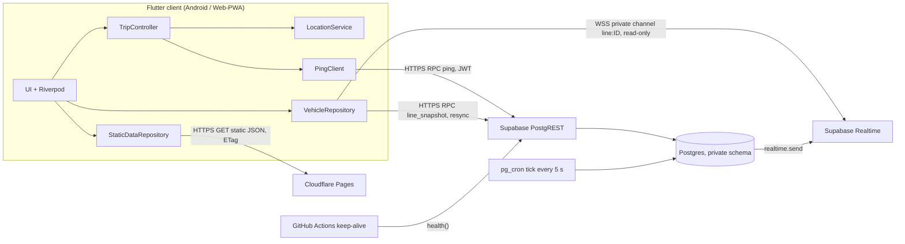
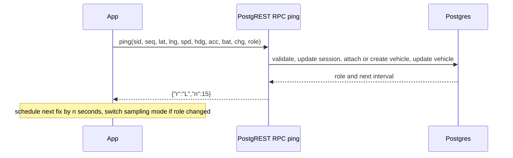
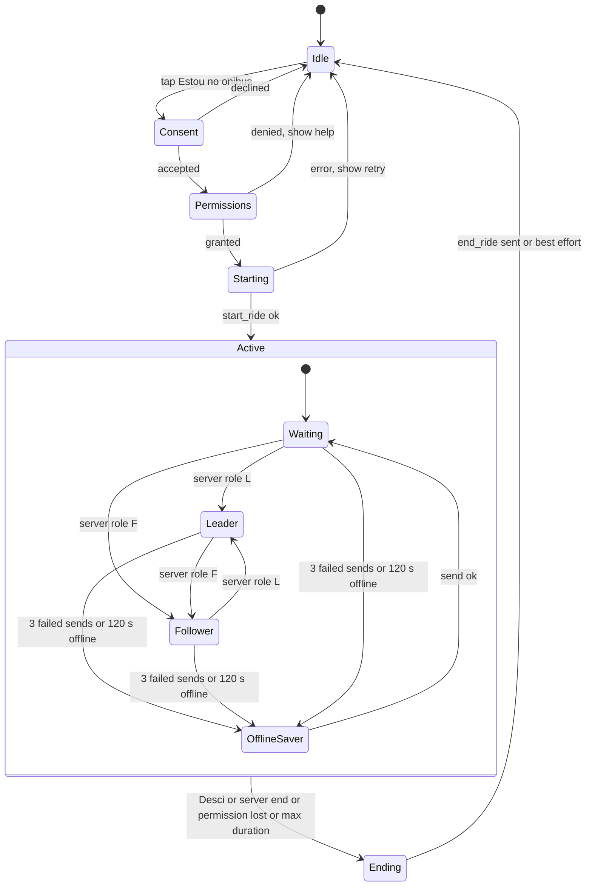

# PLAN.md — BusMateus (working title)

> Implementation plan for a collaborative, crowd-sourced bus-tracking app for **São Mateus, ES, Brazil**.
> **Version 1.0 — 2026-09-30.** Derived from `relatorio-tecnico-bus-tracking-sao-mateus.md` (v. 27/09/2026), plus the verification work and design changes listed in §2.
> This file is the build contract. Another model (and a human reviewer) must be able to build the alpha from this file alone.

## Table of contents

0. How to use this document (read first)
1. Product definition and alpha scope
2. Corrections and deviations from the report (with reasons)
3. Verified facts, constraints and assumptions
4. Requirements (functional, non-functional, security, privacy)
5. Architecture
6. Backend specification (Supabase)
7. Static data (lines, schedules, routes)
8. Client specification (Flutter)
9. UI specification (every screen)
10. Performance, battery and data engineering rules
11. Unstable-connection rules
12. Security specification
13. LGPD (Brazilian data-protection law) specification
14. Coding, architecture and commenting rules
15. Testing and QA strategy
16. Build plan (spikes, milestones, atomic tasks)
17. CI/CD, environments and release
18. Operations and runbooks
19. Risks and owner decisions
20. Appendices (strings, DoD checklists, policy outline)

---

## 0. How to use this document (read first)

### 0.1 Precedence
If two statements conflict, the higher one wins. Record the conflict and resolution in `DECISIONS.md`.

1. §12 (Security) and §13 (LGPD) — non-negotiable.
2. The budgets and rules in §4 and §10 (CPU, RAM, data, battery, resilience).
3. The rest of this plan.
4. The original report.

### 0.2 Conventions
- **MUST / SHOULD / MAY** follow RFC 2119.
- Scope tags: **[A]** = required for alpha. **[A\*]** = alpha "should" (cut first if time slips). **[L]** = later (do not build now; do not block on it).
- **VERIFY** = a fact that may have changed or that this plan could not fully confirm. Check against official docs when you reach that task, and write the result in `DECISIONS.md`. Never assume.
- IDs: `RFxx` / `RNFxx` keep the report's numbering; new ones continue the sequence. `SECxx` security, `PRVxx` privacy, `Dxx` deviation, `Sx` spike, `Txx` task, `KLx` known limitation.

### 0.3 Rules for the implementing model
1. **One change per task** (§16). Small commits. Do not start the next task until the current acceptance criteria pass.
2. **Spikes first** (§16 Phase A). They settle unknowns that could invalidate the design.
3. **Do not invent facts.** If a package API, a Supabase feature or a legal rule is not certain, mark it VERIFY, test it, record it.
4. When ambiguous, pick the **simplest option that satisfies every MUST rule**, write a short ADR in `DECISIONS.md`, and continue. Ask the owner only about items in §19.2.
5. **Never run "upgrade everything".** Dependencies change one package at a time (§14.7).
6. **Never** commit secrets, put the Supabase `service_role`/secret key in any client, log coordinates, or run abuse/load tests against production.
7. Language: code, comments, commit messages, docs = English. **User-visible strings = pt-BR.** Legal documents = pt-BR.
8. If a task needs something that this plan forbids (e.g., a new SDK), stop and write an ADR proposing it; do not add it silently.
9. Each task lists a recommended **Model/Effort (M/E)**. It is a recommendation: use a stronger setting for security-critical SQL, the ping/election logic and anything touching consent.

### 0.4 Working title and identifiers
- Product working title: **BusMateus** (rename freely; avoid "São Gabriel", "SGBus", "Mobilibus" or any operator trademark in the name, icon or store listing).
- Android `applicationId`: decide before the first store upload (cannot change afterwards). Proposal: `app.busmateus`. See §19.2.
- Repo name: `busmateus`.

---

## 1. Product definition and alpha scope

### 1.1 What it is
A free, independent, **non-official** app where riders of São Mateus' city buses share the bus's position while they ride. The backend merges the riders on the same bus into one **vehicle**, elects one rider's phone as **leader** (the one that reports often) to save everybody's battery, and shows other users a live map of vehicles per line, plus static timetables.

### 1.2 Principles (in priority order)
1. **Privacy and security first.** The server never exposes individual users; it stores the minimum; it erases location when the trip ends.
2. **Cheap for the phone**: CPU, RAM, mobile data, battery (the owner's top requirement).
3. **Works on bad networks** (3G/4G in a moving bus, tunnels, dead zones).
4. **Simplicity.** Fewest moving parts that satisfy 1–3. R$0 recurring infra.
5. Features.

### 1.3 Non-goals for alpha
Push notifications, favourites, trip history, delay statistics/ML ETA, admin panel, GTFS-Realtime export, accounts/login, payments, ads, analytics SDKs, iOS native app, intermunicipal lines, point-to-point route planning.

### 1.4 Adoption phases (from the report, condensed)
| Phase | Audience | Lines | Target |
|---|---|---|---|
| 0 | Owner | 1 line | works end-to-end alone |
| 1 | Classmates (Ufes/CEUNES) | 2–3 high-flow lines to campus | ≥1 active reporter per line most of the day |
| 2 | Students | student-relevant urban lines | organic use |
| 3 | City residents | all 21 urban lines | Play Console account paid (one-time US$25), local outreach |
| 4 | Future | municipal/intermunicipal, official data | partnership |

**This plan builds Phase 0 → Phase 1 ("alpha").** Everything else is kept possible but not built.

### 1.5 Alpha scope
**In:**
- Android app (Flutter), Portuguese (pt-BR) only.
- Web/PWA build (same codebase) so iOS users can at least **watch** the map [A]; web **sharing** (foreground only) [A\*].
- 1–3 pilot lines seeded manually (all 21 line names listed in the line list, but only pilot lines flagged `pilot`/live-capable) [A]; remaining lines show timetable only.
- Anonymous sessions (no sign-up), per-trip location sharing with explicit consent.
- Vehicle merging, leader election, live map, static timetables, offline-tolerant behaviour.
- Privacy center: policy, terms, "delete my data".

**Out:** see §1.3.

### 1.6 Alpha exit criteria ("alpha-stable")
All must hold before inviting classmates beyond the owner's own devices:
1. Pilot lines seeded with source attribution and a visible "unofficial timetable" notice.
2. ≥ 5 real bus trips recorded in field tests, including ≥ 2 phones on the same bus; leader hand-over occurred with **no visible gap > 20 s** on the map.
3. p95 latency from leader fix to map update on a viewer ≤ **10 s** (target ≤ 15 s per RNF04).
4. All security tests in §12.6 pass; no open P0/P1 finding.
5. 8-hour simulator soak on the dev project with no errors, no free-tier limit alarms.
6. Measured budgets in §10.1 are met on the reference devices (or each miss is documented with a fix plan).
7. Privacy policy + terms published and linked in-app; "delete my data" works end-to-end; consent flow verified.
8. App survives: screen off 30 min, airplane-mode toggle, app swiped from recents, GPS toggled off, permission revoked mid-trip (behaviours in §8.6).

### 1.7 Glossary
- **Session / ride session**: one rider's trip on one line (server row, erased at end).
- **Vehicle**: the server's estimate of one physical bus (one or more sessions attached).
- **Leader**: the session whose phone reports at high frequency for a vehicle. **Follower**: others, low frequency (redundancy). **Waiting** (`W`): session not yet attached to a moving vehicle.
- **Fix**: one GPS reading sent to the server.
- **Tick**: the server's periodic housekeeping job (every ~5 s).
- **Tile**: map image square.

---

## 2. Corrections and deviations from the report (with reasons)

The report is a good base. Verification and a deeper design pass found points that must change. Each deviation is binding; log new ones in `DECISIONS.md` using the same `Dxx` style.

| ID | Report said | This plan does | Why |
|---|---|---|---|
| D01 | Use `smart_location` plugin: "built-in anti-spoofing, native foreground service, offline cache; solves RNF12 for free". | Use **`geolocator`** directly (its Android foreground-notification config + `isMocked` flag, VERIFY) and implement filtering, scheduling and retry ourselves. | Verification found `smart_location` is a tiny, very new (March 2026) wrapper around `geolocator` (v0.0.4, ~23 weekly downloads, 2 deps) with none of the claimed features. A different package, `smart_location_plus`, is a geocoding/geofencing wrapper that requests `ACCESS_BACKGROUND_LOCATION`: **do not use it**. |
| D02 | Store `location_pings` (history) for hours, cluster from them. | **No ping history.** Each session row holds only the **latest** fix. Location columns are nulled when the trip ends. | Data minimisation (LGPD necessity principle), far less DB writes/size on a 500 MB free tier, simpler code. Nothing in alpha needs history. |
| D03 | Clients publish via Realtime Broadcast (binary payload); Edge Function does clustering. | **Ingestion = authenticated HTTPS RPC (PostgREST function)**; **Realtime is server→client only**; **no Edge Functions in alpha**. | Client-to-client/open broadcast cannot be validated or authorised and is spoofable. RPC gives JWT auth, ownership checks, validation, rate limits in SQL. Edge Functions have a 500k invocations/month free cap that a 15-s cadence would exceed; PostgREST API calls are not counted that way. Fewer components = smaller attack surface. |
| D04 | Windowed `ST_ClusterDBSCAN` over the last 30 s of pings. | **Attach-at-ping online clustering** against vehicle state, using **dead-reckoned** positions; periodic **tick** only for election, expiry, broadcast. | Followers report every ~90 s: their fix is up to ~900 m behind the bus by the next window, so DBSCAN on raw positions would split one bus into several. Dead-reckoning + tolerance fixes it and gives **stable vehicle IDs** (no marker flicker). |
| D05 | Vehicle position = cluster centroid. | Vehicle position = **newest accepted fix from any attached session**. | Centroid of fixes with different ages is biased backwards. |
| D06 | Leader/follower roles changed by the server; client implied to learn it. | Role and next interval are returned **in the `ping` response** (`{"r":"L","n":15}`). Leader hand-over is **two-phase** (new leader acks before old one is demoted). | No extra connection/subscription on the reporter; no gap at hand-over. |
| D07 | `schedules` table in Postgres. | Timetables are a **static, versioned JSON on the CDN, bundled in the app** (repo is source of truth). DB keeps only `private.lines` (ids, active flag, optional route). | Zero DB load, cacheable, works offline, easy review via PRs. |
| D08 | Client sends `recorded_at`. | **Server time only.** | Client clocks are wrong/spoofable; removes an attack surface and bytes. |
| D09 | RNF03: "poucas dezenas de KB" per trip. | Revised measurable budget (§10.1): leader ≤ ~0.5 MB/h, follower ≤ ~0.1 MB/h, viewer ≤ ~0.1 MB per 10 min of realtime. | Over PostgREST each request carries a ~1 KB JWT in headers, so "a few KB" is not reachable. Real data is still tiny. A WebSocket ingestion path is a **[L]** optimisation. |
| D10 | Legal basis: "legitimate interest" (defensible). | **Consent (LGPD art. 7, I) for location sharing**, obtained in a prominent in-app disclosure at "start trip", recorded server-side by consent version. Legitimate interest only for plain map viewing. Legal review still required. | Sharing is already opt-in per trip, so consent is natural, easier to prove, and matches Google Play's prominent-disclosure rule for location. |
| D11 | (Implicit) background location. | **No `ACCESS_BACKGROUND_LOCATION`.** Use a **foreground service (type `location`)** started from the visible app. **Swiping the app away ends the trip.** | Avoids Play's strict background-location review, is more privacy-preserving, and simpler to reason about. |
| D12 | OSM tiles as the map. | **OSM raster tiles with `flutter_map`'s built-in cache (≥ 8.2.0), behind a `TileSource` abstraction**, with an exit plan before Phase 2. | The public OSM tile server is for light use and forbids bulk download. See §8.9 and R-05. |
| D13 | Realtime binary payload. | **Compact JSON** (short keys, 5-decimal coordinates). Binary only if a spike proves a real gain. | Binary support unverified; JSON arrays of numbers are ~45 bytes per vehicle. |
| D14 | One Supabase project. | **Two** (dev, prod), both in region **South America (São Paulo)**, VERIFY region availability on the free plan. | Free plan allows 2 active projects; keeps data in Brazil (LGPD transfer simplicity) and lowers latency. |
| D15 | Realtime channels implicitly public. | **Private channels with Realtime Authorization (RLS on `realtime.messages`)**, "allow public access" turned **off**, clients have **no** send permission. | Prevents spoofed vehicle broadcasts. |
| D16 | Sessions are anonymous users. | Same, plus: persisted session (no re-sign-in each launch), daily purge of stale anonymous users, per-user quotas, global capacity cap, server-side kill switch. | Free-tier MAU/DB protection, abuse limits behind mobile carrier NAT (see §12.4). |
| D17 | Edge Function runs the 15-s loop. | **`pg_cron` tick (~5 s) calling a SQL function.** | No cold starts, no invocation quota, one fewer language/runtime to secure; 5 s tick keeps map latency low. VERIFY sub-minute cron on the plan. |

### Known limitations accepted for alpha
- **KL1 — Promotion latency.** A follower learns it became leader only at its next ping (≤ ~90 s). Mitigations: staggered follower phases; two-phase hand-over (no gap on planned rotation); vehicle shows "last seen N s ago". Improve later with shorter follower interval when the leader looks unstable.
- **KL2 — Lone rider = exact bus position = that rider's position.** Unavoidable for a crowdsourced bus tracker; disclosed in the consent text (§9, S06).
- **KL3 — Bunching.** Two buses of the same line closer than the tolerance (~80–150 m) can merge into one vehicle.
- **KL4 — Web/iOS** reports only with the screen on and the page open.
- **KL5 — Cold start.** No riders → no live data; timetables fill the gap.

---

## 3. Verified facts, constraints and assumptions

### 3.1 Verified during planning (2026-09-30)
- **Android developer verification.** Enforcement begins **30 Sep 2026** in Brazil, Indonesia, Singapore and Thailand: apps must be registered to a verified developer to be installed/updated on certified Android devices, including sideloaded APKs. Limited-distribution accounts (≤ 20 devices, no ID or fee for students/hobbyists) and an "advanced flow"/ADB route for unregistered apps exist. Global expansion is planned for 2027. VERIFY details at `developer.android.com/developer-verification` before every distribution decision.
- **Supabase free plan (mid-2026):** 500 MB database, 50k MAU (anonymous users count), 5 GB egress/month, 200 concurrent Realtime connections, 2 M Realtime messages/month (256 KB max message), 500k Edge Function invocations, **projects pause after 7 days of inactivity**, **no automatic backups**, Nano instance (shared CPU, ~0.5 GB RAM). Pro is US$25/month if ever needed.
- **flutter_map ≥ 8.2.0** has built-in tile caching on non-web platforms (default soft limit **1 GB — far too large; cap it**, §8.9). Web has no built-in cache (browser HTTP cache is used).
- `smart_location` is not what the report describes (see D01).

### 3.2 Still VERIFY (done inside spikes S1–S4)
- `geolocator` Android foreground-service behaviour with screen off / app swiped away; `Position.isMocked` availability; notification action button support.
- Supabase: `realtime.send(...)` from SQL to private channels; RLS on `realtime.messages` for `SELECT` and absence of client `INSERT`; sub-minute `pg_cron` syntax; anonymous sign-in rate limits and CAPTCHA options; São Paulo region on the free plan; whether `last_sign_in_at`/`auth.sessions` columns used by the purge job exist as assumed.
- Flutter Web: `--wasm` build support/size; service-worker behaviour in the current stable Flutter; Screen Wake Lock on iOS standalone PWAs.
- Play Console: foreground-service permission declaration; closed-testing requirements for new personal accounts (the number of testers and days has changed over time).

### 3.3 Assumptions
- Single operator (Viação São Gabriel); no official open data; timetables transcribed manually from public sources (§7.5).
- Pilot users have Android phones with Google Play Services and 2–4 GB RAM; some are low-end.
- São Mateus is in UTC−3 (America/Sao_Paulo). Store UTC; display local time.
- The owner is a Flutter/Dart/Deno user (Riverpod + go_router in other projects). Reuse those habits: **Riverpod (no codegen), go_router, Deno for tooling**.

---

## 4. Requirements

Status tags: **[A]** alpha-must, **[A\*]** alpha-should, **[L]** later.

### 4.1 Functional requirements (RF)

| ID | Requirement | Tag | Notes / change vs report |
|---|---|---|---|
| RF01 | User picks the line they are riding from the list of urban lines. | A | Lines without `pilot` flag show timetable only. |
| RF02 | Starting a **trip session** happens when the user taps "Estou no ônibus" and confirms. | A | Requires consent (§13) + permissions. |
| RF03 | User can end the trip manually ("Desci"). | A | Also from the Android notification (tap opens trip screen; action button if plugin supports it). |
| RF04 | Session ends automatically: idle (<50 m net movement for 10 min), no ping for 10 min, hard cap 4 h, permission revoked, app swiped away. | A | Server enforces; client also ends early where it can. |
| RF05 | App sends periodic fixes: lat, lng, speed, heading, accuracy, battery (5 % steps), charging flag. | A | **No client timestamp** (D08). |
| RF06 | Backend attaches sessions of the same line that are close and coherent to one **vehicle**. | A | Attach-at-ping (D04). |
| RF07 | Backend elects a leader per vehicle: prefers charging, then highest battery (≥ 15 % unless alone), tie → least time led. | A | |
| RF08 | Leader reports every ~15 s while moving (~30 s still); followers every ~90 s ± jitter; waiting sessions every ~20 s. | A | Server tells the client the next interval in each response. |
| RF09 | Leadership re-evaluated every ~5 min and immediately if the leader is dead (>45 s silent). Two-phase hand-over. | A | |
| RF10 | User sees vehicles (not individual users) of the selected line on a map and in a list. | A | |
| RF11 | User can view timetables of any line without any live data. | A | Static JSON. |
| RF12 | Server discards implausible fixes: outside city bounding box, accuracy > 60 m, speed > 25 m/s (~90 km/h), implied speed between fixes > 30 m/s with > 200 m jump, and (when route geometry exists) > 300 m from the route (not published). | A | Strikes → session ended after 5. |
| RF13 | No persistent identity tied to location: anonymous auth; session rows keep no history; location erased at trip end. | A | See §13. |
| RF14 | **Consent** screen (prominent disclosure) before the first trip and whenever the consent version changes; consent version recorded server-side. | A | New. |
| RF15 | **Delete my data**: ends active session, deletes server-side records for this anonymous user, signs out and clears local storage. | A | New (LGPD art. 18). |
| RF16 | "Você ainda está no ônibus?" prompt when the device appears to be walking (slow-speed pattern) or after long idle; no answer in 3 min → trip ends. | A\* | New. |
| RF17 | **Kill switch / maintenance / forced update**: static `config.json` (CDN) and server flag; app shows a blocking or banner state. | A | New (ops safety). |
| RF18 | Live-lines indicator on the home list (which lines have vehicles now). | A | One cheap RPC `live_summary`. |
| RF19 | Route polyline drawn on the line map (from pilot-line traces). | A\* | Encoded polyline, lazy loaded. |
| RF20 | Stops layer / next-bus-at-stop ETA. | L | |
| RF21 | Community timetable corrections form. | L | Report §12.3. |
| RF22 | Notifications, favourites, history, delay stats. | L | Out of scope (report §4). |

### 4.2 Non-functional requirements (RNF)

Budgets are **targets to validate** on the reference devices (§10.1, §15.5). If a target is unreachable, document why and the nearest achievable value; never silently relax.

| ID | Requirement | Tag |
|---|---|---|
| RNF01 | Recurring infra cost R$0 (free tiers only). One-time Play fee (US$25) is a separate "legal" cost. | A |
| RNF02 | Battery: leader phone's extra drain ≤ ~4 %/h over idle baseline; follower ≤ ~2 %/h; viewing map ≤ a typical map app. | A |
| RNF03 | Data (revised, D09): leader ≤ ~0.5 MB/h, follower ≤ ~0.1 MB/h; viewer realtime ≤ ~0.1 MB/10 min; first map view ≤ ~1.5 MB (tiles), repeat views ≤ ~0.1 MB (cache). | A |
| RNF04 | Fix → viewer map update: target < 15 s, alpha target p95 ≤ 10 s. | A |
| RNF05 | Usable on unstable 3G/4G: no blocking spinners on cached data, bounded timeouts, backoff, latest-wins semantics (§11). | A |
| RNF06 | Data minimisation and short retention (§13.4). | A |
| RNF07 | Works with few users per line (single rider = valid vehicle once moving). | A |
| RNF08 | Backend survives free-tier auto-pause: daily keep-alive from GitHub Actions; app shows a friendly "waking up" state (a cold resume can take ~30 s). | A |
| RNF09 | Android keeps tracking with screen off / app in background **while the foreground service runs**. | A |
| RNF10 | iOS/Web states clearly that tracking needs the screen on and page open. | A |
| RNF11 | Runs well on entry-level phones (2 GB RAM, Android 8–10 era CPUs) and low-end iPhones via PWA. | A |
| RNF12 | Resists simple GPS spoofing: client `isMocked` rejection + server plausibility, bounding box, route check, strikes, quotas. | A |
| RNF13 | **Cold start**: first Flutter frame ≤ 2 s mid-range / ≤ 3.5 s low-end; no network call blocks first paint. | A |
| RNF14 | **Size**: Android download (arm64, AAB) ≤ 15 MB; Web first load ≤ 3 MB transferred (compressed). | A |
| RNF15 | **Memory**: ≤ ~150 MB PSS with map visible; ≤ ~80 MB during a trip with screen off. | A |
| RNF16 | **CPU**: trip tracking with screen off averages < 2 % CPU; map pan ≥ 55 fps on a low-end device for ≥ 90 % frames. | A |
| RNF17 | **Accessibility**: TalkBack-usable, 48 dp targets, contrast ≥ 4.5:1, text scale to 200 %, no information by colour alone. | A |
| RNF18 | **Observability without PII**: server-side aggregate counters and Play vitals only; no analytics SDKs; no coordinates in any log. | A |
| RNF19 | **Reproducible infra**: the whole backend can be rebuilt from `supabase/migrations` + `data/`. (No backups on free plan; data is ephemeral or in git.) | A |
| RNF20 | **Graceful capacity**: when free-tier limits are near, degrade (refuse new sessions, longer intervals) instead of failing. | A |

### 4.3 Security requirements (SEC) — details in §12

| ID | Requirement |
|---|---|
| SEC01 | No client can read or write any table directly; only a small whitelist of RPC functions and one read-only Realtime topic family. |
| SEC02 | A user can only act on **their own** session; other users' sessions are indistinguishable from non-existent ones. |
| SEC03 | No secret key in any client or repo. Only the public (anon/publishable) key ships. |
| SEC04 | All SQL functions: `SECURITY DEFINER`, `SET search_path = ''`, fully-qualified names, typed params, no dynamic SQL, explicit `REVOKE`/`GRANT`. |
| SEC05 | Clients cannot publish to Realtime channels; public channels are disabled. |
| SEC06 | TLS everywhere; no cleartext on Android; strict security headers on the web build. |
| SEC07 | Input validated twice (client for UX, server for truth). |
| SEC08 | Per-user rate limits, per-user quotas, global capacity cap, blocklist, kill switch. |
| SEC09 | Supply chain: pinned dependencies, lockfiles committed, minimal allow-list of packages, 2FA on GitHub/Supabase/Cloudflare/Google accounts. |
| SEC10 | Automated security tests (pgTAP + abuse simulator) run in CI before every release. |

### 4.4 Privacy requirements (PRV) — details in §13

| ID | Requirement |
|---|---|
| PRV01 | Collect only: pseudonymous user id, line, latest fix (lat, lng, speed, heading, accuracy), battery bucket, charging flag, server timestamps, consent version. |
| PRV02 | Never collect: name, e-mail, phone, contacts, device identifiers (IMEI/Android ID/advertising ID), installed apps, photos, microphone. Do not store IP addresses ourselves. |
| PRV03 | Location erased the moment a session ends; session metadata deleted within 1 h; vehicles deleted ≤ 2 min after last fix; inactive anonymous users deleted after 30 days. |
| PRV04 | Other users only see **vehicles**, never sessions, battery or user ids. |
| PRV05 | In-app privacy policy + terms (pt-BR), "delete my data", consent version tracking, a contact channel for data-subject requests. |
| PRV06 | No third-party SDKs that collect data (no Firebase/Crashlytics/Ads/Analytics). |
| PRV07 | Data region Brazil (Supabase São Paulo); disclose every third party that sees IPs (Cloudflare, OSM tile servers, Supabase). |

---

## 5. Architecture

### 5.1 Overview



### 5.2 Components and responsibilities

| Component | Does | Must NOT |
|---|---|---|
| **Flutter app** | UI, consent, location sampling, ping client, map, static data cache | hold secrets, trust its own validation, log coordinates |
| **Cloudflare Pages** | hosts Web build, static JSON (`manifest.json`, `config.json`, `lines.<hash>.json`, `routes/*.json`), legal pages | store user data |
| **Supabase Auth** | anonymous sign-in only | allow e-mail/phone/OAuth sign-ups |
| **Supabase PostgREST** | exposes whitelisted RPCs in `public` | expose tables or the `private` schema |
| **Postgres (`private` schema)** | sessions, vehicles, lines, config, consents, quotas | be readable by `anon`/`authenticated` |
| **pg_cron** | tick, cleanup, purge | run unbounded work (guard with advisory lock + early exit) |
| **Supabase Realtime** | pushes vehicle snapshots per line on private channels | accept client broadcasts |
| **GitHub Actions** | CI, keep-alive ping, release builds | hold the Supabase secret key (needed only for migrations: use a dedicated DB password/access token in Actions secrets, scoped, rotated) |

### 5.3 Data flows

**A. Start trip**
1. App (already signed in anonymously) calls `accept_consent(version)` once per consent version.
2. App requests OS permissions, then calls `start_ride(line, first fix, accuracy, battery)`.
3. Server validates (kill switch, quotas, capacity, bbox, line active, blocklist, consent version), ends any stale active session of that user, inserts a session, returns `{sid, r:"W", n:20}`.
4. App starts the foreground service and the fix stream.

**B. Ping (every fix)**


**C. Tick (every ~5 s, server only)**: expire/end sessions → erase locations → election → delete dead vehicles → build per-line payload → `realtime.send` only for lines that changed.

**D. View**: open line screen → `line_snapshot(line)` (instant state) → subscribe `line:<id>` (private) → apply messages → on reconnect or 45 s silence with vehicles present → snapshot again → on leave/background → unsubscribe.

**E. End trip**: `end_ride(sid)` (best-effort); server also ends by timeout. Local state cleared. Location columns nulled server-side.

### 5.4 Trust boundaries
- **Untrusted:** every client, every JWT claim except `sub`, every parameter, the network.
- **Trusted:** Postgres functions (`SECURITY DEFINER`), `pg_cron`, repo-controlled static data.
- A compromised client can at best (a) report fake positions for its own session within bounds, (b) be rate-limited/ended. It cannot read others' data or touch tables.

---

## 6. Backend specification (Supabase)

### 6.1 Project setup checklist
1. Two projects: `busmateus-dev`, `busmateus-prod`, region **South America (São Paulo)** (VERIFY availability). 2FA on the Supabase account.
2. **Auth**: enable *Anonymous sign-ins*; disable e-mail/phone/OAuth sign-ups; JWT expiry default (1 h) is fine; raise the anonymous sign-in rate limit above the default (mobile carriers in Brazil use CGNAT, so many legitimate users share one IP; the default per-IP limit can block real users); VERIFY CAPTCHA option for web (Cloudflare Turnstile) and enable on web if abuse appears.
3. **API**: exposed schemas = `public` only. Max rows small. Keep the `private` schema **not exposed**.
4. **Realtime**: turn **off** "Allow public access" (private channels only). Enable Realtime Authorization.
5. **Extensions**: `postgis` (route checks), `pg_cron`. (No `pg_net`, no Edge Functions.)
6. **Defence in depth:** `alter default privileges in schema public revoke execute on functions from anon, authenticated, public;` — Supabase by default grants EXECUTE on new `public` functions to `anon` and `authenticated`; every function therefore needs an explicit `REVOKE`/`GRANT` (below).
7. **Secrets:** only the publishable/anon key goes to clients. The `service_role`/secret key is never used by this project (no Edge Functions) and must not be copied anywhere.
8. Keep `supabase/config.toml` and all SQL in git (`supabase/migrations/`). Forward-only migrations.

### 6.2 Schema (reference DDL — implement, then test)

```sql
-- 0001_init.sql (sketch; adapt to current Supabase conventions: extensions live in schema "extensions")
create schema if not exists private;
revoke all on schema private from public, anon, authenticated;

-- ---- configuration (tunable without redeploy) -------------------------------------------------
create table private.app_config (key text primary key, value jsonb not null);

-- ---- lines (ids mirror data/lines.json; never reuse ids) --------------------------------------
create table private.lines (
  id        smallint primary key,
  code      text not null unique check (code ~ '^[a-z0-9-]{2,40}$'),
  is_active boolean  not null default true,
  route     extensions.geography(LineString, 4326)          -- optional, pilot lines only
);

-- ---- vehicles (server's estimate of one physical bus) -----------------------------------------
create table private.vehicles (
  id            bigint generated always as identity primary key,
  line_id       smallint not null references private.lines(id),
  lat           double precision not null,
  lng           double precision not null,
  heading       smallint,                       -- 0..359, null if unknown
  speed_mps     real     not null default 0,
  fix_at        timestamptz not null,           -- server time of newest accepted fix
  leader_sid    uuid,                           -- confirmed leader session
  next_leader   uuid,                           -- pending hand-over target
  last_elect_at timestamptz not null default now(),
  created_at    timestamptz not null default now(),
  updated_at    timestamptz not null default now()
) with (fillfactor = 70);
create index vehicles_line_idx on private.vehicles(line_id);

-- ---- ride sessions: ONE row per trip; only the LATEST fix is kept ----------------------------
create table private.ride_sessions (
  id            uuid primary key default gen_random_uuid(),
  user_id       uuid not null references auth.users(id) on delete cascade,
  line_id       smallint not null references private.lines(id),
  vehicle_id    bigint references private.vehicles(id) on delete set null,
  started_at    timestamptz not null default now(),
  last_seen_at  timestamptz,
  ended_at      timestamptz,
  end_reason    text check (end_reason in ('user','idle','timeout','max_duration','abuse','server','permission')),
  seq           integer  not null default 0,
  lat double precision, lng double precision,             -- NULLed when the session ends
  speed_mps real, heading smallint, accuracy_m smallint,
  battery_pct smallint, charging boolean,
  role          char(1) not null default 'W' check (role in ('L','F','W')),
  moving_ticks  smallint not null default 0,
  still_ticks   smallint not null default 0,
  coherence_fail smallint not null default 0,
  strikes       smallint not null default 0,
  anchor_lat double precision, anchor_lng double precision, anchor_at timestamptz,   -- idle detection
  led_s         integer not null default 0              -- time spent as leader (rotation tie-break)
) with (fillfactor = 70);
create unique index one_active_session_per_user on private.ride_sessions(user_id) where ended_at is null;
create index active_sessions_by_vehicle on private.ride_sessions(vehicle_id) where ended_at is null;
create index active_sessions_by_line    on private.ride_sessions(line_id)    where ended_at is null;
create index ended_sessions_by_time     on private.ride_sessions(ended_at)   where ended_at is not null;

-- ---- consent proof (LGPD art. 8 §2: controller must be able to prove consent) -----------------
create table private.consents (
  user_id uuid not null references auth.users(id) on delete cascade,
  version smallint not null,
  accepted_at timestamptz not null default now(),
  primary key (user_id, version)
);

-- ---- abuse control ---------------------------------------------------------------------------
create table private.blocked_users (user_id uuid primary key, reason text, blocked_at timestamptz default now());

-- ---- per-line broadcast bookkeeping ------------------------------------------------------------
create table private.line_state (line_id smallint primary key references private.lines(id), last_sent_at timestamptz, last_count smallint default 0);

-- Defence in depth: RLS on, NO policies, no grants.
alter table private.app_config      enable row level security;
alter table private.lines           enable row level security;
alter table private.vehicles        enable row level security;
alter table private.ride_sessions   enable row level security;
alter table private.consents        enable row level security;
alter table private.blocked_users   enable row level security;
alter table private.line_state      enable row level security;
revoke all on all tables in schema private from public, anon, authenticated;
```

**Default config (`private.app_config`)** — all values tunable via SQL without a release:

| key | default | meaning |
|---|---|---|
| `service_enabled` | `true` | kill switch |
| `consent_version` | `1` | current consent text version |
| `bbox` | `{"lat_min":-19.05,"lat_max":-18.40,"lng_min":-40.25,"lng_max":-39.55}` | accepted area (approximate; VERIFY against real municipal routes) |
| `max_active_sessions` | `150` | global capacity cap (free tier protection) |
| `max_starts_per_hour` | `6` | per user |
| `min_ping_interval_s` | `4` | per session |
| `accuracy_max_m` | `60` | reject worse fixes |
| `speed_max_mps` | `25` | ≈ 90 km/h (RF12) |
| `teleport_speed_mps` / `teleport_min_m` | `30` / `200` | implied-speed check |
| `strikes_to_end` | `5` | abuse threshold |
| `route_max_dist_m` | `300` | off-route threshold (only if route exists) |
| `attach_base_tol_m` / `attach_speed_factor` / `attach_tol_max_m` | `80` / `0.5` / `400` | attach tolerance: `min(max, base + factor·speed·age)` |
| `coherence_fails_to_detach` | `2` | |
| `moving_speed_mps` / `moving_ticks_to_publish` | `3` / `2` | a new vehicle is created only after sustained movement |
| `leader_interval_moving_s` / `leader_interval_still_s` | `15` / `30` | |
| `follower_interval_s` / `follower_jitter_s` | `90` / `10` | |
| `waiting_interval_s` | `20` | |
| `leader_dead_after_s` | `45` | |
| `member_alive_s` | `300` | |
| `publish_ttl_s` | `120` | vehicle hidden if no fix for this long |
| `reelect_every_s` | `300` | |
| `leader_min_battery` | `15` | unless alone |
| `idle_displacement_m` / `idle_end_after_s` | `50` / `600` | |
| `session_timeout_s` / `session_max_s` | `600` / `14400` | |
| `ended_row_retention_s` | `3600` | for quota counting only (no location) |
| `anon_user_ttl_days` | `30` | purge |

### 6.3 Public API (RPC functions in `public`) — the **only** client surface

All: `LANGUAGE plpgsql SECURITY DEFINER SET search_path = ''`, typed params, no dynamic SQL. Each ends with `revoke all on function ... from public, anon; grant execute on function ... to authenticated;` — except `health()` (also `anon`). Every function begins by checking `auth.uid() is not null`. Errors that are *normal flow* are returned as JSON `{"e":"<code>"}` with HTTP 200 (cheaper and simpler for the client); malformed input or missing auth raises an exception.

| RPC | Params | Returns | Purpose |
|---|---|---|---|
| `health()` | — | `'ok'` | keep-alive; callable by `anon`; does nothing else |
| `accept_consent(p_version smallint)` | version | `{ok:true}` | store consent proof (version must equal current) |
| `start_ride(p_line smallint, p_lat float8, p_lng float8, p_acc real, p_bat smallint, p_chg boolean)` | | `{"sid":"…","r":"W","n":20}` or `{"e":"capacity"\|"quota"\|"maint"\|"consent"\|"area"\|"blocked"\|"line"}` | create session |
| `ping(p_sid uuid, p_seq int, p_lat float8, p_lng float8, p_spd real, p_hdg smallint, p_acc real, p_bat smallint, p_chg boolean, p_role text)` | | `{"r":"L"\|"F"\|"W","n":<s>}` plus optional `"e":"gone"\|"idle"\|"timeout"\|"abuse"\|"maint"` and `"a":1` ("ask: still on the bus?") | main ingest |
| `end_ride(p_sid uuid)` | | `{ok:true}` | idempotent end |
| `line_snapshot(p_line smallint)` | | `{"t":<epoch_s>,"v":[[id,lat,lng,hdg,kmh,n,age_s],…]}` | initial/resync state |
| `live_summary()` | — | `[[line_id,count],…]` only lines with ≥1 published vehicle | home list indicators |
| `delete_me()` | — | `{ok:true}` | erase this anonymous user (cascade) |

Notes:
- `p_role` is the role the client **currently believes it has**. It is only an acknowledgement for hand-over; the server never grants anything because of it.
- Round coordinates to 5 decimals (~1.1 m) in all outputs.
- `n` in vehicle arrays is the member count **capped at 3** (display-only confidence; never an exact number).
- Sessions of other users are never returned in any form (SEC02). For a session id not owned by the caller, `ping`/`end_ride` behave exactly as for a non-existent one: `{"e":"gone"}`.

### 6.4 `ping` algorithm (normative)

Run inside one transaction. Take `pg_advisory_xact_lock(line_id)` (per line, serialises attach/create so two riders cannot create duplicate vehicles) and `SELECT … FOR UPDATE` on the caller's session row.

1. **Auth/ownership**: `uid = auth.uid()`; load session where `id = p_sid and user_id = uid and ended_at is null` else return `{"e":"gone"}`. Check `service_enabled` (`"maint"`) and blocklist.
2. **Sequence**: if `p_seq <= seq` → duplicate/out-of-order → return current instruction without changes.
3. **Rate limit**: if `now - last_seen_at < min_ping_interval_s` → `strikes += 1`, return current instruction.
4. **Validate**: finite numbers; lat/lng inside bbox; `acc <= accuracy_max_m`; `0 <= spd <= speed_max_mps`; heading null or 0..359; battery 0..100. Invalid → `strikes += 1`, ignore fix, return instruction. `strikes >= strikes_to_end` → end session (`abuse`).
5. **Teleport check** vs stored position: implied speed `> teleport_speed_mps` and distance `> teleport_min_m` → strike, ignore.
6. **Route check** (only if the line has `route`): distance to route `> route_max_dist_m` → mark off-route: store fix, **do not attach/publish**, no strike (detours exist).
7. **Store** fix on the session; `seq = p_seq`; `last_seen_at = now`; battery/charging; update `moving_ticks`/`still_ticks` (moving if `spd >= moving_speed_mps`; still if `spd < 0.5`).
8. **Idle check**: if no anchor or distance(anchor, fix) `> idle_displacement_m` → reset anchor; else if `now - anchor_at > idle_end_after_s` → end session (`idle`), return `{"e":"idle"}`.
9. **Attach**:
   - If not attached: find the **nearest** vehicle on the same line whose *predicted* position (dead-reckoned from its last fix by `age = now - fix_at`, capped at 60 s) is within `tol(age) = min(attach_tol_max_m, attach_base_tol_m + attach_speed_factor · speed · age)`. If found → attach (no movement needed; the rider may board while the bus is stopped).
   - Else if `moving_ticks >= moving_ticks_to_publish` → **create** a vehicle at this fix and attach (this session becomes leader).
   - Else stay **Waiting** (`W`): the user may have pressed "start" while still at the stop; never publish a stopped lone session as a bus.
   - If attached: coherence check vs predicted vehicle position; on failure `coherence_fail += 1`, on success reset to 0; `coherence_fail >= coherence_fails_to_detach` → detach (becomes Waiting; may re-attach/create on the next fix). A detached session that is slow (walking) never creates a vehicle (needs `moving_ticks`).
10. **Update vehicle** if this fix is newer than `fix_at`: position, speed, heading, `fix_at = now`, `updated_at = now`.
11. **Role & interval** (what the client must do next):
    - Waiting → `{"r":"W","n":waiting_interval_s}`.
    - `vehicle.leader_sid = sid` → `L`; interval `leader_interval_moving_s`, or `leader_interval_still_s` if `still_ticks >= 2`.
    - `vehicle.next_leader = sid` → respond `L`; **if** `p_role = 'L'` (client has already switched) then `leader_sid = sid; next_leader = null` (**phase 2**).
    - else `F`; interval `follower_interval_s ± random(follower_jitter_s)`.
    - If the vehicle has **no** leader (new vehicle or leader gone) the first attached session becomes leader immediately.
12. Optionally set `"a":1` when the slow-speed (walking) pattern persists ≥ 4 min (RF16).

**Dead reckoning helper** (equirectangular, fine at city scale):
```
lat2 = lat + (v·dt·cos(h)) / 111320
lng2 = lng + (v·dt·sin(h)) / (111320·cos(lat))     -- h in radians, clockwise from north; if heading null use lat,lng unchanged and widen tolerance by v·dt
```
Use a plain haversine helper `private.dist_m(lat1,lng1,lat2,lng2)` (IMMUTABLE, PARALLEL SAFE). PostGIS is needed only for the optional route check.

### 6.5 `tick` algorithm (pg_cron every ~5 s)

```
tick():
  if not pg_try_advisory_xact_lock(<const>) then return;      -- never overlap
  if not service_enabled then return;
  if no active sessions and no vehicles then return;          -- early exit (cheap when idle)

  1. END sessions: last_seen_at < now - session_timeout_s  → 'timeout'
                   started_at   < now - session_max_s      → 'max_duration'
     (set ended_at, end_reason; NULL lat/lng/speed/heading/accuracy/battery/anchor; keep row for quotas)
  2. DELETE ended sessions older than ended_row_retention_s.
  3. For each vehicle:
       members := active sessions attached with last_seen_at > now - member_alive_s
       if none → delete vehicle.
       leader_alive := leader_sid in members and its last_seen_at > now - leader_dead_after_s
       if not leader_alive → next_leader := best(members)   (leader_sid cleared)
       else if now - last_elect_at >= reelect_every_s → cand := best(members);
            if cand != leader_sid → next_leader := cand;  last_elect_at := now
       led_s += tick_period for the leader's session
  4. Per line with changes since line_state.last_sent_at (any vehicle updated, removed, or count changed):
       payload := {"t":epoch_s, "v":[[id, round(lat,5), round(lng,5), heading, round(speed·3.6), min(n,3), age_s], …]}
       only vehicles with now - fix_at <= publish_ttl_s
       perform realtime.send(payload, 'v', 'line:'||line_id, true);    -- private topic
       update line_state
```
`best(members)` = eligible members (battery ≥ `leader_min_battery`, or only member) ordered by: charging first, higher `battery_pct`, lower `led_s`, older `started_at`.

### 6.6 Realtime authorization (SQL sketch — VERIFY syntax in S2)

```sql
-- Clients may only RECEIVE messages on topics "line:<id>"; there is NO insert policy, so clients cannot send.
create policy "read line topics" on realtime.messages
  for select to authenticated
  using ( realtime.topic() ~ '^line:[0-9]{1,4}$' );
```
Server publishes with `realtime.send(payload, 'v', 'line:7', true)` from the tick function (runs as the function owner, not a client).

### 6.7 Scheduled jobs (`pg_cron`)

| Job | Schedule | Does |
|---|---|---|
| `bm_tick` | every 5 s (VERIFY seconds syntax; fall back to 10 s or 1-minute-plus-self-loop if unavailable) | §6.5 |
| `bm_purge_anon` | daily ~03:30 America/Sao_Paulo | delete anonymous `auth.users` with no session activity for `anon_user_ttl_days` (cascade removes consents and ended sessions); VERIFY `auth.sessions` columns |
| `bm_vacuum_hint` | none needed | autovacuum default is enough at this size; use `fillfactor` + HOT updates |

Keep-alive: a GitHub Actions workflow calls `health()` daily (prevents the 7-day pause). Do not rely on `bm_tick` to count as activity.

### 6.8 Backend tests (pgTAP, `supabase test db`) — see §12.6 and §15.2 for the full list.

### 6.9 Capacity maths (free tier, to keep in mind)
- Reporters use HTTPS RPC → they do **not** consume Realtime connections. Viewers do (≤ 200 concurrent): one connection per open map screen; unsubscribe on leave/background.
- Realtime messages count per delivery. A viewer on a line with one active vehicle receives ~4 msgs/min. 2 M msgs/month ≈ 33 k viewer-hours at that rate. Plenty for alpha; watch it in Phase 2+.
- Egress 5 GB/month: per-trip traffic is tiny; tiles come from OSM (not Supabase).
- DB: no history → size stays far below 500 MB.

---

## 7. Static data (lines, schedules, routes)

### 7.1 Source of truth and pipeline
- **The repo is the source of truth.** Humans edit `data/lines/*.json` (one file per line) and `data/routes/<code>.geojson`. A Deno tool validates and builds:
  1. `build/lines.<hash>.json` — all lines + timetables (immutable, content-hashed name).
  2. `build/routes/<code>.<hash>.json` — encoded polyline (precision 5) per pilot line.
  3. `build/manifest.json` — `{ "data_version": "...", "lines": "lines.<hash>.json", "routes": {"<code>": "routes/<code>.<hash>.json"}, "generated_at": "..." }`.
  4. `build/config.json` — remote flags: `{ "min_app_version": "0.1.0", "maintenance": false, "message_pt": "", "consent_version": 1, "tile_url": "https://tile.openstreetmap.org/{z}/{x}/{y}.png" }`.
  5. `supabase/seed/lines.sql` — `insert … on conflict do update` for `private.lines (id, code, is_active)`; route geometry loaded separately for pilot lines.
- Build output is deployed to Cloudflare Pages with cache headers: `manifest.json` and `config.json` → `Cache-Control: no-cache` (use ETag); hashed files → `public, max-age=31536000, immutable`.
- The app **bundles** the latest `lines.json` + `manifest.json` as assets (first run works offline). At runtime it fetches `manifest.json` at most once per day (conditional GET), downloads a new `lines.<hash>.json` only if the name changed, and swaps it atomically.

### 7.2 `data/lines/<code>.json` schema (v1)
```json
{
  "schema": 1,
  "id": 1,
  "code": "aroeira-cohab",
  "short": "AC",
  "name": "Aroeira / Cohab",
  "terminals": ["Aroeira", "Cohab"],
  "area_tags": ["Aroeira", "Cohab"],
  "is_active": true,
  "pilot": true,
  "schedules": [
    { "day_type": "weekday",         "origin": "Aroeira", "times": ["05:30", "06:10"] },
    { "day_type": "saturday",        "origin": "Aroeira", "times": ["06:00"] },
    { "day_type": "sunday_holiday",  "origin": "Aroeira", "times": ["07:00"] }
  ],
  "source_ids": ["onibus-online"],
  "verified_at": null
}
```
Rules: `id` is a stable smallint, **never reused**; `code` is an immutable slug (`^[a-z0-9-]{2,40}$`); removing a line = `is_active:false`; times are `HH:MM` 24 h, ascending, unique; `day_type ∈ {weekday, saturday, sunday_holiday}`; `short` ≤ 3 chars (badge), unique across lines. File budget: all lines ≤ 100 KB raw (≈ 10–15 KB compressed).
`data/sources.md` lists every source with URL, retrieval date and licence/permission status.

### 7.3 Validation (CI-enforced)
JSON Schema validation, unique ids/codes/shorts, sorted times, UTF-8, size budget, no unknown keys, every `source_ids` entry exists.

### 7.4 Route geometry [A\*]
- Pilot-line route traces come from the **owner's own recorded rides** (Phase 0) or manual tracing — never from scraping Moovit.
- Tool: GPX/GeoJSON → simplify (Douglas–Peucker ≈ 5 m) → encoded polyline for the app, `geography(LineString)` for `private.lines.route`.
- Each route file ≤ ~8 KB. Fetched lazily when a line screen opens; cached on disk.

### 7.5 Acquiring timetable data (care rules)
- Transcribe **manually** and sparingly from the public sources listed in the report (operator site, onibus.online, horariodeonibus.net). No aggressive automation, honour each site's terms and `robots.txt`.
- **Do not scrape Moovit** (terms of use); look at it manually only to cross-check names.
- Mark everything "best effort / unofficial" in the UI; keep `verified_at` null until confirmed by the operator or a rider.
- Contact the operator/Secretaria de Mobilidade in parallel (report §12.2); keep correspondence out of the repo if it contains personal data.
- If the owner later publishes compiled data, choose a licence (open question §19.2).

---

## 8. Client specification (Flutter)

### 8.1 Targets and versions
- Flutter **latest stable at M0**; pin it (`.fvmrc` or CI `flutter-version`) and write it in README. Dart 3 (sealed classes, records, pattern matching).
- Android: `minSdk` = Flutter's current default (VERIFY; ≥ API 24 likely), `targetSdk` = Play's current requirement (VERIFY at release). Build **AAB** for Play and **per-ABI split APKs** for direct tests.
- Web: `flutter build web --release` (+ `--wasm` if S4 proves it smaller/faster); PWA manifest + icons.
- iOS native: **not built** (D-report). iOS users use the PWA.

### 8.2 Package allow-list (anything else needs an ADR)

| Purpose | Package | Notes |
|---|---|---|
| State | `flutter_riverpod` | plain providers, **no code generation** |
| Routing | `go_router` | flat routes, no shell route needed |
| Backend | `supabase_flutter` | Auth (anonymous), RPC, Realtime. Disable URL/deep-link session detection (not used). Pass a custom keep-alive HTTP client (§11.2). |
| Map | `flutter_map` (≥ 8.2.0), `latlong2` | raster tiles + built-in cache (capped) |
| Location | `geolocator` | foreground-service config on Android; `isMocked` |
| Battery | `battery_plus` | level + charging only |
| Prefs | `shared_preferences` | tiny key/values (consent version, theme, data version) |
| Wake lock (web/iOS) | `wakelock_plus` | only on the trip screen, web build |
| Links | `url_launcher` | open policy URL / mail |
| Notifications permission | smallest viable option (VERIFY `geolocator`'s notification config + Android 13 runtime permission; if a plugin is needed use the lightest, with a minimal permission set) | |
| Polyline decode | tiny pure-Dart function (≈ 25 lines) | no package |
| Tests | `flutter_test`, `mocktail` | |

**Forbidden:** Firebase/FCM/Crashlytics/Analytics, Google Maps SDK, ad SDKs, any telemetry SDK, local DBs (Drift/Isar/ObjectBox — not needed in alpha), `permission_handler` (unless S1 proves it is the only way and its permissions are trimmed), `build_runner` code-gen, `freezed`, large icon/font packages (use system font + Material icons with tree-shaking).

### 8.3 Project layout (feature-first, layered; Dart files ≤ ~300 lines)

```
app/
  lib/
    main.dart                         # bootstrap only: runApp quickly, defer init
    app/                              # app.dart, router.dart, theme/ (tokens, light/dark), strings_pt.dart
    core/
      config/                         # env.dart (dart-define), constants.dart (mirrors server defaults), feature flags
      errors/                         # typed failures, Result helpers
      logging/                        # Log (no coordinates; ring buffer in memory, release = warnings only)
      net/                            # http client factory (keep-alive), backoff.dart, retry policy
      geo/                            # haversine, bbox, polyline decode, plausibility helpers (pure Dart)
      time/                           # monotonic clock wrapper, formatters pt-BR
    data/
      static_data/                    # StaticDataRepository (bundle + CDN + ETag + atomic swap)
      api/                            # BusApi: typed wrappers over rpc() calls + DTOs
      realtime/                       # VehicleRepository (snapshot + channel + watchdog + poll fallback)
      prefs/                          # PrefsRepository
    domain/                           # PURE DART (no Flutter imports)
      models/                         # Line, Schedule, Vehicle, TripSnapshot
      trip/                           # TripState (sealed), TripReducer, SamplingPolicy, AutoEndPolicy
    features/
      home/                           # lines list + live indicators
      line/                           # line screen (map tab, schedule tab)
      trip/                           # consent, permissions, trip screen, TripController, LocationService, PingClient
      settings/                       # settings, privacy center, about
      system/                         # maintenance / update-required / offline banner
    platform/                         # android/ (foreground service glue), web/ (wakelock, install hint)
  test/                               # mirrors lib/
  integration_test/
supabase/ (migrations, tests, seed)   data/   tools/   docs/   .github/workflows/
```

Rules: `domain/` never imports Flutter or Supabase. `features/*` talk to `data/*` only through Riverpod providers. UI widgets contain **no business logic** (they read state, call controller methods). One public class per file when large.

### 8.4 App bootstrap (performance-critical)
1. `main()` → `runApp(ProviderScope(child: App()))` immediately; native splash only (no Flutter splash screen).
2. Home renders from **bundled** static data on the first frame.
3. After the first frame (`WidgetsBinding.addPostFrameCallback`): initialise Supabase, ensure anonymous session (reuse persisted), then in idle time fetch `config.json` + `manifest.json`. **No network call may block rendering.**
4. If `config.json` says `maintenance:true` or `min_app_version` > current → show system screen (S13). If the fetch fails → ignore silently (use last known/bundled).

### 8.5 Trip state machine (pure Dart `TripReducer` — unit-test heavily)



State is a **sealed class**; transitions are a pure function `(state, event) → (state, effects)`; effects (start service, call API, show notification) are executed by `TripController`. Only one trip at a time.

### 8.6 Location service and sampling policy (Android; Web uses the same policy with browser geolocation)

**Separation of concerns:** `LocationService` produces fixes; `SamplingPolicy` (pure) decides mode; `PingClient` sends. **Send each accepted fix immediately; keep one request in flight; coalesce (latest wins).**

| Mode | When | Location request | Send cadence |
|---|---|---|---|
| `waiting` | role `W` | balanced accuracy, ~20 s | every fix (~20 s) |
| `leaderMoving` | role `L`, moving | high accuracy, ~10–15 s interval | server `n` (~15 s) |
| `leaderStill` | role `L`, still ≥ 60 s | balanced, ~30 s | server `n` (~30 s) |
| `follower` | role `F` | low-power/balanced, ~90 s interval (stream recreated with long interval) | server `n` (~90 s ± jitter) |
| `offlineSaver` | 3 failed sends or no success for 120 s | follower-like sampling, no uploads except **probes** (30 → 60 → 120 s, jitter) | probe only |
| `paused` | permission revoked / location services off / mock detected | stream stopped | none; show banner (see below) |

Rules:
- Change mode only on a role/state change, with **hysteresis** (don't recreate the location stream more than once per 30 s).
- **Drop** a fix on the client if: `isMocked` (VERIFY), accuracy > 60 m, outside the bounding box, or timestamp older than 20 s. (Server re-checks everything.)
- Round before sending: lat/lng to 5 decimals, speed to 0.1 m/s, battery to 5 % steps.
- `seq` increments per **accepted fix** (not per attempt).
- Never queue history. If offline, keep only the **latest** fix. After reconnect send the latest only.

**Android foreground service:**
- Permissions (merged manifest must contain exactly these location/FGS ones): `INTERNET`, `ACCESS_FINE_LOCATION`, `ACCESS_COARSE_LOCATION`, `FOREGROUND_SERVICE`, `FOREGROUND_SERVICE_LOCATION`, `POST_NOTIFICATIONS`. **Not allowed:** `ACCESS_BACKGROUND_LOCATION`, `RECEIVE_BOOT_COMPLETED`, `REQUEST_IGNORE_BATTERY_OPTIMIZATIONS`, `WAKE_LOCK` unless a spike proves it is indispensable (wake locks cost battery). Audit the **merged** manifest in CI and strip stray plugin permissions with `tools:node="remove"`.
- Service type `location`; start it **only from the visible activity after a user tap** (Android 12+ forbids starting foreground services from the background).
- Persistent notification: title "Compartilhando viagem — {linha}", text "Toque para abrir ou encerrar". Include an "Encerrar" action if the plugin supports it; otherwise tapping opens the trip screen where "Desci" is one tap.
- **Swiping the app from recents ends the trip** (service stops; server times out in ≤ 10 min, usually sooner via no-ping end). Document this in the Help text.
- Doze/OEM battery killers: a moving bus rarely enters Doze, but some OEMs kill background work aggressively. Provide a one-time help card (S08) telling users to set the app's battery use to "Unrestricted/Sem restrições" if the trip stops. Do **not** request the battery-optimisation exemption permission.

**Permission denied / revoked mid-trip:** stop stream, send `end_ride` best-effort, show S07 (with "Abrir ajustes"). **GPS toggled off:** `paused` + banner "Ative a localização"; auto-resume when it returns; if > 5 min paused → end trip. **Mock location detected:** drop fixes, show "Localização simulada detectada — desative para compartilhar".

### 8.7 Ping client (`PingClient`)
- Calls `BusApi.ping(...)` with a **single persistent HTTP client** (keep-alive, §11.2), timeout 8 s.
- Success → apply `{r, n, e, a}`: update role/mode, schedule next send for `n` seconds after the **last send** (not after the response), handle `e`: `gone`/`timeout`/`idle`/`abuse` → end trip locally with the matching message; `maint` → pause + banner; `a:1` → show "Ainda no ônibus?" prompt.
- Failure → classify: network (timeout/DNS/TLS) → count failure, backoff; `401` → refresh session once and retry once; `429`/`5xx` → backoff honouring `Retry-After`; other `4xx` → stop trip with a generic error (likely outdated app).
- Backoff (only for connectivity failures): 5 s → 10 s → 20 s → 40 s → cap 60 s, **±20 % jitter**, reset on success. Never retry a fix older than the newest one.

### 8.8 Vehicle repository (viewer)
1. On entering a line screen: show cached last-known vehicles instantly (if < 2 min old), call `line_snapshot`.
2. Subscribe to private channel `line:<id>` (ensure the auth token is set on Realtime). On each message replace the line's vehicle list (messages are full snapshots of that line).
3. **Watchdog:** if the line has ≥ 1 vehicle and no message for 45 s → call `line_snapshot` again and, if the socket is not joined, resubscribe. If the socket is down for > 30 s → **fallback polling** of `line_snapshot` every 20 s (stop polling when the socket returns).
4. On app `paused` (background) or leaving the screen → **unsubscribe and stop polling**. On `resumed` → snapshot + resubscribe.
5. Marker ages are computed locally: `ageNow = ageFromServer + (monotonicNow − receivedAt)`. Never use the device wall clock.
6. A vehicle absent from the newest snapshot is removed (fade out ≤ 300 ms).

### 8.9 Map specification
- `flutter_map` with a `TileSource` abstraction: `OsmTileSource` (default, alpha) and room for `SelfHostedTileSource`/`KeyedTileSource` later (URL from `config.json`; no API keys in the repo).
- **OSM policy compliance (MUST):** set `userAgentPackageName`; show the visible attribution "© OpenStreetMap contributors" (tappable); **never bulk-download or pre-fetch** regions; keep the cache enabled; one tile layer; no multi-subdomain tricks.
- **Cap the built-in cache** (default soft limit is 1 GB): set ≈ **50 MB** (VERIFY the `BuiltInMapCachingProvider` configuration API); on web rely on the browser HTTP cache.
- Camera: initial centre São Mateus city; `minZoom 12`, `maxZoom 17` (data savings; no zoom ≥ 18), `cameraConstraint` to the bounding box; `retinaMode` **off** (4× fewer bytes; accept slightly softer tiles); interaction flags: pan + pinch only (disable rotation/fling tricks that cause extra tile churn).
- Rendering: wrap the map in `RepaintBoundary`; markers are lightweight widgets (circle + arrow via `CustomPainter` or `Icon`), **max ~20 markers**; no per-frame animation: tween marker position once per update over ≤ 800 ms (skipped when `MediaQuery.disableAnimations`).
- Dark theme: keep standard tiles (no colour filters — they cost GPU); dim UI chrome only.
- Tiles are the largest data cost in viewing. Defaults: limit zoom range, no retina, keep cache, don't reload tiles on every setState (keep the `TileLayer` const-like).

### 8.10 Static data repository
`StaticDataRepository` exposes `Stream<LinesData>`; loads bundled asset → overlays cached remote copy → conditional-GET manifest (≤ 1/day, only on Wi-Fi *or* mobile, tiny) → atomic swap of file in app documents dir. Validates schema version; on any parse error keeps the previous copy.

### 8.11 Local storage
`shared_preferences` only: `consent_version_accepted`, `theme_mode`, `data_version`, `last_manifest_etag`, `help_card_seen`. **Never** store coordinates, trip history, or session ids beyond the active trip's in-memory state. Android `allowBackup="false"` and `dataExtractionRules` excluding everything (prevents the anonymous token from being cloned through cloud backup).

### 8.12 Web/PWA specifics
- Same code; `kIsWeb` branches isolated in `platform/web/`.
- Sharing allowed only in **foreground**: request geolocation on tap; hold a **Screen Wake Lock** during a trip (battery cost: screen stays on — tell the user to lower brightness); if unsupported show text.
- Banner (always visible during a web trip): "Mantenha esta tela aberta e o celular desbloqueado." Pause/stop on `visibilitychange` hidden for > 60 s.
- iOS: show a one-time "Adicionar à Tela de Início" hint (Safari share sheet) for a better PWA experience.
- Service worker/offline shell: VERIFY the current Flutter default behaviour (S4). If the generated service worker is unavailable or unreliable, ship a minimal custom one that caches the app shell and `lines.<hash>.json` only (never API responses, never tiles).
- Security headers via Cloudflare Pages `_headers` (§12.5).

---

## 9. UI specification (every screen)

### 9.1 Design principles
1. **One-handed, glanceable, calm.** Few controls per screen; the primary action is always reachable with the thumb (bottom area).
2. **Instant.** Every screen paints from local data first; network results fill in. No full-screen spinners on cached content.
3. **Honest.** Always say what is live vs. timetable, how old a position is, and that timetables are unofficial.
4. **Cheap.** No images, no custom fonts, no Lottie, no gradients/blur, minimal shadows, minimal animation (respect "reduce motion").
5. **Accessible by default** (§9.4).

### 9.2 Design tokens
- Material 3. `ColorScheme.fromSeed(seedColor: 0xFF0B6E4F)` (deep green) for light and dark; allow `ThemeMode.system | light | dark`. Dark theme uses near-black surfaces (battery on OLED).
- Semantic colours: `live` green `#16A34A` (also paired with a **text label**, never colour alone), `stale` amber `#B45309`, `error` red per scheme.
- Typography: **system font only**, M3 text styles; never fix font sizes in px — use theme styles so 200 % text scale works.
- Spacing scale: 4 / 8 / 12 / 16 / 24 / 32. Corner radius 12 (cards), 20 (bottom sheets), full (chips/badges). Elevation 0–1.
- Touch targets ≥ 48×48 dp. Icons from the built-in Material set only (tree-shaken).
- Line badge: rounded rectangle, 40×28 dp, `short` text (≤ 3 chars) on a colour derived deterministically from the line `id` (6-colour palette checked for contrast ≥ 4.5:1).
- All strings live in `app/lib/app/strings_pt.dart` as constants (pt-BR). No hard-coded text in widgets. Dates `dd/MM/yyyy`, times `HH:mm`, relative "há 12 s", "há 3 min".

### 9.3 Navigation map

```
Welcome (first run only)
  └─► Home (Linhas) ──► Line (tabs: Mapa | Horários) ──► Share-trip sheet ──► Trip (active)
        │                                                        └─► Permission help / Consent
        └─► Settings ──► Privacy center ──► Policy / Terms / Delete data
                    └─► About & data sources
Global overlays: Offline banner · Maintenance screen · Update-required screen
```
`go_router` flat routes: `/welcome`, `/`, `/line/:id`, `/trip`, `/settings`, `/privacy`, `/privacy/policy`, `/privacy/terms`, `/about`, `/system`. The trip route cannot be popped by the system back button without confirmation while a trip is active (back minimises the app instead).

### 9.4 Accessibility rules (apply to all screens)
- Every interactive element has a `Semantics` label (pt-BR). Vehicles on the map are **also listed** below/over the map as text rows (TalkBack and low-vision users do not need the map).
- Contrast ≥ 4.5:1 text, ≥ 3:1 UI. State is never by colour alone (icon + text).
- Focus order follows visual order. Dialog titles announce. Live status text uses `liveRegion`.
- Respect reduce-motion and bold-text settings. Tested at 200 % text scale on a 360 dp-wide screen: no clipped or overlapping text (use `Flexible`/wrapping; lists scroll).

### 9.5 Screens

#### S01 — Native splash
Native Android splash (theme background + launcher icon). No Flutter splash. Goal: first Flutter frame ≤ 2 s (mid), ≤ 3.5 s (low-end).

#### S02 — Welcome (first run only) `/welcome`
Purpose: explain in 20 seconds, no permissions yet.
```
┌──────────────────────────────────┐
│                                  │
│        (app icon, 72 dp)         │
│   Acompanhe o ônibus ao vivo     │  headlineSmall
│                                  │
│  • Veja onde o ônibus está       │
│  • Quem está dentro compartilha  │
│    a posição, de forma anônima   │
│  • Sem cadastro, sem anúncios    │
│                                  │
│  App independente e não oficial. │  bodySmall
│                                  │
│ [          Começar          ]    │  FilledButton (bottom, full width)
│   Como funciona a privacidade    │  TextButton → Privacy summary sheet
└──────────────────────────────────┘
```
Behaviour: "Começar" stores `welcome_seen` and goes to Home. No location prompt here. States: none (static).

#### S03 — Home / Linhas `/`
Purpose: choose a line; see which have live vehicles.
```
┌──────────────────────────────────┐
│ BusMateus                    ⚙   │  AppBar: title, settings icon
├──────────────────────────────────┤
│ [ Buscar linha ou bairro      ]  │  SearchBar (local filter, no network)
├──────────────────────────────────┤
│ Ao vivo agora                    │  sectionHeader (only if any live)
│ ┌──────────────────────────────┐ │
│ │ [AC] Aroeira / Cohab      ●  │ │  ● + "Ao vivo" text (semantic)
│ │      1 ônibus ao vivo        │ │
│ └──────────────────────────────┘ │
│ Todas as linhas                  │
│ [SG] Guriri via Beira-Mar        │
│      Só horários                 │  subtitle for non-pilot lines
│ [SC] Santa Tereza / Cohab        │
│ ...                              │
├──────────────────────────────────┤
│ Horários não oficiais.           │  persistent footnote
└──────────────────────────────────┘
```
Data: lines from static data (instant). Live indicators from `live_summary()` — called on open, on `resumed`, and on pull-to-refresh (min 10 s between calls); **no polling timer**.
States: *loading live info* → list shows without dots (no spinner); *live failed* → small inline "Não foi possível atualizar o ao vivo" with retry; *search empty* → "Nenhuma linha encontrada"; *offline* → global banner; list still works.
Interactions: tap tile → S04. Settings icon → S10. List uses `ListView.builder`, items `const`-friendly, fixed item extent.

#### S04 — Line screen, Mapa tab `/line/:id`
Purpose: see vehicles of this line; start sharing.
```
┌──────────────────────────────────┐
│ ←  Aroeira / Cohab         ⋮    │  AppBar (overflow: "Sobre os dados")
│ [ Mapa ] [ Horários ]            │  TabBar
├──────────────────────────────────┤
│                                  │
│          (flutter_map)           │  RepaintBoundary
│     ➤ vehicle markers            │
│                                  │
│ © OpenStreetMap contributors     │  attribution (tappable)
├──────────────────────────────────┤
│ ● Ao vivo · atualizado há 8 s    │  status row (liveRegion)
│ Ônibus 1 · a caminho do Centro?  │  list rows (text alternative to map)
│ ┌──────────────────────────────┐ │
│ │      Estou no ônibus         │ │  FilledButton (primary action)
│ └──────────────────────────────┘ │
└──────────────────────────────────┘
```
Marker: circle with the line badge colour + a small heading arrow; selected marker shows a tooltip "Há 8 s". No direction text is claimed unless known (omit "a caminho de" in alpha — use only "Ônibus 1 · há 8 s · 32 km/h").
Status row states:
- **Live**: "● Ao vivo · atualizado há N s" (green dot + text).
- **Stale** (age > 45 s): "◐ Última posição há N min" amber + text.
- **No vehicles**: card "Nenhum ônibus compartilhando agora. Veja os horários ou ajude compartilhando sua viagem." with buttons [Ver horários] [Estou no ônibus].
- **Connecting**: small "Conectando…" text (not blocking).
- **Offline**: banner "Sem conexão — mostrando a última posição conhecida" (if cache < 2 min) else "Sem conexão".
- **Non-pilot line** (no live capability): the map tab shows the route area and a note "Esta linha ainda não tem rastreamento ao vivo. Veja os horários." and **hides** "Estou no ônibus".
Interactions: tap marker/list row → center map; "re-center" FAB appears after the user pans away. Leaving the screen unsubscribes from Realtime.

#### S05 — Line screen, Horários tab
Purpose: timetable without any live data.
```
┌──────────────────────────────────┐
│ ←  Aroeira / Cohab               │
│ [ Mapa ] [ Horários ]            │
├──────────────────────────────────┤
│ ( Dias úteis )( Sábado )( Dom/Fer)│  SegmentedButton, default = today
│ Saída de: [ Aroeira ▾ ]          │  origin selector (if >1 origin)
│                                  │
│ Próximo: 14:35  (em 12 min)      │  highlighted card
│ 05:30  06:10  06:50  07:30       │  Wrap of time chips, grouped by hour
│ 08:10  ...                       │  past times dimmed
├──────────────────────────────────┤
│ ⓘ Horários não oficiais, reunidos│
│ de fontes públicas. Podem estar  │
│ desatualizados. Atualizado em    │
│ 05/10/2026.                      │
└──────────────────────────────────┘
```
Day-type default is computed from the **local São Mateus date** (Sat → `saturday`, Sun → `sunday_holiday`; public holidays are not auto-detected in alpha — the user can switch). "Próximo" uses device local time converted to America/Sao_Paulo (fixed UTC−3 offset is acceptable for alpha; the zone has no DST). Empty state: "Sem horários cadastrados para este dia." Never hits the network.

#### S06 — Share-trip sheet (consent) — modal bottom sheet
Purpose: **prominent disclosure + consent** (required by LGPD design and Google Play policy). Shown before the first trip and whenever `consent_version` changes.
```
┌──────────────────────────────────┐
│ Compartilhar sua localização     │  titleLarge
│                                  │
│ Para mostrar onde o ônibus está, │
│ este app coleta a localização do │
│ seu celular enquanto a viagem    │
│ estiver ativa — inclusive com a  │
│ tela bloqueada ou o app em       │
│ segundo plano.                   │
│                                  │
│ • Usada só para posicionar o     │
│   ônibus no mapa.                │
│ • Não é ligada ao seu nome,      │
│   e-mail ou telefone.            │
│ • É apagada quando a viagem      │
│   termina.                       │
│ • Outros usuários veem a posição │
│   do ônibus, não quem está nele. │
│   Se só você compartilhar, a     │
│   posição do ônibus é a sua.     │
│ • Você pode encerrar quando      │
│   quiser.                        │
│                                  │
│ Política de Privacidade          │  link
│                                  │
│ [ Aceitar e continuar ]          │  FilledButton
│ [ Agora não ]                    │  TextButton
└──────────────────────────────────┘
```
Flow: Accept → `accept_consent(version)` (if it fails because offline, store acceptance locally and retry before `start_ride`; `start_ride` returns `{"e":"consent"}` if missing) → system permission dialogs (S07) → `start_ride`.
Rules: no pre-ticked boxes; consent text identical on web; text versioned (`consent_version`); the sheet must be dismissible without side effects.

#### S07 — Permission education and denied states (dialogs/sheets)
- **Before system prompt** (only if not yet granted): "Para compartilhar, o app precisa da localização *enquanto estiver em uso*. Nós **não** pedimos localização 'o tempo todo'." [Continuar] → OS dialog. Then (Android 13+) notification permission: "A notificação mostra que a viagem está ativa e permite encerrar." [Continuar].
- **Denied (can ask again):** "Sem permissão de localização. Sem ela não dá para compartilhar a viagem." [Tentar de novo] [Cancelar].
- **Denied permanently:** same text + [Abrir ajustes] (opens app settings) [Cancelar].
- **Notification denied:** non-blocking note: "Sem a notificação, o Android pode encerrar o compartilhamento. Recomendamos permitir." The trip may continue.
- **Location services off:** "Ative a localização do aparelho." [Abrir ajustes].
- **Web:** browser prompt text pre-explained; if blocked: instructions for Safari/Chrome site settings.

#### S08 — Trip screen (active) `/trip`
Purpose: show that sharing is on, give a big way out, show health at a glance, cost almost nothing.
```
┌──────────────────────────────────┐
│ Compartilhando viagem            │  AppBar (no back arrow)
│ Aroeira / Cohab                  │
├──────────────────────────────────┤
│  ● Compartilhando                │  status (liveRegion)
│  Tempo de viagem  00:23:41       │  updates 1×/s only if screen is on
│                                  │
│  Conexão     ✓ Conectado         │  or "✕ Sem conexão — tentando de novo"
│  GPS         ✓ Bom               │  or "Fraco" / "Desligado"
│  Seu celular  Modo economia      │  follower
│               ─ or ─             │
│  Seu celular  Enviando com mais  │  leader: "Revezamos a cada poucos
│               frequência         │  minutos para poupar a bateria de
│                                  │  todos."
│                                  │
│  ⓘ Se parar sozinho, defina a    │  one-time help card (dismissible):
│    bateria do app como "Sem      │  battery usage "Unrestricted"
│    restrições".                  │
│                                  │
│ ┌──────────────────────────────┐ │
│ │   Desci — encerrar viagem    │ │  FilledButton.tonal / error colour, 56 dp
│ └──────────────────────────────┘ │
└──────────────────────────────────┘
```
Rules:
- **No map** and no animations on this screen (CPU/battery). A text status only. A link "Ver mapa" is optional [L].
- The elapsed-time ticker runs **only while the screen is visible**; otherwise nothing runs except the foreground service and ping loop.
- "Desci" → immediate local end (stop service) then best-effort `end_ride` with a 5 s timeout; show S09.
- Web variant adds the banner "Mantenha esta tela aberta e o celular desbloqueado." and a "Baixe o brilho" tip; shows wake-lock status.
- Prompt dialog (RF16): "Você ainda está no ônibus?" [Sim, continuar] [Desci]; no answer in 3 min → end trip.
- States: *waiting for movement* ("Aguardando o ônibus sair…"), *leader*, *follower*, *offline saver* ("Sem conexão. Vamos retomar assim que voltar."), *paused* (permission/GPS banner with action).

#### S09 — Trip ended (dialog or full-screen card)
Content: "Viagem encerrada. Obrigado por ajudar!" plus the reason when automatic:
- idle: "Encerramos porque o celular ficou parado por 10 minutos."
- timeout/limit: "Encerramos por tempo máximo ou falta de sinal."
- permission: "Encerramos porque a permissão de localização foi removida."
- abuse: "Encerramos por envios de localização inconsistentes."
- server maintenance: "Serviço em manutenção. Tente mais tarde."
Button [Voltar às linhas]. No statistics, no history, no share button.

#### S10 — Settings `/settings`
List (no network):
- **Tema**: Sistema / Claro / Escuro.
- **Privacidade e dados** → S11.
- **Sobre e fontes de dados** → S12.
- **Ajuda**: "Como compartilhar uma viagem", battery tip, web/iOS notice.
- **Falar com a gente**: `mailto:` the privacy/support contact (§19.2).
- Version + data version ("Horários: 05/10/2026").

#### S11 — Privacy center `/privacy`
- "Política de Privacidade" and "Termos de Uso": bundled pt-BR text (works offline) with link to the canonical web page.
- "O que coletamos" — a 6-line summary mirroring §13.2.
- **"Apagar meus dados"** → confirmation dialog: "Isso encerra sua viagem, apaga os dados ligados a este aparelho no servidor e reinicia o app." [Cancelar] [Apagar]. Calls `delete_me()`, signs out, clears prefs, returns to S02. If offline: "Sem conexão. Tente novamente quando estiver online." (do **not** pretend success).
- "Revogar consentimento": ends any trip and clears the local consent flag (next trip asks again).
- Contact for data-subject requests (LGPD art. 18).

#### S12 — About and data sources `/about`
Text: "App independente e não oficial. Não é da Viação São Gabriel nem da Prefeitura de São Mateus." Data sources list (from `data/sources.md`, shipped in the static data), "© OpenStreetMap contributors" with link to its copyright page, open-source licences screen (Flutter `showLicensePage`), repository link.

#### S13 — System screens (blocking)
- **Maintenance** (`config.maintenance` or server `maint`): "Serviço em manutenção. Os horários continuam disponíveis." [Ver horários] [Tentar de novo]. Timetables stay usable.
- **Update required** (`min_app_version`): "Atualize o app para continuar." [Atualizar] (store link or PWA reload). Timetables remain usable.
- **Waking up** (server cold resume, ~30 s): "Acordando o servidor… isso pode levar alguns segundos." with a bounded retry (max 3 attempts, then the generic error).

#### S14 — Offline banner (global, non-blocking)
Thin banner at the top: "Sem conexão. Mostrando dados salvos." Appears after the first failed request, disappears after the next success. Never blocks input.

### 9.6 Notification (Android, trip active)
Title "Compartilhando viagem — {linha}"; text "Toque para abrir ou encerrar"; ongoing; low importance (no sound/vibration); small monochrome icon. Channel name "Viagem ativa".

### 9.7 Microcopy rules
Short, friendly, second person (você), no jargon ("ping", "cluster", "líder" never appear in the UI — use "enviando com mais frequência"). Errors say **what happened and what to do**. Never blame the user.

---

## 10. Performance, battery and data engineering rules

### 10.1 Budgets (measure on the reference devices; §15.5)

| Metric | Budget |
|---|---|
| First Flutter frame (release) | ≤ 2 s mid-range, ≤ 3.5 s low-end |
| Android download size (arm64 AAB) | ≤ 15 MB (universal APK ≤ 25 MB) |
| Web first load (compressed) | ≤ 3 MB; repeat load ≤ 0.2 MB |
| RAM (PSS) | ≤ 150 MB map visible; ≤ 80 MB trip with screen off |
| CPU during trip, screen off | average < 2 % |
| UI | build p95 < 8 ms, raster p95 < 8 ms on mid-range; map pan ≥ 55 fps (≥ 90 % frames) on low-end |
| Leader data | ≤ ~0.5 MB/h (≈ 240 fixes × ≤ 2 KB) |
| Follower data | ≤ ~0.1 MB/h (≈ 40 fixes × ≤ 2 KB) |
| Viewer realtime | ≤ ~0.1 MB per 10 min |
| First map view | ≤ ~1.5 MB tiles; repeat ≤ ~0.1 MB |
| Battery | leader ≤ ~4 %/h above idle; follower ≤ ~2 %/h |
| Latency | fix → viewer p95 ≤ 10 s (target < 15 s) |

**Reference devices (minimum):** one low-end Android (≤ 2 GB RAM, Android 9–10), one mid-range Android (recent), one iPhone with Safari (PWA). Record exact models in `docs/field-tests/devices.md`.

### 10.2 Rules (CPU / RAM)
1. Release/profile builds only for measurements. Impeller default on Android.
2. `const` constructors everywhere possible; `ListView.builder`; no `shrinkWrap` on long lists; fixed `itemExtent` when rows are uniform.
3. Rebuild narrowly: Riverpod `select`, small widgets, no providers watched at the top of big screens.
4. No work in `build()`. No JSON parsing on the UI isolate for payloads > ~20 KB (use `compute`; timetable file is small enough to decode once at load).
5. Timers: **one** repeating timer at most per screen, cancelled in `dispose`; none in background except the ping scheduler.
6. Map: one `TileLayer`, ≤ ~20 markers, `RepaintBoundary`, no per-frame animation.
7. No images/assets beyond launcher icon; fonts = system; icons tree-shaken.
8. Dispose every `StreamSubscription`, `Timer`, `AnimationController`, `Channel`. Lint rules enforce it (§14.2).
9. Avoid opacity animations, `BackdropFilter`, `ShaderMask`, large `ClipPath`, `saveLayer` triggers.
10. Release builds: `--obfuscate --split-debug-info`, R8 shrink on, `--tree-shake-icons`, split per ABI.

### 10.3 Rules (battery)
1. Foreground service **only** during an active trip; stop it on any end path.
2. Followers sample GPS rarely (low-power mode, long interval); leaders sample at the minimum rate that meets the 15 s cadence.
3. Prefer *fewer, well-spaced* radio wake-ups; do not add extra timers/polls. Viewer screens never poll while the socket is healthy.
4. No wake locks on Android. On web the screen wake lock is used **only** on the trip screen.
5. Trip screen: no map, no animation; the elapsed-time ticker pauses when the screen is off.
6. Drop to `offlineSaver` quickly when offline (stop high-accuracy GPS).
7. Don't hold the CPU awake for retries: backoff + jitter; no tight loops.

### 10.4 Rules (data)
1. Compact payloads: short JSON keys in realtime messages, coordinates rounded to 5 decimals, numbers not strings.
2. **Latest-wins**: never upload backlog. No batching of old fixes.
3. Keep-alive HTTP connection for pings (a fresh TLS handshake costs more than the ping). VERIFY in S2 how long the edge keeps idle connections; choose the follower interval (60–90 s) to maximise reuse if it matters.
4. Static data: conditional GET, content-hashed immutable files, gzip/brotli from the CDN.
5. Map: capped zoom, no retina, disk cache, no prefetch.
6. Realtime: one channel at a time; unsubscribe when not visible.
7. No remote images, no web fonts, no telemetry.

---

## 11. Unstable-connection rules

### 11.1 Principles
- **Offline-first read path:** home list, timetables, last-known vehicles (< 2 min) work without network.
- **Latest-wins write path:** only the newest fix matters; old fixes are dropped.
- **Everything has a timeout, a backoff and a ceiling.** No unbounded retries, no tight loops, no blocking spinners.
- **Idempotent:** `seq` makes duplicate/out-of-order delivery harmless; `end_ride` is idempotent.
- **The server is the clock.**

### 11.2 Network client
- One shared HTTP client for the app, with: connect timeout 5 s, total request timeout 8 s, keep-alive/idle timeout ≥ 60 s, gzip accepted, no automatic retries (the app owns retry policy), TLS only.
- Supabase auto token refresh stays on; handle `401` once per request.
- Offline detection by **request failures**, not by a connectivity plugin (fewer wake-ups, fewer plugins). Optionally use `connectivity_plus` hints later [L].

### 11.3 Failure matrix

| Situation | App behaviour | Server behaviour |
|---|---|---|
| Brief loss (< 20 s) | skip sends; next fix goes out when possible | nothing special |
| Loss 20–120 s | backoff sends; keep leader role locally | leader considered dead after 45 s → a follower may be promoted at its next ping |
| Loss > 120 s | `offlineSaver` (low-power GPS, probes 30→60→120 s) | session survives until 10 min without ping |
| Back online | probe succeeds → `W/L/F` as instructed; first send = latest fix | normal; may re-attach |
| Slow 3G (RTT > 2 s) | 8 s timeout; never queue; one request in flight | |
| Duplicate/out-of-order request | n/a | `seq` check ignores it |
| Token expired offline | on reconnect: refresh, retry once | 401 → client refresh |
| Realtime socket drop | auto-rejoin; snapshot on rejoin; polling every 20 s after 30 s down | |
| Backend paused (free tier) | S13 "waking up", ≤ 3 retries over ~60 s, then generic error | resumes ~30 s after first request |
| Free-tier limit reached | `{"e":"capacity"}` → "Muitas pessoas compartilhando agora; tente em instantes." | refuse new sessions, keep existing |
| App killed / swiped | trip ends; no resurrection | session times out ≤ 10 min |
| Phone reboot | no auto-resume (no boot receiver) | session times out |
| App update during trip | trip ends | |

---

## 12. Security specification

### 12.1 Threat model (summary)

| # | Threat | Example | Controls |
|---|---|---|---|
| T1 | Reading other users' data | calling REST on tables, guessing session ids | tables in non-exposed `private` schema, RLS on + no policies, no grants; RPC-only; ownership check; opaque UUIDv4 ids; indistinguishable `gone` response |
| T2 | Writing/altering others' data | ping/end with someone else's `sid` | `user_id = auth.uid()` in every statement |
| T3 | Calling privileged/internal functions | `tick`, purge, config edits | internal functions live in `private`, not exposed; `public` functions explicitly `REVOKE`d from `anon`/`public` and granted only to `authenticated`; `ALTER DEFAULT PRIVILEGES … REVOKE` |
| T4 | Fake vehicles/ghost buses (GPS spoofing, bots) | mock-location app, scripted pings | client `isMocked` filter; server bbox/accuracy/speed/teleport checks; moving-before-publish rule; route check on pilot lines; strikes → session end; per-user quotas; blocklist; global cap |
| T5 | Spoofed Realtime messages | client broadcasting fake vehicles | private channels only; no insert policy on `realtime.messages`; public access disabled |
| T6 | Resource exhaustion / free-tier DoS | mass anonymous sign-ins, ping flooding, session flooding | auth rate limits (raised for CGNAT but finite), `min_ping_interval_s`, strikes, `max_starts_per_hour`, `max_active_sessions`, kill switch, early-exit tick, small payload limits |
| T7 | Injection | SQL via params | typed params, no dynamic SQL, `search_path=''` |
| T8 | Secret leakage | service key in app/repo | project never needs the secret key; secret scanning in CI; only publishable key in builds |
| T9 | Supply chain | malicious package/CI action | allow-list, pinned versions, lockfiles, Dependabot/Renovate review, pin GitHub Actions to commit SHAs, minimal permissions on workflows |
| T10 | Device-side compromise | other apps reading tokens | app-private storage; backups disabled; token has no PII; short JWT lifetime; no WebView |
| T11 | Transport attacks | MITM | TLS only; no cleartext (`usesCleartextTraffic=false`); HSTS on web; **no certificate pinning in alpha** (pinning breaks with Supabase/Cloudflare cert rotation — documented decision) |
| T12 | Privacy attack by inference | watching a lone rider's bus | accepted & disclosed (KL2); no per-user ids or battery exposed; positions rounded; no history |
| T13 | Account/infra takeover | stolen Supabase/GitHub/Cloudflare login | hardware/app 2FA everywhere, least-privilege tokens, rotate DB password/tokens, no shared accounts |
| T14 | Abuse of static data pipeline | malicious PR changing timetables | PR review + schema validation + CI; protected `main` branch |

### 12.2 Backend rules (MUST)
1. Every `public` function: `SECURITY DEFINER`, `SET search_path = ''`, fully-qualified object names (`private.ride_sessions`, `extensions.…`, `auth.uid()`), typed params, no `EXECUTE`/dynamic SQL, `STABLE`/`IMMUTABLE` flags where true, header comment (purpose, params, returns, security notes).
2. Each function ends with explicit `REVOKE ALL … FROM public, anon` and `GRANT EXECUTE … TO authenticated` (only `health()` is also granted to `anon`).
3. First statement checks `auth.uid() is not null`; ownership is part of the `WHERE`, never a separate "check then act".
4. No function ever returns another user's id, `sid`, battery, or raw session rows.
5. Exceptions: only for malformed input/auth; normal failures are JSON codes. Never leak internals in error text.
6. No `SELECT *` into responses; build outputs explicitly.
7. Migrations forward-only, reviewed, applied by CI to dev then prod. No ad-hoc prod DDL except documented emergency steps (kill switch update).
8. Test with the actual `anon` and `authenticated` roles (pgTAP `set role`), not as `postgres`.

### 12.3 Android hardening (MUST)
- `android:allowBackup="false"`, `dataExtractionRules` exclude all, `android:usesCleartextTraffic="false"` + network security config (system CAs only), `android:debuggable` false in release, only the launcher activity and the plugin's service exported as strictly needed (`android:exported` explicit everywhere), no custom URL schemes/deep links, no WebView, no `ContentProvider`s of our own, no `SYSTEM_ALERT_WINDOW`.
- Release: R8 minify + resource shrink, Dart `--obfuscate --split-debug-info` (keep symbols privately for crash decoding), Play App Signing, keystore never in git (CI secret or local).
- Merged-manifest audit in CI: fail if any permission outside the allow-list in §8.6 appears.
- Use `android.permission.POST_NOTIFICATIONS` runtime flow on 13+; foreground-service type declared; Play "foreground service" declaration completed (VERIFY).
- Token storage: Supabase default (app-private SharedPreferences). Rationale: anonymous token carries no PII and is useless without the app sandbox; documented in `DECISIONS.md`. Revisit if accounts are ever added.

### 12.4 Abuse and CGNAT notes
Brazilian mobile carriers commonly place many subscribers behind one public IP. Therefore: **never block or rate-limit by IP in our own logic**, keep the platform's per-IP sign-in limit generous but finite, persist the anonymous session so each install signs in **once**, and rely on per-user and global limits in SQL. Do not store IPs.

### 12.5 Web hardening (MUST)
Cloudflare Pages `_headers` (draft; test with the real Flutter build and adjust):
```
/*
  Content-Security-Policy: default-src 'self'; script-src 'self' 'wasm-unsafe-eval'; style-src 'self' 'unsafe-inline'; img-src 'self' data: blob: https://tile.openstreetmap.org; connect-src 'self' https://<PROJECT_REF>.supabase.co wss://<PROJECT_REF>.supabase.co https://tile.openstreetmap.org; worker-src 'self' blob:; manifest-src 'self'; object-src 'none'; base-uri 'self'; form-action 'none'; frame-ancestors 'none'
  Strict-Transport-Security: max-age=31536000; includeSubDomains
  X-Content-Type-Options: nosniff
  Referrer-Policy: no-referrer
  Permissions-Policy: geolocation=(self), camera=(), microphone=(), payment=(), usb=()
  Cross-Origin-Opener-Policy: same-origin
/data/*
  Cache-Control: public, max-age=31536000, immutable
/data/manifest.json
  Cache-Control: no-cache
/data/config.json
  Cache-Control: no-cache
```
- Self-host CanvasKit/fonts instead of Flutter's default Google CDN fetch (`--no-web-resources-cdn`, VERIFY flag name): removes a third party that would see user IPs, shortens the critical path, and lets the CSP stay tight. If Roboto still loads from `fonts.gstatic.com`, bundle a minimal font or use a system font stack for web (VERIFY; document the choice).
- If `--wasm` requires cross-origin isolation (COOP/COEP), verify OSM tiles still load; otherwise skip wasm.
- Turn on Turnstile CAPTCHA for anonymous sign-in on **web only**, only if abuse is observed.

### 12.6 Mandatory security tests (CI + manual; failing = release blocker)

| ID | Test | Expected |
|---|---|---|
| AC01 | Call every RPC without a JWT (role `anon`) except `health` | denied |
| AC02 | As an authenticated user, try `select` on every `private.*` table and on `realtime.messages` inserts | permission denied / no rows |
| AC03 | User B calls `ping` with A's `sid` | `{"e":"gone"}`; A's row unchanged |
| AC04 | User B calls `end_ride` with A's `sid` | no effect; same response as unknown id |
| AC05 | Call `tick`, purge and any internal function via REST | not found / denied |
| AC06 | Realtime: join `line:<valid>` OK; join `room:x`, `line:abc`, a non-private channel → denied; any client broadcast on `line:*` → denied |  |
| AC07 | Pings outside bbox, accuracy 500 m, speed 60 m/s, teleport 5 km in 5 s | ignored, strikes increment; 5 strikes → session ended `abuse` |
| AC08 | Flood: 1000 pings/min from one session | strikes/limits; DB stays healthy; no unbounded growth |
| AC09 | `start_ride` > `max_starts_per_hour`; > `max_active_sessions` globally | `quota` / `capacity` codes |
| AC10 | `start_ride` without consent / old consent version | `{"e":"consent"}` |
| AC11 | Parameter fuzz: nulls, NaN, ±Inf, huge numbers, wrong types, SQL-ish strings in `p_role` | rejected without errors leaking internals |
| AC12 | Spoof scenario: attacker claims 100 % battery and a far-away fixed position next to a real bus | cannot attach (outside tolerance); with a route present it is not published; without a route it may create a ghost vehicle → **documented residual risk** (mitigations: moving-before-publish, caps, blocklist) |
| AC13 | `delete_me()` removes the caller's rows (sessions, consents, auth user) and nothing else | verified by row counts |
| AC14 | Kill switch: set `service_enabled=false` | `start_ride`/`ping` return `maint`; static data still served |
| AC15 | Android merged manifest audit; `allowBackup=false`; cleartext off; release not debuggable | pass |
| AC16 | Secret scan (gitleaks) on repo and on built artifacts; no `service_role`/secret key anywhere | pass |
| AC17 | Log audit: run a full trip with debug logging on, grep app logs, DB logs and CI logs for coordinates | none |
| AC18 | Web headers present; no mixed content; CSP violations = 0 in console | pass |
| AC19 | Dependency audit: pinned versions, lockfiles committed, no unlisted packages | pass |

### 12.7 Incident response (alpha)
1. **Contain:** flip kill switch (`update private.app_config set value='false' where key='service_enabled'`) and/or set `config.json.maintenance=true`.
2. **Assess:** what data, which users, which window (Supabase logs, GitHub audit log).
3. **Eradicate/fix:** patch via migration; rotate DB password/tokens/keys; invalidate sessions if needed (delete anonymous users).
4. **Notify:** LGPD breach communication to ANPD and affected people when there is relevant risk (deadline currently **3 business days** — VERIFY Res. CD/ANPD no. 15/2024). Keep a dated incident log in `docs/security/incidents.md` (no personal data).
5. **Learn:** add a regression test (§12.6) and an ADR.

---

## 13. LGPD (Brazilian data-protection law) specification

> This section is an engineering implementation of LGPD principles (Lei 13.709/2018), **not legal advice**. A lawyer/DPO review is a **gate before Phase 2 (public students)** and mandatory before Phase 3 (public). Items marked VERIFY need confirmation.

### 13.1 Roles
- **Controlador (controller):** the owner (natural person, until a legal entity exists). Name and contact are published in the policy.
- **Operadores (processors) / suboperadores:** Supabase (database, auth, realtime; region São Paulo), Cloudflare (static hosting/CDN), GitHub (code, CI), Google Play (distribution). **Third parties receiving IP/metadata:** OpenStreetMap tile servers (while OSM tiles are used), Google (Play services/Play Store), and — unless self-hosted — Google's CDN for Flutter web assets (§12.5).
- **Encarregado (DPO):** designate a contact person/channel. ANPD Resolution CD/ANPD no. 2/2022 relaxes some obligations for small processing agents (including individuals) but still requires a communication channel — VERIFY applicability with counsel.

### 13.2 Data inventory

| Data | Purpose | Where | Retention | Personal data? |
|---|---|---|---|---|
| Anonymous user UUID | rate limits, ownership, consent proof | `auth.users` | until user deletes or 30 days inactive | **Yes (pseudonymous)** |
| Consent version + timestamp | prove consent (art. 8 §2) | `private.consents` | with the user | Yes (linked to pseudonym) |
| Line id, session id, start/end times, end reason | operate/limit trips | `private.ride_sessions` | location erased at end; row ≤ 1 h after end | Yes while active |
| Latest fix: lat, lng, speed, heading, accuracy | place the bus | `private.ride_sessions` | until trip ends (then NULLed) | **Yes** (location) |
| Battery % (5 % steps) + charging | choose a leader | `private.ride_sessions` | until trip ends (then NULLed) | Yes (device state) |
| Vehicle position (merged) | show the bus | `private.vehicles` | ≤ 2 min after last fix | May reveal a lone rider's position (KL2) |
| Server/infra logs (IP, user-agent) | security/operation | Supabase/Cloudflare/OSM | per provider (short) | Yes (IP) — provider-side |
| Local prefs (theme, consent flag) | UX | device | until uninstall | No |

**Never collected (PRV02):** name, e-mail, phone, contacts, device/advertising IDs, IMEI, installed apps, photos, mic, precise history of past trips.

### 13.3 Legal basis and consent (D10)
- **Location sharing:** consent (art. 7, I). Free, informed, unambiguous, **specific** (location sharing for positioning the bus), obtained by a clear affirmative action in S06; revocable at any time (end trip, "Revogar consentimento", "Apagar meus dados"). Consent text is versioned; changing it bumps `consent_version` and re-prompts.
- **Map viewing without sharing:** no location of the viewer is collected; infra-level logs rely on legitimate interest (art. 7, IX) — keep the minimum.
- Consent is **not** a condition for viewing timetables or the map.
- Do not request more permissions than needed (principle of necessity). No background-location permission (D11).

### 13.4 Retention rules (enforced by code)
| Item | Rule | Mechanism |
|---|---|---|
| Location in a session | erased on end (user, idle, timeout, max duration, abuse, permission) | tick/`end_ride` NULL columns |
| Ended session row | deleted ≤ 1 h after end | tick |
| Vehicle | deleted when no member alive (≤ ~5 min) and hidden after 120 s | tick |
| Anonymous user | deleted after 30 days without activity (cascades consents/sessions) | `bm_purge_anon` |
| Local data | cleared by "Apagar meus dados" | client + `delete_me()` |
| Logs | no coordinates ever; provider logs follow provider defaults (disclosed) | AC17 |

### 13.5 Data-subject rights (art. 18) — how each is served
- **Confirmation/access:** we hold no linkable history; policy explains this. For a request, the owner can look up by the user's pseudonymous id only if the user provides it (it is shown in S11 behind a "mostrar código de suporte" action — optional [A\*]; the code is the anonymous UUID).
- **Correction:** n/a (no user-entered data).
- **Anonymisation/blocking/deletion:** `delete_me()` (S11) — immediate.
- **Portability:** n/a (no history).
- **Information about sharing:** policy lists processors and third parties (§13.1).
- **Revocation of consent:** S11.
- **Contact:** e-mail channel in the policy; answer within the legal period (VERIFY: 15 days for the complete declaration).

### 13.6 Minors
The app is not directed to children. Many riders are adolescents (students): process in their **best interest** (art. 14), keep the minimal design above, no profiling, no ads, no engagement tricks. VERIFY with counsel whether **ECA Digital (Lei 15.211/2025)** imposes extra duties on this kind of service and, if so, add them (e.g., age-appropriate defaults, parental-consent mechanisms for under-12s). The app does not ask for age; the policy states the minimum recommended age (VERIFY wording).

### 13.7 International transfers
Primary data in São Paulo (Supabase). Providers with global infrastructure (Cloudflare, Google, OSM) may process IPs outside Brazil: disclose in the policy (art. 33). Self-hosting tiles and Flutter web assets reduces this.

### 13.8 Privacy by design checklist (must stay true)
- [ ] No history table; location NULLed at end.
- [ ] Server timestamps only; no device clock stored.
- [ ] No third-party SDKs; no analytics; no ads.
- [ ] Consent screen before any location access; text versioned; proof stored.
- [ ] "Delete my data" works and is tested (AC13).
- [ ] Policy + terms in-app and on the web; contact channel works.
- [ ] RIPD (relatório de impacto, DPIA-lite) written in `docs/privacy/ripd.md` before Phase 2 (threats, controls, residual risk, KL2).
- [ ] Records of processing (data inventory §13.2) kept current in `docs/privacy/`.

### 13.9 Policy and terms outline (pt-BR; the owner/lawyer finalises text)
**Política de Privacidade:** who we are (controller + contact) · what we collect and what we do not · purposes · legal bases · how long we keep data · who receives data (processors and third parties) · international transfers · your rights and how to exercise them · security measures · children and adolescents · changes to the policy · date/version.
**Termos de Uso:** what the app is (independent, **not affiliated** with Viação São Gabriel or Prefeitura) · no guarantee of accuracy/availability (timetables unofficial, positions approximate) · acceptable use (no fake locations, no automation/abuse, no sharing while not on the bus) · right to end sessions/block abusive users · open-source/data licences · liability limits · governing law (Brazil) · contact.

---

## 14. Coding, architecture and commenting rules

### 14.1 General principles
1. **Simple > clever.** Smallest design that meets MUST rules. Delete code you do not need.
2. **Pure core, thin edges.** Business rules in pure functions (Dart `domain/`, SQL helpers); I/O at the edges.
3. **Make illegal states unrepresentable** (sealed classes, enums, non-nullable types).
4. **Fail safe:** on doubt, stop sharing location rather than keep sharing.
5. **Measure before optimising** (§10, §15.5), but never violate the budgets knowingly.
6. **Security and privacy rules override convenience.**
7. **Every behaviour with a rule in this plan has a test.**

### 14.2 Dart / Flutter
- `analysis_options.yaml`: `flutter_lints` + `strict-casts`, `strict-inference`, `strict-raw-types`; enable at least: `always_declare_return_types`, `avoid_print`, `cancel_subscriptions`, `close_sinks`, `unawaited_futures`, `use_build_context_synchronously`, `prefer_const_constructors`, `prefer_const_declarations`, `prefer_final_locals`, `require_trailing_commas`, `avoid_dynamic_calls`, `only_throw_errors`, `public_member_api_docs` (for `domain/` and `data/`).
- `dart format` enforced. Files ≤ ~300 lines; functions ≤ ~40 lines; nesting ≤ 3; cyclomatic complexity ≤ ~10.
- No logic in widgets; no `setState` outside tiny local UI state; no `BuildContext` across async gaps; no globals/singletons (use providers).
- Names carry **units**: `intervalS`, `distanceM`, `speedMps`, `ageMs`. Boolean names are questions (`isLeader`, `hasConsent`).
- Immutable models: `final` fields, `const` constructors, `copyWith` hand-written; value equality only where needed.
- Errors: typed failures (sealed `AppFailure`), no bare `catch (e)` that swallows; log with context **without coordinates**; user-facing messages from `strings_pt.dart`.
- Async: every `Future` awaited or `unawaited(...)` with a comment explaining why; every subscription/timer/controller disposed.
- Time: use a `Clock` abstraction (injectable, monotonic for ages) — never `DateTime.now()` sprinkled in logic; tests use a fake clock.
- Randomness (jitter) via injectable `Random`.
- Platform code only under `platform/`; `domain/` never imports Flutter/Supabase.
- Generated files: none (no code-gen).

### 14.3 Architecture rules
- Dependency direction: `features → data → core`, `features → domain`, `data → domain`, `domain → (nothing)`.
- One provider per concern; providers are overridable in tests; side effects live in controllers/notifiers, not in widgets.
- `TripController` is the **only** place that starts/stops the foreground service and sends pings.
- Constants that mirror server config live in `core/config/constants.dart` with a comment pointing to the SQL key; the **server instruction (`n`) always wins** over client defaults.
- No feature flags beyond `config.json`'s remote flags.

### 14.4 SQL rules
- Style: lower-case keywords, snake_case, one statement per line where readable, schema-qualified names, comments on every table/function/column that is not obvious.
- Function header comment: purpose · params · returns · security notes · side effects · complexity.
- No triggers unless unavoidable (hidden control flow). No dynamic SQL. No `SELECT *` in functions.
- All constants come from `private.app_config` (read once per call into locals) — no magic numbers in function bodies (document defaults next to the migration that seeds them).
- Idempotent seeds (`on conflict do update`). Migration filenames `NNNN_description.sql`, never edited after merge.
- Test every function with pgTAP under `anon` and `authenticated` roles.

### 14.5 Deno tooling (`tools/`)
`deno fmt`, `deno lint`, `deno test`; commit `deno.lock`; run with the **minimum** permission flags (`--allow-read=data,build --allow-write=build`, network only for the simulator against the dev project); no `npm:` imports without an ADR; scripts are deterministic and idempotent.

### 14.6 Commenting and documentation practices
- Comment **why**, constraints, invariants and units — not what the code obviously does. If a comment explains *what*, rename or refactor.
- Public APIs: `///` doc comments (what, params, errors, example when non-obvious).
- Reference decisions in code: `// See DECISIONS.md#D04` for non-obvious choices (e.g., why dead reckoning).
- TODO format: `// TODO(#issue): action — reason`. No commented-out code. No TODO without an issue.
- Security-sensitive spots get `// SECURITY:` comments stating the invariant (e.g., ownership predicate).
- Privacy-sensitive spots get `// PRIVACY:` comments (e.g., "never log coordinates").
- Keep `README.md` (setup, run, test, release), `DECISIONS.md` (ADRs, append-only), `docs/` (privacy, security, runbooks, field tests) current in the same PR as the change.

### 14.7 Dependency policy (hard-won lesson: blanket major upgrades broke a previous Flutter project)
1. Add a package only if on the allow-list (§8.2) or via ADR (reason, size impact, maintainer health, licence, permissions it adds).
2. Pin via `pubspec.lock` (committed). Use caret ranges in `pubspec.yaml` but **never** run `flutter pub upgrade --major-versions` for everything.
3. Upgrade **one package at a time**, with a changelog read, tests green, and a size/permission diff.
4. Review the merged Android manifest and APK size after every plugin change.
5. Prefer deleting a dependency over adding one.

### 14.8 Git and workflow
- Trunk-based with short branches `feat/…`, `fix/…`, `chore/…`; PRs ≤ ~400 changed lines; protected `main` (CI green + review/self-review checklist).
- Conventional commits (`feat:`, `fix:`, `chore:`, `docs:`, `test:`, `refactor:`, `perf:`, `security:`).
- **One logical change per PR/task**; update tests and docs in the same PR.
- Tag releases `v0.1.0-alpha.N`; keep `CHANGELOG.md`.

### 14.9 Logging
- `Log.d/i/w/e` wrapper; debug builds verbose; release builds keep warnings/errors in an in-memory ring buffer (never sent anywhere, never persisted in alpha).
- **Never** log coordinates, tokens, session ids or user ids. Redact by construction (the wrapper has no overloads that accept lat/lng).

### 14.10 Definition of Done (every task/PR)
- [ ] Acceptance criteria of the task met.
- [ ] Unit/widget/SQL tests added or updated; all green in CI.
- [ ] `dart format`, analyzer clean (no new warnings), `deno lint` clean where relevant.
- [ ] No new permission/dependency without ADR; merged-manifest check passes.
- [ ] Budgets not regressed (size check in CI; manual perf check if UI/location/net touched).
- [ ] Security/privacy checklist items touched are re-verified (§12.6, §13.8).
- [ ] Docs/ADR/CHANGELOG updated.

---

## 15. Testing and QA strategy

### 15.1 Pyramid
| Layer | Tool | Scope | Gate |
|---|---|---|---|
| Unit (pure Dart) | `flutter_test`, `mocktail` | `domain/` (trip reducer, sampling policy, auto-end, backoff, plausibility, polyline decode, time formatting), `core/geo` | CI, coverage ≥ 90 % on `domain/` |
| Widget | `flutter_test` | each screen's states (loading/empty/error/offline/live/stale), 200 % text scale, semantics labels | CI |
| Integration | `integration_test` + fake API | trip flow with a fake location source and fake `BusApi` (leader/follower switch, offline→online, server `end` codes) | CI (emulator optional) / manual before release |
| SQL | pgTAP via `supabase test db` | every RPC under `anon` and `authenticated`; algorithms in §6.4–6.5; AC01–AC14 | CI |
| Simulation | Deno `tools/sim` | N buses × M riders against **dev** project; latency, message counts, leader hand-over gaps, abuse scenarios | before each milestone close, 8-h soak before alpha |
| Field | real bus rides | §15.4 protocol | alpha exit |
| Security | §12.6 list | manual + CI | release blocker |

### 15.2 Backend test cases (minimum)
Attach/create: (1) first moving session creates a vehicle; (2) a stopped lone session never publishes; (3) second rider within tolerance attaches (even if the bus is stopped); (4) rider 600 m away does **not** attach; (5) dead-reckoned follower fix 60 s later still attaches; (6) detach after 2 incoherent fixes; (7) two simultaneous starts do not create duplicate vehicles (advisory lock).
Election: (8) charging beats higher battery; (9) battery < 15 % ineligible unless alone; (10) tie → lowest `led_s`; (11) dead leader (>45 s) → next leader chosen; (12) two-phase hand-over: old leader keeps `L` until new leader pings with `p_role='L'`; (13) re-election at most every 300 s.
Lifecycle: (14) idle 10 min ends session and NULLs location; (15) timeout 10 min; (16) max 4 h; (17) `end_ride` idempotent; (18) ended rows deleted after retention; (19) vehicle deleted when no members alive; (20) `delete_me` cascade.
Broadcast: (21) message only for changed lines; (22) payload shape/size; (23) coordinates rounded to 5 decimals; (24) `n` capped at 3; (25) no user/session ids in any payload.
Validation/abuse: AC07–AC12.

### 15.3 Client test cases (minimum)
- `TripReducer`: every arrow in the state diagram, plus illegal events ignored.
- `SamplingPolicy`: mode per role/speed/offline; hysteresis (no stream recreation < 30 s).
- `PingClient`: success → schedules next at `n` after last send; timeout → backoff 5/10/20/40/60 s with jitter bounds; 401 → single refresh+retry; duplicate-suppression; latest-wins coalescing; server codes `gone/idle/timeout/abuse/maint`.
- `AutoEndPolicy`: GPS off > 5 min, permission revoked, walking prompt timeout (3 min).
- `VehicleRepository`: snapshot → channel → watchdog resync at 45 s → polling fallback after 30 s socket-down → stop on background; age maths with a fake monotonic clock.
- `StaticDataRepository`: bundle first, newer remote swaps atomically, corrupt remote keeps old.
- Widgets: S03 live dots and no-spinner behaviour; S04 states; S05 day-type default and "próximo"; S06 consent gating; S08 states; S11 delete flow offline error.

### 15.4 Field-test protocol (`docs/field-tests/`)
1. **Solo ride** (Phase 0): one phone, one line, full route. Record: observed vs. displayed position lag, first publish delay after boarding, battery start/end, data used, any crash. Capture the route trace for the line polyline.
2. **Two-phone ride:** both phones on the same bus; verify one becomes follower, hand-over every ~5 min without gap > 20 s, killing the leader's app promotes the other within ~90 s (KL1).
3. **Bad network:** airplane mode 30 s, 3 min; tunnel/dead zone; verify `offlineSaver` and recovery; viewer sees "última posição há N".
4. **Lifecycle:** screen off 30 min; swipe app away (trip must end); GPS off/on; permission revoked; low-battery mode; incoming call.
5. **Viewer on another phone** at a stop: measure latency (stopwatch against a known landmark/timestamp), data used, battery.
6. **Web/iOS:** Safari PWA viewer; foreground sharing with wake lock for 10 min.
Log results in a table (date, line, devices, OS, result, notes). **Never** commit raw GPS traces of real people; traces of the owner's own route may be committed only as a simplified polyline.

### 15.5 Measuring budgets (how)
- **Data:** Android Studio Network Profiler or `adb shell dumpsys netstats detail` per UID before/after a 1-hour trip; browser DevTools for web.
- **Battery:** `adb shell dumpsys batterystats --reset`, ride, then `dumpsys batterystats` / Battery Historian; compare to an idle baseline and to a reference navigation app with screen off.
- **CPU/RAM/frames:** profile-mode build, Flutter DevTools (CPU, memory, performance overlay), `adb shell dumpsys meminfo <package>`, `adb shell dumpsys gfxinfo`.
- **Startup:** `flutter run --profile --trace-startup` and `adb shell am start -W`.
- **Size:** `flutter build appbundle --analyze-size`, `--target-platform android-arm64`; CI fails if the arm64 APK grows > 5 % between releases without an ADR.
- **Latency:** simulator publishes a timestamped fix; viewer client logs receive time (both on one machine/NTP) → p50/p95.

---

## 16. Build plan (spikes, milestones, atomic tasks)

Order matters. Each task = **one prompt/PR**. **M/E** = recommended model and effort for the implementing assistant (S5.5 = Claude Sonnet 5.5, H4.5 = Claude Haiku 4.5, O5.5 = Claude Opus 5.5; effort L/M/H). Raise effort/model for security SQL, ping/election logic, consent and anything that touches money-like risk (data leaks).

### Phase A — Spikes (time-boxed, 0.5–1 day each; result → `DECISIONS.md`)

| ID | Question | Pass criteria | Fallback | M/E |
|---|---|---|---|---|
| S1 | Does `geolocator`'s Android foreground service keep fixes + HTTPS calls running with screen off for 30 min? What happens on swipe-away? `isMocked` available? Notification action? | continuous fixes at configured cadence; trip ends on swipe-away as designed; no `ACCESS_BACKGROUND_LOCATION` needed | `flutter_foreground_task` (separate isolate) or a minimal custom native service | S5.5/M |
| S2 | Supabase: `realtime.send` from SQL to a private channel; RLS read-only on `realtime.messages`; client cannot send; seconds-level `pg_cron`; anonymous sign-in config; São Paulo region; bytes per `ping` request/response; keep-alive reuse at 15 s vs 90 s cadence | all true; measured bytes recorded | tick 10 s; poll-based viewers (snapshot every 15 s) if Realtime auth fails; different cadence | S5.5/H |
| S3 | `flutter_map` + built-in cache cap (~50 MB) + OSM `User-Agent`/attribution on a low-end device; frame times | ≥ 55 fps pan; cache cap honoured | custom tile provider with `dart:io` LRU | S5.5/M |
| S4 | Flutter Web: `--wasm` vs default size/startup on mid phone; service worker; CDN-free assets; wake lock + geolocation on iOS Safari PWA | first load ≤ 3 MB; viewer usable | default renderer; minimal custom service worker; web = viewer only | S5.5/M |

### Milestone M0 — Repo and tooling
| Task | Deliverable | Acceptance | M/E |
|---|---|---|---|
| T01 | Repo skeleton (`app/ supabase/ data/ tools/ docs/ .github/`), `README.md`, `DECISIONS.md`, `CHANGELOG.md`, `.gitignore`, `LICENSE` placeholder (owner decides), `SECURITY.md`, issue/PR templates with the DoD checklist | clone → README steps work | H4.5/L |
| T02 | `flutter create` (Android + Web only), set `applicationId` placeholder, pin Flutter version, `analysis_options.yaml` (§14.2), empty `ProviderScope` app, Android manifest minimal | `flutter analyze` + `flutter test` pass; merged manifest has only allowed permissions | S5.5/L |
| T03 | CI: analyze, format check, test, size report, manifest audit, gitleaks | green on empty app | S5.5/M |
| T04 | Supabase dev + prod projects (São Paulo), CLI linked, `supabase/config.toml`, empty migrations dir, auth settings per §6.1, realtime public access off | checklist in `docs/runbooks/supabase-setup.md` all ticked | S5.5/M |
| T05 | GitHub Action: daily `health()` keep-alive (publishable key only) | workflow runs, returns `ok` | H4.5/L |

### Milestone M1 — Backend core (SQL)
| Task | Deliverable | Acceptance | M/E |
|---|---|---|---|
| T06 | Migration `0001`: schemas, tables, indexes, RLS, revokes, default privileges, `app_config` seed, helpers (`dist_m`, `predict`) | pgTAP: AC01–AC02 pass; helpers unit-tested | O5.5/H |
| T07 | `health`, `accept_consent`, `start_ride`, `end_ride` | tests for quotas, capacity, consent, bbox, idempotent end | O5.5/H |
| T08 | `ping` (§6.4) incl. attach/create/detach, strikes, idle, role/interval | tests 1–7, 14, AC03, AC07, AC08, AC11 | O5.5/H |
| T09 | `tick` (§6.5): end/expire, election with two-phase hand-over, vehicle cleanup, per-line broadcast | tests 8–13, 15–19, 21–25 | O5.5/H |
| T10 | `line_snapshot`, `live_summary`, `delete_me` | tests 20, AC13, payload shape | S5.5/H |
| T11 | Realtime authorization policies + `pg_cron` jobs (tick, purge) | AC05, AC06; cron visible and running | S5.5/H |
| T12 | `supabase/seed` generator hook (lines SQL) + kill-switch runbook | AC14 | S5.5/M |
| T13 | Deno simulator `tools/sim` (buses, riders, abuse scenarios, latency report) | 30-min run on dev, metrics printed, no errors | S5.5/M |

### Milestone M2 — Static data
| Task | Deliverable | Acceptance | M/E |
|---|---|---|---|
| T14 | JSON Schema + validator + builder (`lines.<hash>.json`, `manifest.json`, `config.json`, seed SQL) | CI validates; size ≤ 100 KB | S5.5/M |
| T15 | Seed pilot lines (1–3) and list **all 21** urban line names (others `pilot:false`, timetable if available) with `data/sources.md` | validator passes; sources recorded | owner + H4.5/L |
| T16 | Cloudflare Pages deploy of `build/` + `_headers` | `manifest.json` revalidates (ETag), hashed files immutable | S5.5/L |
| T17 | Route tool: GPX/GeoJSON → encoded polyline + `private.lines.route` SQL (pilot lines) [A\*] | polyline ≤ 8 KB per line | S5.5/M |

### Milestone M3 — Client foundation
| Task | Deliverable | Acceptance | M/E |
|---|---|---|---|
| T18 | Theme tokens, light/dark, `strings_pt.dart`, router skeleton with all routes as placeholders | screens navigable; 200 % text scale ok | S5.5/M |
| T19 | `core/` (Clock, Log, geo helpers, backoff, Result/failures) + unit tests | coverage ≥ 90 % | S5.5/M |
| T20 | `data/net` HTTP client (keep-alive, timeouts) + Supabase init after first frame + persisted anonymous auth | cold start measured; no network before first frame; one sign-in per install | S5.5/H |
| T21 | `BusApi` typed wrappers + DTOs + error mapping (fake + real) | contract tests vs dev project | S5.5/M |
| T22 | `StaticDataRepository` (bundle → cache → conditional GET → atomic swap) | offline first run shows lines | S5.5/M |
| T23 | Remote `config.json` handling + S13/S14 (maintenance, update required, offline banner) | simulated flags show screens; timetables remain usable | S5.5/M |

### Milestone M4 — Viewing (read-only value)
| Task | Deliverable | Acceptance | M/E |
|---|---|---|---|
| T24 | S02 Welcome + S03 Home (search, list, live indicators via `live_summary`) | no spinners on cached content; live dots appear | S5.5/M |
| T25 | S05 Horários tab (day types, origin selector, next departure, disclaimer) | correct for all day types; offline | S5.5/M |
| T26 | Map widget: `TileSource`, OSM compliance, capped cache, bounds, attribution (S3 results applied) | perf budget; attribution visible | S5.5/M |
| T27 | `VehicleRepository` (snapshot, private channel, watchdog, polling fallback, lifecycle) | tests per §15.3; reconnect works with airplane toggle | O5.5/H |
| T28 | S04 Mapa tab: markers, list rows, status row states, recenter, route polyline [A\*] | all states reachable in widget tests; TalkBack reads vehicle list | S5.5/M |

### Milestone M5 — Trip sharing (Android)
| Task | Deliverable | Acceptance | M/E |
|---|---|---|---|
| T29 | `domain/trip`: `TripState`, `TripReducer`, `SamplingPolicy`, `AutoEndPolicy` (pure) + tests | all transitions covered | O5.5/H |
| T30 | S06 Consent + S07 permission flows + consent versioning (local + `accept_consent`) | cannot reach `start_ride` without consent; denied/permanent-denied states | S5.5/H |
| T31 | `LocationService` (geolocator stream, foreground service, notification, mock/accuracy/bbox filters, mode switching with hysteresis) | S1 criteria in real device; manifest audit passes | O5.5/H |
| T32 | `PingClient` (seq, in-flight=1, latest-wins, backoff+jitter, 401 refresh, server codes) | tests §15.3 | O5.5/H |
| T33 | `TripController` wiring + S08 Trip screen + S09 end states + Android notification | solo ride works end-to-end on dev project | S5.5/H |
| T34 | Auto-end + RF16 prompt + offline saver + GPS-off/permission-revoked handling | field protocol step 4 passes | S5.5/H |
| T35 | Two-device test with simulator + real phones: leader hand-over, promotion latency measured | meets alpha criteria 2–3 or documented | S5.5/M |

### Milestone M6 — Web/PWA
| Task | Deliverable | Acceptance | M/E |
|---|---|---|---|
| T36 | Web build config: PWA manifest, icons, self-hosted assets, `_headers`, deploy | size budget; CSP clean (AC18) | S5.5/M |
| T37 | Web viewer parity (map, list, timetables) | works on iOS Safari + Chrome Android | S5.5/M |
| T38 | Web sharing (foreground, wake lock, banner, pause on hidden) [A\*] | 10-min foreground trip works | S5.5/H |
| T39 | iOS "Add to Home Screen" hint | shown once | H4.5/L |

### Milestone M7 — Privacy and settings
| Task | Deliverable | Acceptance | M/E |
|---|---|---|---|
| T40 | S10 Settings + S12 About (sources, OSM attribution, licences) | all links work offline where bundled | H4.5/M |
| T41 | S11 Privacy center: bundled policy/terms, delete-my-data, revoke consent, support code [A\*] | AC13 end-to-end; offline error honest | S5.5/H |
| T42 | Policy/terms drafts (pt-BR) from §13.9 + `docs/privacy/ripd.md` + data inventory | reviewed by owner; lawyer review scheduled | S5.5/M |

### Milestone M8 — Hardening
| Task | Deliverable | Acceptance | M/E |
|---|---|---|---|
| T43 | Run all AC tests; fix findings; write `docs/security/review-alpha.md` | no open P0/P1 | O5.5/H |
| T44 | Perf/battery/data measurements on reference devices; optimise to budgets | table in `docs/field-tests/budgets.md` | S5.5/H |
| T45 | Release hardening: R8, obfuscation, signing, manifest/permission audit, size gate | AC15, AC16 | S5.5/M |
| T46 | 8-hour soak (simulator) + free-tier usage review | no errors, usage < 30 % of limits | S5.5/M |
| T47 | Field tests (§15.4) incl. real buses; update pilot-line routes/timetables | alpha exit criteria 2, 3, 8 | owner + S5.5/M |

### Milestone M9 — Alpha release
| Task | Deliverable | Acceptance | M/E |
|---|---|---|---|
| T48 | Distribution: register Android developer account (limited-distribution ≤ 20 devices for Phase 1, or Play Console for wider testing — §17.4); internal testing track; PWA live | testers install successfully on certified devices | owner + S5.5/L |
| T49 | Pilot kit: 1-page user guide (pt-BR), feedback form, known limitations list, contact | handed to classmates | H4.5/L |
| T50 | Ops: runbooks (§18), dashboards checklist, kill-switch drill | drill executed once | S5.5/M |

### Critical path
S1, S2 → T06–T11 → T20–T21 → T27 → T29–T33 → T35 → T43–T47 → T48. M2/M3/M4 run in parallel with M1 once S2 is closed.

### Cut order if time slips (alpha)
T38 (web sharing) → T17/RF19 (route polyline) → RF16 prompt → T41 support code → T39. Never cut: consent, delete-my-data, security tests, kill switch, auto-end.

---

## 17. CI/CD, environments and release

### 17.1 Environments
| Env | Supabase | Static host | Use |
|---|---|---|---|
| local | `supabase start` (Docker) | `flutter run` | development, pgTAP |
| dev | `busmateus-dev` | Pages preview | simulator, integration, field tests |
| prod | `busmateus-prod` | Pages production | pilot users |
Client env via `--dart-define-from-file=env/<env>.json` containing **only** `SUPABASE_URL`, `SUPABASE_PUBLISHABLE_KEY`, `STATIC_BASE_URL`. Never commit prod keys unnecessarily (they are public by design, but keep hygiene); never include any secret key.

### 17.2 CI workflows (GitHub Actions; pin actions by SHA; `permissions: contents: read` by default)
1. `ci.yml` (PR): `flutter analyze`, format check, tests, `deno fmt/lint/test`, data validation, pgTAP (`supabase start` + `supabase test db`), gitleaks, manifest audit, size report.
2. `deploy-static.yml` (main): build data + web → Cloudflare Pages.
3. `migrate.yml` (manual dispatch, prod gated by approval): `supabase db push` with a scoped access token stored as an Actions secret.
4. `keepalive.yml` (cron daily): `curl` `health()` RPC.
5. `release-android.yml` (tag): build AAB/APKs, attach to GitHub release; signing material from encrypted secrets (or sign locally — acceptable for alpha).

### 17.3 Release checklist (every alpha build)
- [ ] CHANGELOG + version bump (`0.1.0-alpha.N`, build number).
- [ ] All CI green; §12.6 tests green; budgets checked.
- [ ] Privacy policy/terms versions match `consent_version`.
- [ ] Migrations applied to prod **before** the client that needs them (backward compatible changes only: add, don't remove, for one release).
- [ ] `config.json` `min_app_version` correct.
- [ ] Rollback plan noted (previous AAB/APK, previous static data version, kill switch).

### 17.4 Distribution plan (Android) — VERIFY details at release time
- Enforcement of Android developer verification began 30 Sep 2026 in Brazil. Options: (a) **limited-distribution account** (≤ 20 devices, no fee) for Phase 0–1; (b) **Play Console** one-time US$25 for anything wider, which also gives internal/closed testing tracks and automatic updates; (c) advanced sideload flow/ADB only for the owner's own testing.
- New personal Play accounts may need a **closed test with a minimum number of testers for a minimum period** before production access (requirement has changed over time) — start it **early** (Phase 1) so Phase 3 is not blocked.
- Play requires: privacy policy URL, Data safety form (location collected, not shared, deletion available), foreground-service declaration (type `location`) with justification/video, content rating, target audience (not children).
- iOS users: PWA only.

---

## 18. Operations and runbooks (`docs/runbooks/`)

| Runbook | Trigger | Steps |
|---|---|---|
| Kill switch | abuse, bug, incident | `update private.app_config set value='false' where key='service_enabled'`; set `config.json.maintenance=true` and redeploy static; verify clients show S13; investigate |
| Supabase paused | no response | resume in dashboard (~30 s); check keep-alive workflow; consider Pro plan if recurring |
| Free-tier near limit | usage > 70 % (Realtime peak, messages, egress, DB) | check dashboard weekly; lower `max_active_sessions`; raise intervals (`follower_interval_s`, `leader_interval_moving_s`); delete stale anonymous users; consider Pro (US$25/mo) |
| Ghost bus / spoofing | reports of fake vehicles | identify via SQL (session ids by line, **no coordinates in tickets**), add to `private.blocked_users`, end session, tighten route/bbox config |
| Rotate keys/tokens | suspicion or schedule (6 months) | DB password, access tokens, Cloudflare/GitHub tokens; publishable key rotation only if needed (requires app update) |
| Bad release | crash spike | halt rollout in Play, revert static data if needed, kill switch if server-related |
| Data-subject request | e-mail received | verify the request, use `delete_me` flow guidance or manual deletion by support code, respond within the legal period, log (no personal data) |
| Incident | §12.7 | follow steps; ANPD notification if applicable |

Weekly 10-minute check: Supabase usage dashboard, Cloudflare analytics (no personal data), Play vitals (crash/ANR), GitHub Dependabot alerts, keep-alive run history.

---

## 19. Risks and owner decisions

### 19.1 Risk register
| ID | Risk | Likelihood | Impact | Mitigation |
|---|---|---|---|---|
| R-01 | Cold start (no riders) | High | High | pilot on busiest campus lines; timetables always available; honest empty states |
| R-02 | Android distribution blocked by developer verification | Medium | High | register early; Play Console; limited-distribution for pilot |
| R-03 | Free-tier pause/limits | Medium | Medium | keep-alive; capacity cap; Pro upgrade path (US$25/mo) |
| R-04 | Spoofed/ghost vehicles | Medium | Medium | §12.6, route check, strikes, blocklist, residual-risk disclosure |
| R-05 | OSM tile policy / scale limits | Medium | Medium | `TileSource` abstraction; before Phase 2 pick: self-hosted static tiles/PMTiles (e.g., Cloudflare R2), a keyed free tier (MapTiler/Stadia, check terms), or OpenFreeMap — decide by ADR |
| R-06 | OEM battery killers stop the foreground service | High | Medium | help card; trip ends cleanly; honest messaging |
| R-07 | Operator/Mobilibus hostile reaction | Low–Med | Medium | non-affiliation disclaimer; outreach; no scraping; no operator marks |
| R-08 | LGPD non-compliance in text/process | Medium | High | §13 design; lawyer review before Phase 2; RIPD; delete-my-data |
| R-09 | Promotion latency (KL1) feels laggy | Medium | Low | measure; shorten follower interval adaptively [L] |
| R-10 | Plugin API differences (geolocator, supabase_flutter, flutter_map) | Medium | Medium | spikes S1–S4; pin versions; ADRs |
| R-11 | Single maintainer | High | Medium | simple architecture, docs, tests, infra-as-code |
| R-12 | Flutter Web weight on low-end iPhones | Medium | Low–Med | budgets; viewer-first; later lightweight web viewer [L] |

### 19.2 Owner decisions needed (the implementing model must ask, not guess)
1. **App name**, Android `applicationId`, domain (until then: `*.pages.dev`).
2. **Controller identity and contact e-mail** for the privacy policy and data-subject requests.
3. **Licence** for code (suggest AGPL-3.0 or MIT) and for compiled data (suggest CC BY 4.0 or ODbL).
4. **Lawyer/DPO review** — who and when (before Phase 2).
5. **Play account type** and when to start the closed test.
6. **Pilot lines** (1–3) and the first real route traces.
7. Operator outreach: who contacts São Gabriel / Secretaria de Mobilidade, and when.
8. Whether the web build may share location in alpha (default: viewer first, sharing [A\*]).

### 19.3 Open VERIFY list (collected)
Spike outcomes S1–S4 · seconds-level `pg_cron` · `realtime.send` and private-channel RLS · São Paulo region on free plan · `auth.sessions` columns for purge · `BuiltInMapCachingProvider` size config · `--no-web-resources-cdn` flag and `--wasm` · Play closed-test and foreground-service forms · ANPD Res. 2/2022 and 15/2024 specifics · ECA Digital applicability · minimum age wording.

---

## 20. Appendices

### A. Key pt-BR strings (seed catalogue for `strings_pt.dart`)
| Key | Text |
|---|---|
| `appName` | BusMateus |
| `welcomeTitle` | Acompanhe o ônibus ao vivo |
| `notOfficial` | App independente e não oficial. Não é da Viação São Gabriel nem da Prefeitura de São Mateus. |
| `searchHint` | Buscar linha ou bairro |
| `liveNow` | Ao vivo agora |
| `allLines` | Todas as linhas |
| `onlyTimetable` | Só horários |
| `noVehicles` | Nenhum ônibus compartilhando agora. Veja os horários ou ajude compartilhando sua viagem. |
| `iAmOnBus` | Estou no ônibus |
| `liveUpdated` | Ao vivo · atualizado há {n} s |
| `lastSeen` | Última posição há {n} min |
| `timetableDisclaimer` | Horários não oficiais, reunidos de fontes públicas. Podem estar desatualizados. Atualizado em {date}. |
| `consentTitle` | Compartilhar sua localização |
| `consentAccept` / `consentDecline` | Aceitar e continuar / Agora não |
| `permDenied` | Sem permissão de localização. Sem ela não dá para compartilhar a viagem. |
| `openSettings` | Abrir ajustes |
| `tripSharing` | Compartilhando viagem |
| `tripEnd` | Desci — encerrar viagem |
| `tripWaiting` | Aguardando o ônibus sair… |
| `tripOffline` | Sem conexão. Vamos retomar assim que voltar. |
| `stillOnBus` | Você ainda está no ônibus? |
| `tripEnded` | Viagem encerrada. Obrigado por ajudar! |
| `endedIdle` | Encerramos porque o celular ficou parado por 10 minutos. |
| `deleteMyData` | Apagar meus dados |
| `deleteConfirm` | Isso encerra sua viagem, apaga os dados ligados a este aparelho no servidor e reinicia o app. |
| `maintenance` | Serviço em manutenção. Os horários continuam disponíveis. |
| `updateRequired` | Atualize o app para continuar. |
| `wakingUp` | Acordando o servidor… isso pode levar alguns segundos. |
| `offlineBanner` | Sem conexão. Mostrando dados salvos. |
| `webForeground` | Mantenha esta tela aberta e o celular desbloqueado. |
| `capacity` | Muitas pessoas compartilhando agora; tente em instantes. |

### B. Payload specs
- `ping` request (JSON via PostgREST RPC): `{"p_sid":"<uuid>","p_seq":42,"p_lat":-18.72345,"p_lng":-39.85678,"p_spd":8.3,"p_hdg":270,"p_acc":12,"p_bat":75,"p_chg":false,"p_role":"L"}`.
- `ping` response: `{"r":"L","n":15}` (+ optional `"e"`, `"a"`).
- Realtime event `v` on topic `line:<id>`: `{"t":1790000000,"v":[[12,-18.72345,-39.85678,270,31,2,6]]}` where vehicle = `[id, lat, lng, heading, km/h, members≤3, age_s]`.
- `live_summary`: `[[1,1],[4,2]]`.

### C. Mandatory deliverables checklist (end of alpha)
- [ ] `PLAN.md` kept current; `DECISIONS.md` with D01–D17 outcomes + spike results.
- [ ] `supabase/migrations/*` + pgTAP tests; `tools/sim`; `data/` + validator; Flutter app (Android + Web).
- [ ] `docs/privacy/` (policy, terms, RIPD, inventory), `docs/security/` (review, incidents), `docs/runbooks/`, `docs/field-tests/`.
- [ ] Release artifacts, Play listing assets (no operator marks), user guide.

### D. Final reminders for the implementing model
1. Privacy and security rules (§12, §13) beat every other instruction, including speed.
2. Run the spikes before building on assumptions.
3. One task at a time; keep the budgets visible; measure on a real low-end phone.
4. When you find the plan wrong, **say so**, fix it with an ADR, and update this file.
